# IntelliScan — Complete Activity Diagrams

> **Purpose**: Detailed UML Activity Diagrams for every feature module of the IntelliScan platform.  
> **Format**: Mermaid flowchart syntax (start/end nodes, decisions, actions, swimlanes).  
> **Coverage**: 15 activity diagrams covering all major workflows.

---

## TABLE OF CONTENTS

1. [User Registration Activity](#1-user-registration-activity)
2. [User Login Activity](#2-user-login-activity)
3. [Single Card Scan Activity](#3-single-card-scan-activity)
4. [Batch Multi-Scan Activity](#4-batch-multi-scan-activity)
5. [Contact Management Activity](#5-contact-management-activity)
6. [Contact Search & Filter Activity](#6-contact-search--filter-activity)
7. [AI Email Draft Generation Activity](#7-ai-email-draft-generation-activity)
8. [Workspace Invitation Activity](#8-workspace-invitation-activity)
9. [Calendar Event Creation Activity](#9-calendar-event-creation-activity)
10. [Booking Link & Appointment Activity](#10-booking-link--appointment-activity)
11. [Email Campaign Lifecycle Activity](#11-email-campaign-lifecycle-activity)
12. [Contact Deduplication Activity](#12-contact-deduplication-activity)
13. [CRM Export Activity](#13-crm-export-activity)
14. [Platform Incident Management Activity](#14-platform-incident-management-activity)
15. [AI Engine Configuration Activity](#15-ai-engine-configuration-activity)

---

## 1. USER REGISTRATION ACTIVITY

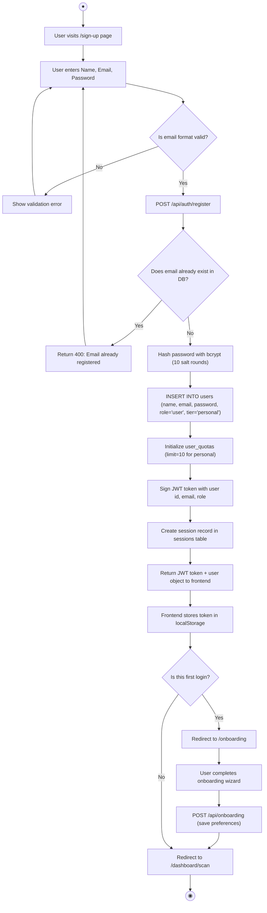

---

## 2. USER LOGIN ACTIVITY

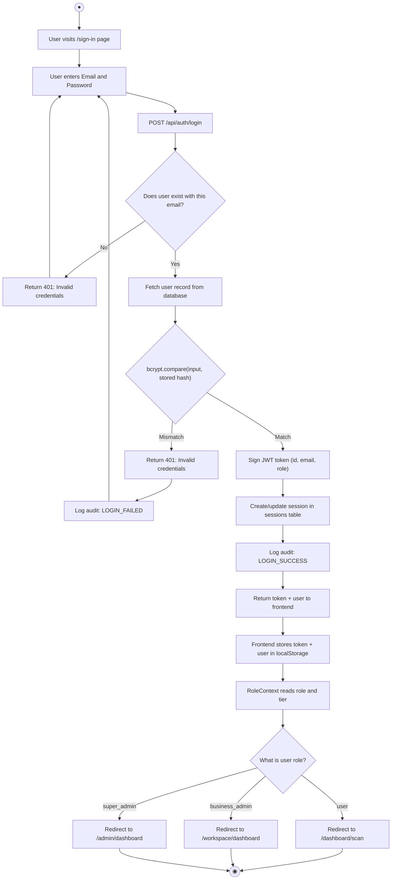

---

## 3. SINGLE CARD SCAN ACTIVITY

This is the **core feature** of the platform — scanning a business card with AI.

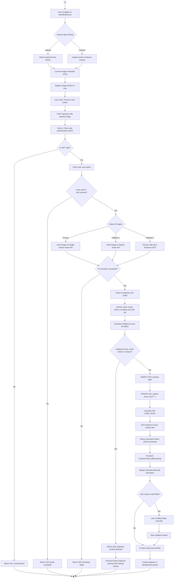

---

## 4. BATCH MULTI-SCAN ACTIVITY

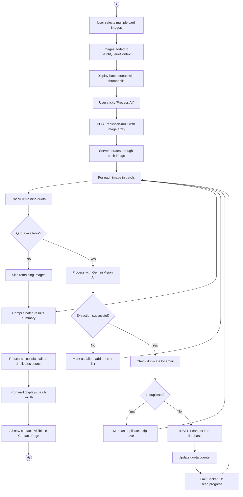

---

## 5. CONTACT MANAGEMENT ACTIVITY

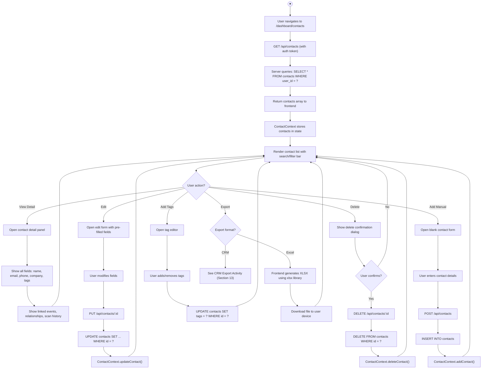

---

## 6. CONTACT SEARCH & FILTER ACTIVITY

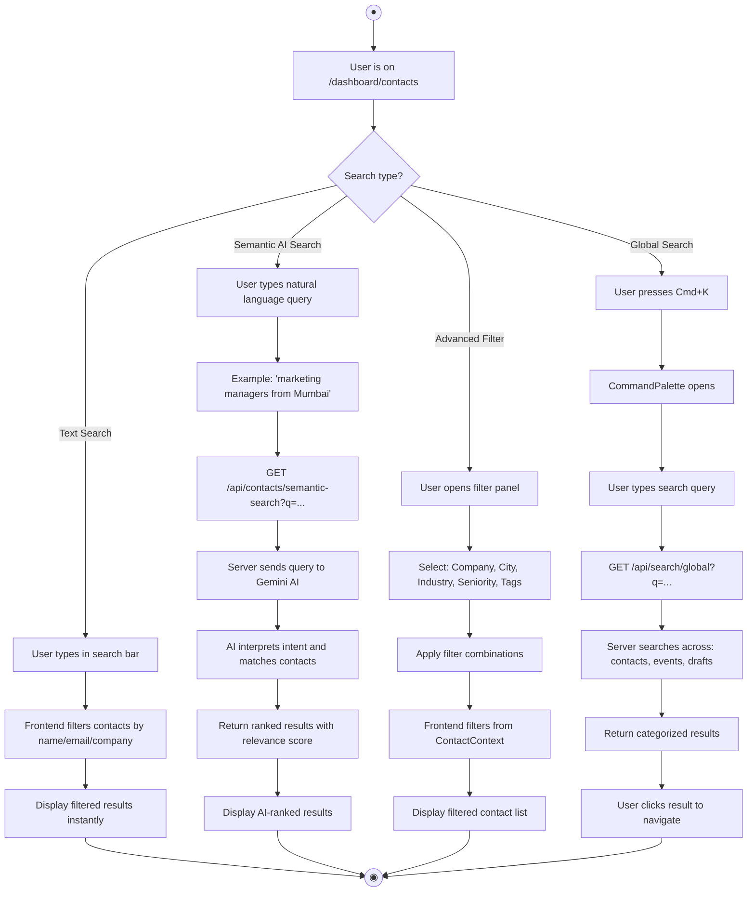

---

## 7. AI EMAIL DRAFT GENERATION ACTIVITY

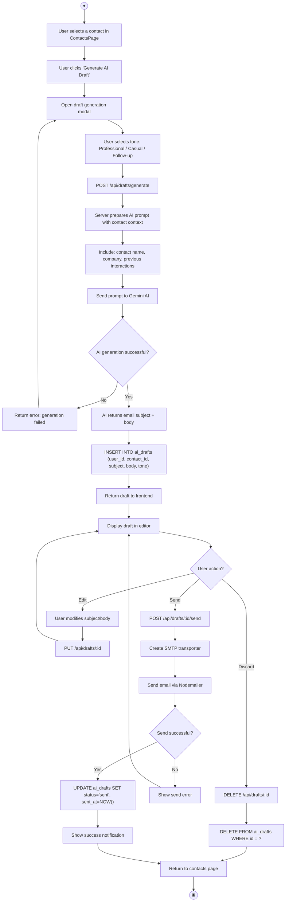

---

## 8. WORKSPACE INVITATION ACTIVITY

```mermaid
flowchart TD
    START(("●")) --> A["Enterprise Admin visits /workspace/members"]
    A --> B["Admin clicks 'Invite Member'"]
    B --> C["Enter: Email, Name, Role"]
    C --> D["POST /api/workspace/members/invite"]
    D --> E{"Admin has workspace_id?"}
    E -- No --> F["Auto-create workspace_id"]
    F --> F1["UPDATE admin user with new workspace_id"]
    F1 --> G
    E -- Yes --> G{"Target email already in this workspace?"}
    G -- Yes --> H["Return 400: Already a member"]
    H --> C
    G -- No --> I{"Target email belongs to another org?"}
    I -- Yes --> J["Return 400: Belongs to another organization"]
    J --> C
    I -- No --> K{"Target user exists in system?"}
    K -- Yes --> L["UPDATE existing user: set workspace_id, role, tier=enterprise"]
    K -- No --> M["Create skeleton user account"]
    M --> M1["Generate random password"]
    M1 --> M2["Hash with bcrypt"]
    M2 --> M3["INSERT INTO users (name, email, password, role, workspace_id, tier)"]
    M3 --> N
    L --> N["Generate invitation token (crypto.randomBytes 32)"]
    N --> O["INSERT INTO workspace_invitations (token, expires 7 days)"]
    O --> P["Create SMTP transporter from env"]
    P --> Q{"SMTP configured?"}
    Q -- Yes --> R["Send invitation email with accept link"]
    R --> R1["Email includes: role, workspace name, accept button"]
    Q -- No --> S["Log: SMTP not configured, skip email"]
    R1 --> T["Log audit: SEND_INVITATION"]
    S --> T
    T --> U["Return success to frontend"]
    U --> V["Show 'Invitation sent' toast"]
    V --> W["Invitee receives email"]
    W --> X["Invitee clicks 'Accept Invitation' link"]
    X --> Y["Navigate to /accept-invitation?token=..."]
    Y --> Z["POST /api/workspaces/invitations/:token/accept"]
    Z --> AA{"Token valid and not expired?"}
    AA -- No --> AB["Return 404/400: Invalid or expired"]
    AB --> ENDD(("◉"))
    AA -- Yes --> AC["UPDATE users SET workspace_id, role"]
    AC --> AD["UPDATE workspace_invitations SET status='accepted'"]
    AD --> AE["Log audit: ACCEPT_INVITATION"]
    AE --> AF["User redirected to workspace dashboard"]
    AF --> ENDD
```

---

## 9. CALENDAR EVENT CREATION ACTIVITY

```mermaid
flowchart TD
    START(("●")) --> A["User navigates to /dashboard/calendar"]
    A --> B["GET /api/calendar/calendars"]
    B --> C["Display calendar grid (month/week/day view)"]
    C --> D["User clicks on time slot or 'New Event'"]
    D --> E["Open EventModal component"]
    E --> F["User enters: Title, Description, Start, End"]
    F --> G{"Add recurrence?"}
    G -- Yes --> H["Select: Daily / Weekly / Monthly / Yearly"]
    H --> H1["Set interval, count, until date"]
    H1 --> I
    G -- No --> I{"Add attendees?"}
    I -- Yes --> J["Enter attendee emails"]
    J --> J1["Search contacts for auto-complete"]
    J1 --> K
    I -- No --> K{"Set reminder?"}
    K -- Yes --> L["Select: 5min / 15min / 30min / 1hr before"]
    L --> M
    K -- No --> M{"Use AI suggestion?"}
    M -- Yes --> N["POST /api/calendar/ai/suggest-time"]
    N --> N1["AI analyzes attendee availability"]
    N1 --> N2["Return suggested time slots"]
    N2 --> N3["User selects suggested time"]
    N3 --> O
    M -- No --> O["User clicks 'Create Event'"]
    O --> P["POST /api/calendar/events"]
    P --> Q["INSERT INTO calendar_events"]
    Q --> R{"Has attendees?"}
    R -- Yes --> S["INSERT INTO event_attendees for each"]
    S --> S1["INSERT INTO event_contact_links"]
    S1 --> S2["Send invitation emails via Nodemailer"]
    S2 --> T
    R -- No --> T{"Has reminder?"}
    T -- Yes --> U["INSERT INTO event_reminders"]
    U --> V
    T -- No --> V["Log audit: EVENT_CREATED"]
    V --> W["Return event to frontend"]
    W --> X["Event appears on calendar grid"]
    X --> Y["Cron job monitors reminders every 5 min"]
    Y --> Y1{"Reminder due?"}
    Y1 -- Yes --> Y2["Send reminder email via SMTP"]
    Y1 -- No --> Y3["Continue monitoring"]
    Y2 --> ENDD(("◉"))
    Y3 --> ENDD
```

---

## 10. BOOKING LINK & APPOINTMENT ACTIVITY

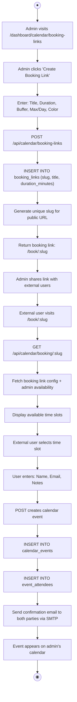

---

## 11. EMAIL CAMPAIGN LIFECYCLE ACTIVITY

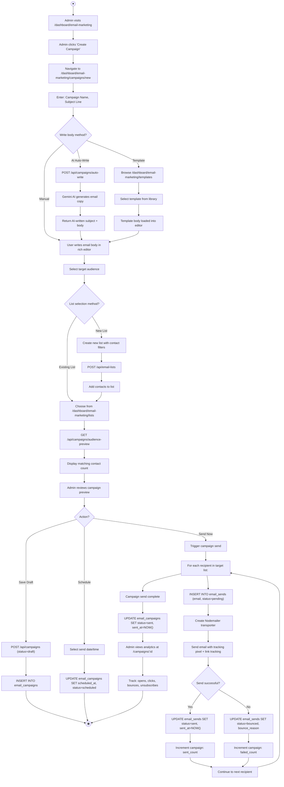

---

## 12. CONTACT DEDUPLICATION ACTIVITY

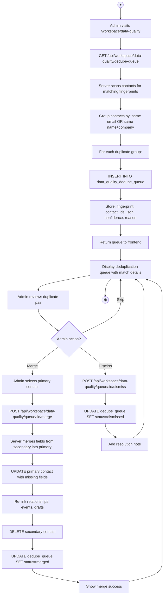

---

## 13. CRM EXPORT ACTIVITY

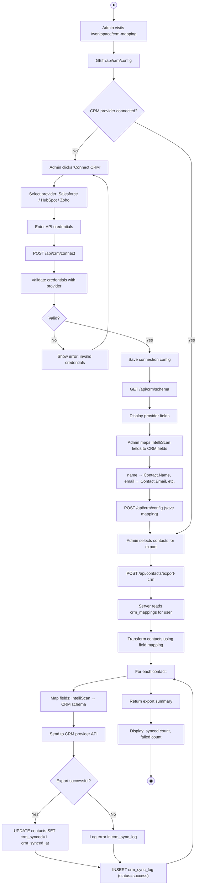

---

## 14. PLATFORM INCIDENT MANAGEMENT ACTIVITY

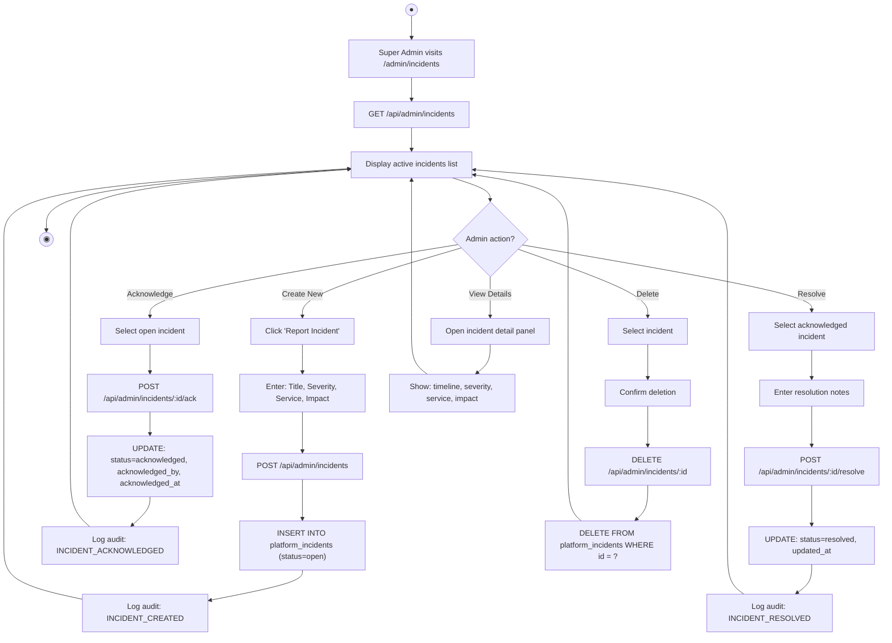

---

## 15. AI ENGINE CONFIGURATION ACTIVITY

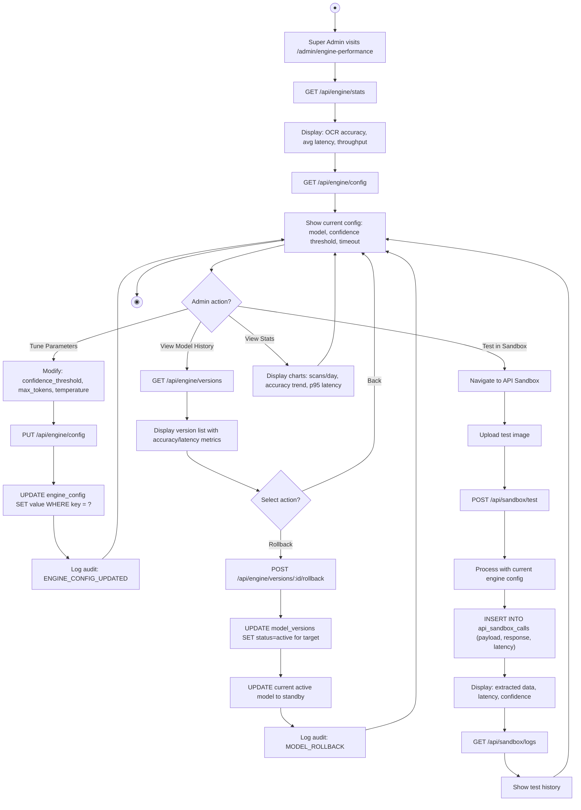

---

## ACTIVITY DIAGRAM SUMMARY

| # | Activity Diagram | Module | Steps | Decision Points | External Systems |
|:--|:----------------|:-------|:------|:-----------------|:-----------------|
| 1 | User Registration | Auth | 15 | 2 | bcrypt, JWT |
| 2 | User Login | Auth | 14 | 3 | bcrypt, JWT |
| 3 | Single Card Scan | Scanner | 25 | 6 | Gemini AI, Tesseract, Socket.IO |
| 4 | Batch Multi-Scan | Scanner | 16 | 3 | Gemini AI, Socket.IO |
| 5 | Contact Management | Contacts | 20 | 4 | xlsx library |
| 6 | Contact Search | Contacts | 15 | 4 | Gemini AI |
| 7 | AI Draft Generation | AI/Email | 18 | 4 | Gemini AI, Nodemailer |
| 8 | Workspace Invitation | Workspace | 22 | 6 | Nodemailer, bcrypt |
| 9 | Calendar Event | Calendar | 20 | 5 | Gemini AI, Nodemailer |
| 10 | Booking Link | Calendar | 14 | 1 | Nodemailer |
| 11 | Email Campaign | Email | 24 | 5 | Gemini AI, Nodemailer |
| 12 | Contact Dedup | Quality | 15 | 2 | — |
| 13 | CRM Export | CRM | 18 | 3 | External CRM API |
| 14 | Incident Mgmt | Admin | 16 | 1 | — |
| 15 | AI Engine Config | Admin | 18 | 3 | Gemini AI |
| | **TOTALS** | | **270 steps** | **52 decisions** | |

---

> **END OF ACTIVITY DIAGRAMS DOCUMENT**  
> 15 detailed Mermaid activity diagrams covering all major workflows.  
> Total: 270 action steps, 52 decision points, 8 external system interactions.
