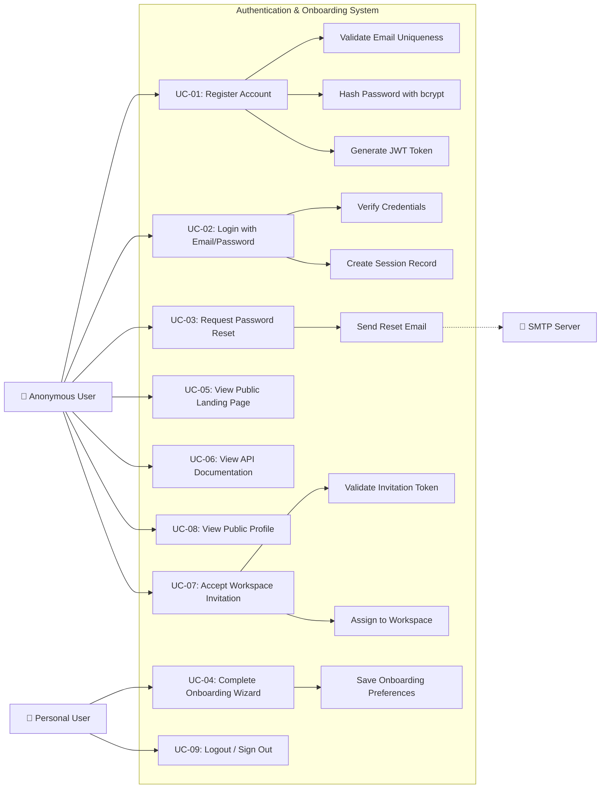
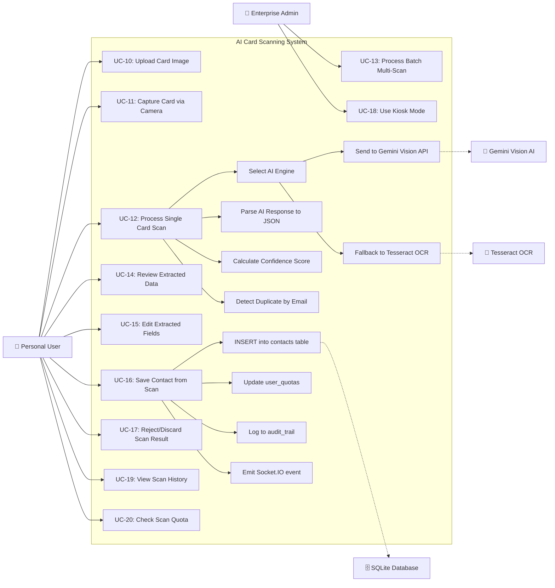
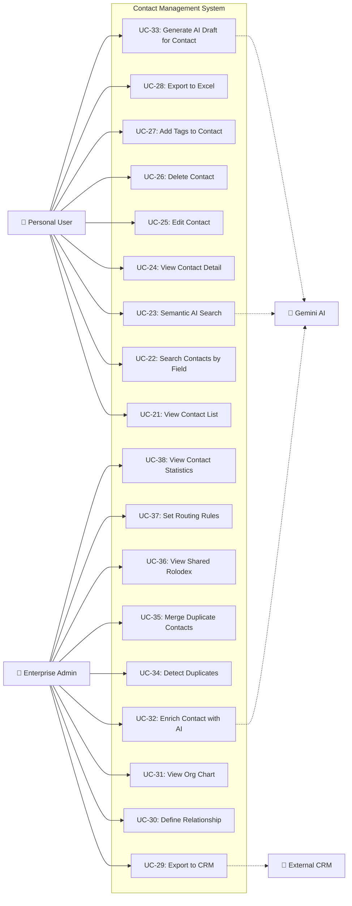
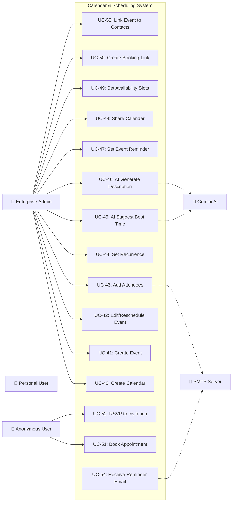
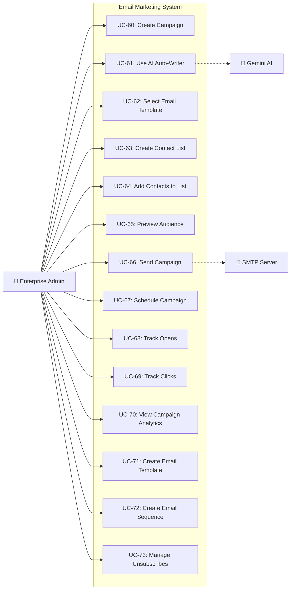
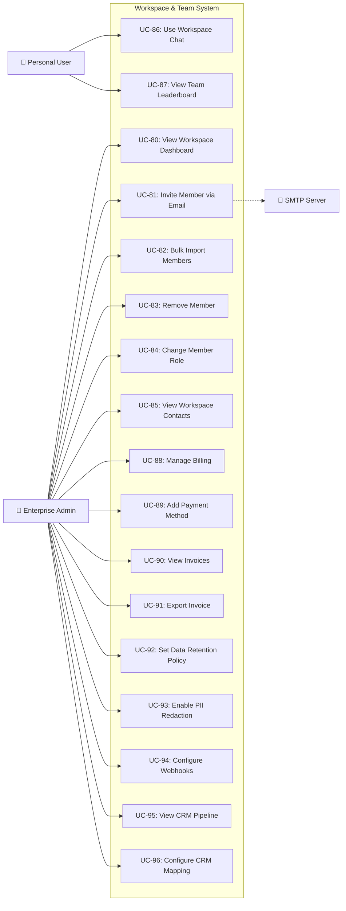
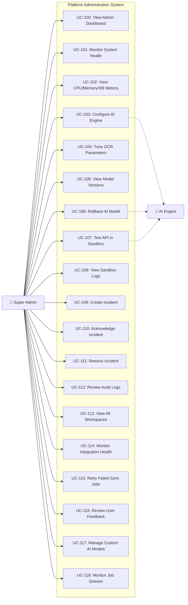
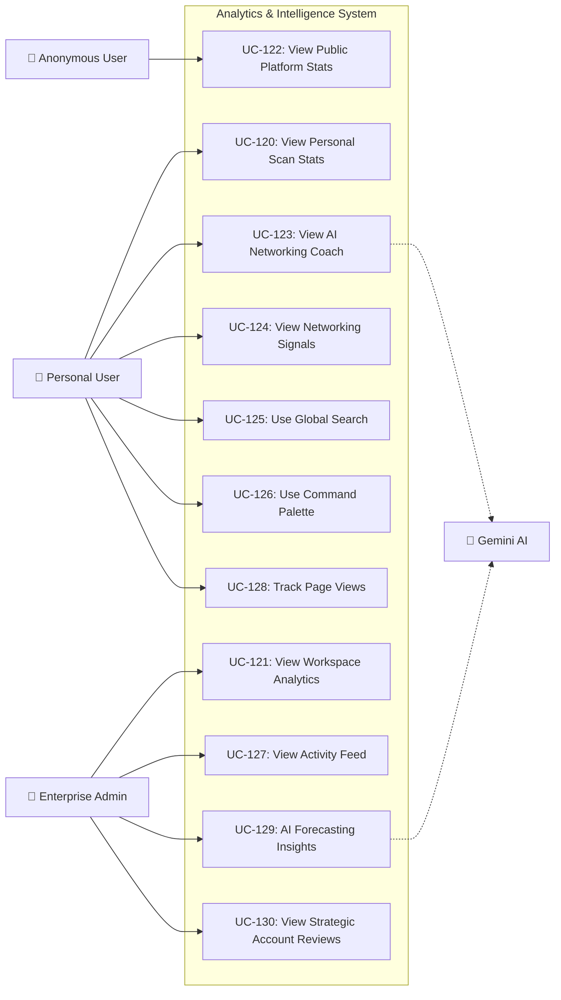
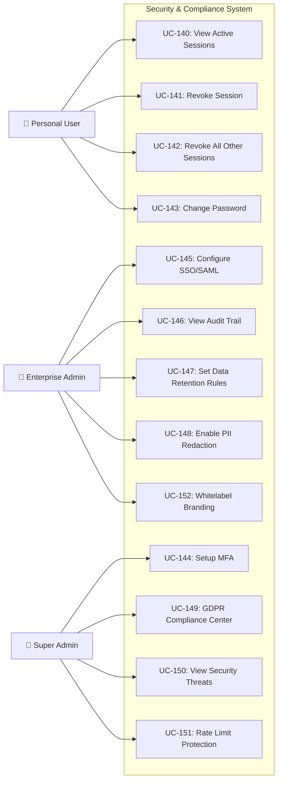

# IntelliScan — Complete Use Case Diagrams

> **Purpose**: Comprehensive UML Use Case Diagrams covering every feature module of the IntelliScan platform.  
> **Format**: Mermaid syntax for rendering in markdown viewers.  
> **Actors**: Anonymous User, Personal User, Enterprise Admin, Super Admin, External Systems (Gemini AI, SMTP, CRM).

---

## TABLE OF CONTENTS

1. [Master Use Case Diagram (All Actors)](#1-master-use-case-diagram)
2. [Authentication & Onboarding Module](#2-authentication--onboarding-module)
3. [AI Card Scanning Module](#3-ai-card-scanning-module)
4. [Contact Management Module](#4-contact-management-module)
5. [Calendar & Scheduling Module](#5-calendar--scheduling-module)
6. [Email Marketing Module](#6-email-marketing-module)
7. [Workspace & Team Management Module](#7-workspace--team-management-module)
8. [Platform Administration Module](#8-platform-administration-module)
9. [Analytics & Intelligence Module](#9-analytics--intelligence-module)
10. [Security & Compliance Module](#10-security--compliance-module)
11. [Use Case Descriptions Table](#11-use-case-descriptions-table)

---

## 1. MASTER USE CASE DIAGRAM

This is the top-level view showing all actors and their primary interactions with the system.

```mermaid
graph TB
    subgraph Actors
        AU["👤 Anonymous User"]
        PU["👤 Personal User"]
        EA["👤 Enterprise Admin"]
        SA["👤 Super Admin"]
        AI["🤖 Gemini AI Engine"]
        SMTP["📧 SMTP Server"]
        CRM["🔗 External CRM"]
    end

    subgraph IntelliScan["IntelliScan Platform"]
        subgraph Auth["Authentication"]
            UC01["UC-01: Register Account"]
            UC02["UC-02: Login"]
            UC03["UC-03: Reset Password"]
            UC04["UC-04: Complete Onboarding"]
        end

        subgraph Scanning["AI Card Scanning"]
            UC05["UC-05: Scan Single Card"]
            UC06["UC-06: Batch Scan Cards"]
            UC07["UC-07: Review Extracted Data"]
            UC08["UC-08: Use Kiosk Mode"]
        end

        subgraph Contacts["Contact Management"]
            UC09["UC-09: View Contact List"]
            UC10["UC-10: Search Contacts"]
            UC11["UC-11: Export Contacts"]
            UC12["UC-12: Manage Relationships"]
            UC13["UC-13: Deduplicate Contacts"]
        end

        subgraph Calendar["Calendar & Scheduling"]
            UC14["UC-14: Manage Calendar Events"]
            UC15["UC-15: Set Availability"]
            UC16["UC-16: Create Booking Link"]
            UC17["UC-17: Book Appointment"]
        end

        subgraph Email["Email Marketing"]
            UC18["UC-18: Create Campaign"]
            UC19["UC-19: Manage Contact Lists"]
            UC20["UC-20: Send Campaign"]
            UC21["UC-21: View Campaign Analytics"]
        end

        subgraph Workspace["Workspace Management"]
            UC22["UC-22: Invite Team Members"]
            UC23["UC-23: Manage Members"]
            UC24["UC-24: Manage Billing"]
            UC25["UC-25: Configure Data Policies"]
        end

        subgraph Admin["Platform Administration"]
            UC26["UC-26: Monitor System Health"]
            UC27["UC-27: Manage AI Engine"]
            UC28["UC-28: Manage Incidents"]
            UC29["UC-29: Review Audit Logs"]
        end
    end

    AU --> UC01
    AU --> UC02
    AU --> UC03
    AU --> UC17

    PU --> UC04
    PU --> UC05
    PU --> UC06
    PU --> UC07
    PU --> UC08
    PU --> UC09
    PU --> UC10
    PU --> UC11

    EA --> UC12
    EA --> UC13
    EA --> UC14
    EA --> UC15
    EA --> UC16
    EA --> UC18
    EA --> UC19
    EA --> UC20
    EA --> UC21
    EA --> UC22
    EA --> UC23
    EA --> UC24
    EA --> UC25

    SA --> UC26
    SA --> UC27
    SA --> UC28
    SA --> UC29

    UC05 -.-> AI
    UC06 -.-> AI
    UC20 -.-> SMTP
    UC22 -.-> SMTP
    UC11 -.-> CRM
```



---

## 2. AUTHENTICATION & ONBOARDING MODULE



### Use Case Descriptions — Authentication

| ID | Use Case | Actor | Precondition | Flow | Postcondition |
|:---|:---------|:------|:-------------|:-----|:--------------|
| UC-01 | Register Account | Anonymous | No existing account with email | 1. Enter name, email, password 2. System validates uniqueness 3. bcrypt hashes password 4. INSERT into users table 5. JWT token generated | User account created, token returned |
| UC-02 | Login | Anonymous | Account exists | 1. Enter email, password 2. System fetches user by email 3. bcrypt.compare verifies 4. JWT signed 5. Session created | JWT returned, session logged |
| UC-03 | Reset Password | Anonymous | Account exists | 1. Enter email 2. System sends reset link via SMTP | Reset email sent |
| UC-04 | Complete Onboarding | Personal User | Logged in, first visit | 1. Select industry 2. Choose use case 3. Set preferences 4. POST /api/onboarding | Preferences saved |
| UC-07 | Accept Invitation | Anonymous | Valid invitation token | 1. Click invitation link 2. Register/login 3. Token validated 4. workspace_id assigned | User added to workspace |

---

## 3. AI CARD SCANNING MODULE



### Scan Flow — Step by Step

| Step | Action | System Component | Data |
|:-----|:-------|:-----------------|:-----|
| 1 | User uploads/captures card image | Frontend (ScanPage) | Base64 image string |
| 2 | Frontend sends POST /api/scan | Axios HTTP Client | `{ image: "data:image/jpeg;base64,..." }` |
| 3 | Backend selects AI engine | index.js scan handler | Engine priority: Gemini → OpenAI → Tesseract |
| 4 | Image sent to Gemini Vision | @google/generative-ai | Structured prompt + image |
| 5 | AI returns extracted data | Gemini API | `{ name, email, phone, company, job_title }` |
| 6 | System checks for duplicates | SQLite query | `SELECT * FROM contacts WHERE email = ?` |
| 7 | Confidence score calculated | Backend logic | Based on field completeness (0-100%) |
| 8 | Contact saved to database | SQLite INSERT | `INSERT INTO contacts (...)` |
| 9 | Quota incremented | SQLite UPDATE | `UPDATE user_quotas SET used_count = used_count + 1` |
| 10 | Audit event logged | audit_trail table | Action: CARD_SCAN, status, details |
| 11 | Real-time notification | Socket.IO emit | `contact:new` event to all connected clients |
| 12 | Result returned to frontend | Express response | JSON contact object with ID |

---

## 4. CONTACT MANAGEMENT MODULE



### Key Contact Use Cases — Detailed

| ID | Use Case | Trigger | Steps | Dependencies |
|:---|:---------|:--------|:------|:-------------|
| UC-21 | View Contact List | User navigates to /dashboard/contacts | 1. GET /api/contacts 2. ContactContext provides data 3. Render table with pagination | ContactContext, auth token |
| UC-23 | Semantic AI Search | User types natural language query | 1. GET /api/contacts/semantic-search?q=... 2. Gemini processes query 3. Returns ranked results | Gemini AI |
| UC-29 | Export to CRM | Admin clicks "Export to Salesforce" | 1. POST /api/contacts/export-crm 2. Map fields via crm_mappings 3. Send to external API 4. Log in crm_sync_log | CRM mapping config |
| UC-30 | Define Relationship | Admin selects two contacts | 1. POST /api/contacts/relationships 2. Type: reports_to/colleague 3. INSERT contact_relationships | Two valid contacts |
| UC-31 | View Org Chart | Admin visits /workspace/org-chart | 1. GET /api/org-chart/:company 2. Query contact_relationships 3. Render tree visualization | Contact relationships data |
| UC-32 | Enrich Contact | Admin clicks "Enrich" on contact | 1. POST /api/contacts/:id/enrich 2. AI infers industry, seniority, bio 3. UPDATE contact record | Gemini AI |
| UC-35 | Merge Duplicates | Admin resolves dedup queue item | 1. POST /api/workspace/data-quality/queue/:id/merge 2. Merge fields 3. DELETE secondary 4. Update references | Dedup queue data |

---

## 5. CALENDAR & SCHEDULING MODULE



### Calendar Data Flow

```
User creates event (CalendarPage)
    │
    ├── POST /api/calendar/events
    │   ├── INSERT calendar_events (title, start, end, recurrence)
    │   ├── INSERT event_attendees (email, name, status=pending)
    │   ├── INSERT event_reminders (method=email, minutes_before)
    │   └── INSERT event_contact_links (event_id, contact_id)
    │
    ├── Attendees receive email invitation (Nodemailer)
    │   └── Email contains RSVP link: /api/calendar/respond/:token
    │
    ├── Cron job (every 5 min) checks event_reminders
    │   └── If due: send reminder email via SMTP
    │
    └── User shares calendar
        └── POST /api/calendar/calendars/:id/share
            └── INSERT calendar_shares (permission: view/edit)
```

---

## 6. EMAIL MARKETING MODULE



### Email Campaign Lifecycle

| Phase | Use Case | API Endpoint | Database Tables |
|:------|:---------|:-------------|:----------------|
| 1. Create | UC-60: Create Campaign | POST /api/campaigns | email_campaigns |
| 2. Write | UC-61: AI Auto-Writer | POST /api/campaigns/auto-write | email_campaigns (body updated) |
| 3. Template | UC-62: Select Template | GET /api/email-templates | email_templates |
| 4. Target | UC-63-64: Build List | POST /api/email-lists | email_lists, email_list_contacts |
| 5. Preview | UC-65: Preview Audience | GET /api/campaigns/audience-preview | contacts + email_list_contacts |
| 6. Send | UC-66: Send Campaign | POST (trigger send) | email_sends, campaign_recipients |
| 7. Track | UC-68-69: Track engagement | Pixel/link tracking | email_sends (opens), email_clicks |
| 8. Analyze | UC-70: View Analytics | GET /api/campaigns/:id | Aggregated stats |

---

## 7. WORKSPACE & TEAM MANAGEMENT MODULE



### Invitation Flow Detail

```
Enterprise Admin invites user
    │
    ├── POST /api/workspace/members/invite
    │   ├── Check if email already in workspace → 400 error
    │   ├── Check if user exists in another org → 400 error
    │   ├── If user exists (no workspace): UPDATE workspace_id
    │   ├── If user doesn't exist: CREATE skeleton user
    │   └── Log audit: TEAM_MEMBER_INVITE
    │
    ├── POST /api/workspaces/:id/invitations
    │   ├── Generate crypto token (32 bytes hex)
    │   ├── INSERT workspace_invitations (token, expires 7 days)
    │   ├── Send email via Nodemailer with accept link
    │   └── Log audit: SEND_INVITATION
    │
    └── Invitee accepts
        ├── POST /api/workspaces/invitations/:token/accept
        ├── Validate token + check expiry
        ├── UPDATE users SET workspace_id, role
        ├── UPDATE workspace_invitations SET status=accepted
        └── Log audit: ACCEPT_INVITATION
```

---

## 8. PLATFORM ADMINISTRATION MODULE



---

## 9. ANALYTICS & INTELLIGENCE MODULE



---

## 10. SECURITY & COMPLIANCE MODULE



---

## 11. USE CASE DESCRIPTIONS TABLE

### Complete Use Case Summary (All Modules)

| ID | Use Case Name | Primary Actor | Module | API Endpoint | Database Table(s) |
|:---|:-------------|:--------------|:-------|:-------------|:-------------------|
| UC-01 | Register Account | Anonymous | Auth | POST /api/auth/register | users |
| UC-02 | Login | Anonymous | Auth | POST /api/auth/login | users, sessions |
| UC-03 | Reset Password | Anonymous | Auth | POST /api/auth/forgot | users |
| UC-04 | Complete Onboarding | Personal User | Auth | POST /api/onboarding | onboarding_prefs |
| UC-05 | View Landing Page | Anonymous | Public | — (static React) | — |
| UC-10 | Upload Card Image | Personal User | Scan | — (frontend only) | — |
| UC-11 | Capture via Camera | Personal User | Scan | — (frontend only) | — |
| UC-12 | Process Single Scan | Personal User | Scan | POST /api/scan | contacts, user_quotas, audit_trail |
| UC-13 | Batch Multi-Scan | Enterprise Admin | Scan | POST /api/scan-multi | contacts, user_quotas |
| UC-14 | Review Extracted Data | Personal User | Scan | — (frontend state) | — |
| UC-16 | Save Contact from Scan | Personal User | Scan | POST /api/contacts | contacts |
| UC-18 | Use Kiosk Mode | Enterprise Admin | Scan | POST /api/scan | contacts |
| UC-21 | View Contact List | Personal User | Contacts | GET /api/contacts | contacts |
| UC-22 | Search Contacts | Personal User | Contacts | GET /api/contacts?search= | contacts |
| UC-23 | Semantic AI Search | Personal User | Contacts | GET /api/contacts/semantic-search | contacts |
| UC-25 | Edit Contact | Personal User | Contacts | PUT /api/contacts/:id | contacts |
| UC-26 | Delete Contact | Personal User | Contacts | DELETE /api/contacts/:id | contacts |
| UC-28 | Export to Excel | Personal User | Contacts | — (frontend xlsx lib) | contacts |
| UC-29 | Export to CRM | Enterprise Admin | Contacts | POST /api/contacts/export-crm | contacts, crm_mappings |
| UC-30 | Define Relationship | Enterprise Admin | Contacts | POST /api/contacts/relationships | contact_relationships |
| UC-31 | View Org Chart | Enterprise Admin | Contacts | GET /api/org-chart/:company | contact_relationships |
| UC-32 | Enrich Contact | Enterprise Admin | Contacts | POST /api/contacts/:id/enrich | contacts |
| UC-33 | Generate AI Draft | Personal User | Drafts | POST /api/drafts/generate | ai_drafts |
| UC-34 | Detect Duplicates | Enterprise Admin | Quality | GET /api/workspace/data-quality/dedupe-queue | data_quality_dedupe_queue |
| UC-35 | Merge Duplicates | Enterprise Admin | Quality | POST /api/.../queue/:id/merge | contacts, data_quality_dedupe_queue |
| UC-40 | Create Calendar | Enterprise Admin | Calendar | POST /api/calendar/calendars | calendars |
| UC-41 | Create Event | Enterprise Admin | Calendar | POST /api/calendar/events | calendar_events, event_attendees |
| UC-42 | Reschedule Event | Enterprise Admin | Calendar | PATCH /api/calendar/events/:id/reschedule | calendar_events |
| UC-45 | AI Suggest Time | Enterprise Admin | Calendar | POST /api/calendar/ai/suggest-time | calendar_events |
| UC-47 | Set Reminder | Enterprise Admin | Calendar | — (part of event create) | event_reminders |
| UC-49 | Set Availability | Enterprise Admin | Calendar | PUT /api/calendar/availability | availability_slots |
| UC-50 | Create Booking Link | Enterprise Admin | Calendar | POST /api/calendar/booking-links | booking_links |
| UC-51 | Book Appointment | Anonymous | Calendar | POST /api/calendar/bookings | calendar_events |
| UC-52 | RSVP to Invitation | Anonymous | Calendar | GET /api/calendar/respond/:token | event_attendees |
| UC-60 | Create Campaign | Enterprise Admin | Email | POST /api/campaigns | email_campaigns |
| UC-61 | AI Auto-Writer | Enterprise Admin | Email | POST /api/campaigns/auto-write | email_campaigns |
| UC-63 | Create Contact List | Enterprise Admin | Email | POST /api/email-lists | email_lists |
| UC-65 | Preview Audience | Enterprise Admin | Email | GET /api/campaigns/audience-preview | email_list_contacts |
| UC-66 | Send Campaign | Enterprise Admin | Email | POST (trigger) | email_sends, campaign_recipients |
| UC-70 | View Analytics | Enterprise Admin | Email | GET /api/campaigns/:id | email_sends, email_clicks |
| UC-81 | Invite Member | Enterprise Admin | Workspace | POST /api/workspace/members/invite | users, workspace_invitations |
| UC-83 | Remove Member | Enterprise Admin | Workspace | DELETE /api/workspace/members/:id | users |
| UC-86 | Workspace Chat | Personal User | Workspace | Socket.IO | workspace_chats |
| UC-88 | Manage Billing | Enterprise Admin | Workspace | GET /api/workspace/billing/overview | billing_payment_methods, billing_invoices |
| UC-92 | Data Retention | Enterprise Admin | Workspace | PUT /api/workspace/data-policies | workspace_policies |
| UC-100 | Admin Dashboard | Super Admin | Admin | GET /api/enterprise/* | analytics_logs, users |
| UC-103 | Configure AI | Super Admin | Admin | PUT /api/engine/config | engine_config |
| UC-106 | Rollback Model | Super Admin | Admin | POST /api/engine/versions/:id/rollback | model_versions |
| UC-107 | API Sandbox | Super Admin | Admin | POST /api/sandbox/test | api_sandbox_calls |
| UC-109 | Create Incident | Super Admin | Admin | POST /api/admin/incidents | platform_incidents |
| UC-112 | Review Audit Logs | Super Admin | Admin | GET /api/enterprise/audit-logs | audit_trail |
| UC-114 | Integration Health | Super Admin | Admin | GET /api/admin/integrations/health | integration_sync_jobs |
| UC-120 | View Scan Stats | Personal User | Analytics | GET /api/contacts/stats | contacts |
| UC-123 | AI Coach | Personal User | Analytics | GET /api/coach/insights | contacts |
| UC-125 | Global Search | Personal User | Analytics | GET /api/search/global | contacts, events, ai_drafts |
| UC-140 | View Sessions | Personal User | Security | GET /api/sessions/me | sessions |
| UC-141 | Revoke Session | Personal User | Security | DELETE /api/sessions/:id | sessions |

---

### Actor Permissions Summary

| Use Case Count | Anonymous | Personal User | Enterprise Admin | Super Admin |
|:---------------|:----------|:--------------|:-----------------|:------------|
| Authentication | 4 | 2 | 2 | 2 |
| Scanning | 0 | 7 | 2 | 0 |
| Contacts | 0 | 8 | 10 | 0 |
| Calendar | 2 | 0 | 11 | 0 |
| Email Marketing | 0 | 0 | 14 | 0 |
| Workspace | 0 | 2 | 14 | 0 |
| Administration | 0 | 0 | 0 | 19 |
| Analytics | 1 | 6 | 4 | 0 |
| Security | 0 | 4 | 5 | 4 |
| **TOTAL** | **7** | **29** | **62** | **25** |

---

> **END OF USE CASE DOCUMENT**  
> Total Use Cases Documented: **55+ primary use cases** with sub-flows across **10 modules**.  
> All diagrams use Mermaid syntax and can be pasted into any Markdown renderer.
