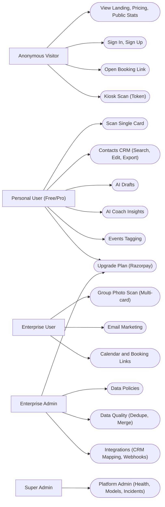
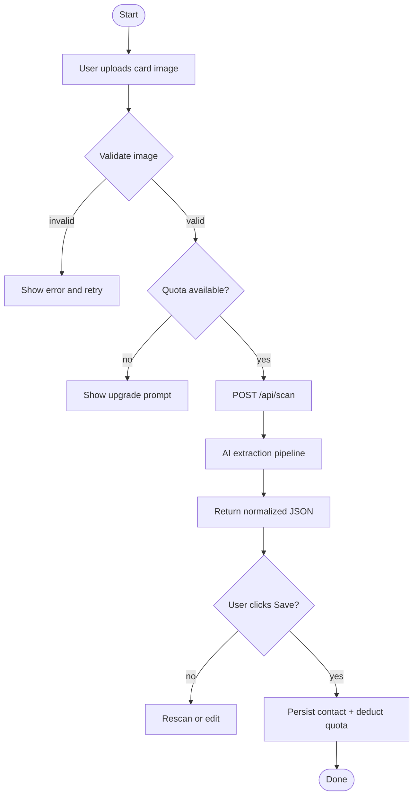
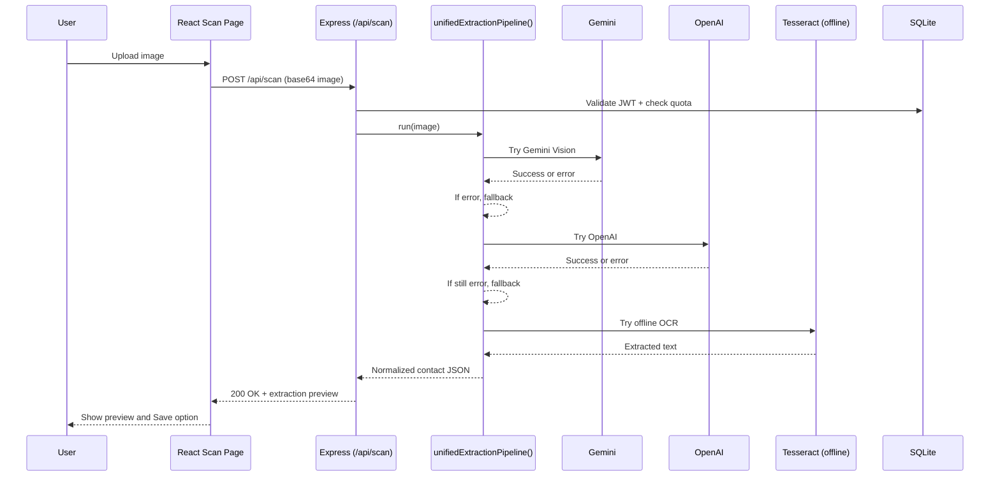
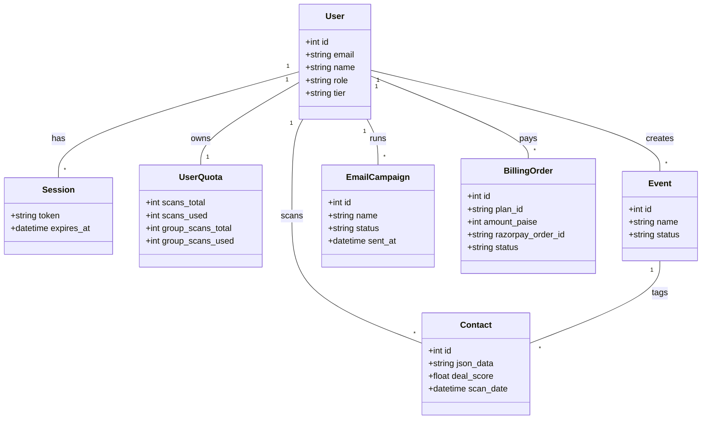

# Presentation-1: IntelliScan (April 4, 2026)

## 1. Project Details

- Project Title: IntelliScan: AI-Powered Enterprise Contact and CRM Management
- Team Members: [Fill Names]
- Enrollment Numbers: [Fill Enrollment Nos.]
- Guide Name: Prof. Khushbu Patel
- Presentation Date: April 4, 2026

## 2. Presentation Agenda (Presentation-1)

1. Introduction and Existing System Analysis
2. Need for the New System
3. Problem Definition and Objectives
4. System Scope (What We Built)
5. Technology Stack
6. UML and System Diagrams (Use Case, Activity, Interaction, Class)
7. Database Overview (Data Dictionary Summary)
8. Implementation Status and Demo Plan

## 3. Existing System (Problem Context)

Current business card and contact management is usually:

1. Manual data entry into spreadsheets or CRMs (slow and error-prone).
2. Physical storage of cards (loss risk, no search).
3. Fragmented tools (contacts, emails, notes, events, and CRM are not connected).
4. Weak follow-up hygiene (leads go stale because reminders and outreach are not automated).

## 4. Need for the New System

IntelliScan solves the gap between physical networking and digital CRM execution:

1. Instant digitization (AI OCR converts cards into structured data).
2. Central CRM (search, edit, export, events tagging).
3. Enterprise workflows (workspace collaboration, dedupe/merge, policies).
4. Follow-up acceleration (AI drafts, email marketing, calendar booking links).
5. Billing upgrades (Razorpay) to unlock higher quotas/features by plan.

## 5. Problem Definition and Objectives

### Problem Definition

Networking leakage: valuable leads are lost because capture is slow, messy, and follow-up is inconsistent.

### Objectives

1. Build a single-card scanner and a multi-card (group photo) scanner.
2. Store contacts centrally with role-based access control (RBAC) and plan-based quotas.
3. Provide workflows for follow-up (AI drafts, email marketing, calendar scheduling).
4. Provide enterprise data hygiene and compliance tools (dedupe/merge, policies, audit logs).

## 6. System Scope (What Is Implemented)

Core end-to-end modules present in the codebase:

1. Authentication, sessions, access profile (role + tier).
2. Single card scan (`POST /api/scan`) with AI fallback (Gemini -> OpenAI -> Tesseract).
3. Group photo scan (`POST /api/scan-multi`) for enterprise users.
4. Contacts CRM (search, edit, export, deal scoring, enrichment hooks).
5. Events and campaigns (tag contacts by event).
6. AI drafts and AI coach (follow-up generation and insights).
7. Email marketing (templates, lists, campaigns, tracking endpoints).
8. Calendar and booking links (enterprise).
9. Data quality center (dedupe queue + merge/dismiss).
10. Compliance policies (retention, redaction toggle, audit storage toggle).
11. Integrations (webhooks + CRM mapping pages).
12. Billing and plan upgrades (Razorpay, with demo simulation if keys missing).

## 7. Technology Stack

Frontend:

1. React (Vite)
2. Tailwind CSS
3. React Router
4. Axios (API calls)

Backend:

1. Node.js + Express
2. SQLite (relational persistence)
3. Socket.IO (realtime features)

AI and Messaging:

1. Gemini API (primary vision extraction)
2. OpenAI (fallback extraction and text generation)
3. Tesseract.js (offline OCR fallback for single-card)
4. Nodemailer (SMTP email sending)

Billing:

1. Razorpay Orders API + signature verification

## 8. UML and System Diagrams

### 8.1 Full Project Use Case Diagram (High Level)

### 8.2 Activity Diagram (Single Card Scan to Save)

### 8.3 Interaction Diagram (Sequence: Scan Pipeline)

### 8.4 Class Diagram (Core Entities)

## 9. Data Dictionary (Summary)

Key tables used by the working product flows:

1. `users`: identity, role, tier, workspace_id
2. `sessions`: active sessions / issued tokens
3. `user_quotas`: scans limits and usage counters
4. `contacts`: CRM contact records (structured fields + AI metadata)
5. `events` and `event_contact_links`: events/campaigns tagging
6. `ai_drafts`: AI follow-up drafts (draft/sent)
7. `email_templates`, `email_lists`, `email_campaigns`, `email_sends`, `email_clicks`: email marketing suite
8. `workspace_policies`: compliance policies (retention, redaction, audit storage)
9. `data_quality_dedupe_queue`: dedupe queue for merge suggestions
10. `billing_orders`, `billing_invoices`, `billing_payment_methods`: billing and upgrades
11. `audit_trail`: audit trail for sensitive actions
12. `webhooks`, `crm_mappings`, `crm_sync_log`: integrations and sync logging

Full database dictionary:

1. Authoritative schema dump: `DATA_DICTIONARY_INTELLISCAN_DB.md`
2. Human-friendly summary (older): `IntelliScan_Data_Dictionary.md`
3. Internal bundle copy: `ALL_DOCUMENT_OF_PROJECT/IntelliScan_Ultimate_Data_Dictionary.md`

## 10. Implementation Status (As of April 4, 2026)

1. Frontend: 120 total routes (explicit + generated), core pages functional.
2. Backend: 145+ API routes present.
3. Most “major project” modules work end-to-end locally (scan, contacts, events, drafts, email marketing, policies, data quality, billing).
4. Remaining gaps are mainly missing endpoints for a few prototype pages (see `PAGE_HEALTH_REPORT.md`).

## 11. Demo Plan (5 to 8 minutes)

1. Login as Free user and show quotas.
2. Scan a single card and save contact.
3. Open Contacts and export CSV.
4. Generate AI draft for that contact.
5. Login as Enterprise admin and show group scan + policies + email marketing.
6. Show billing upgrade flow (Razorpay or simulated).
