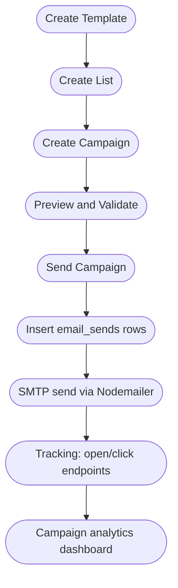
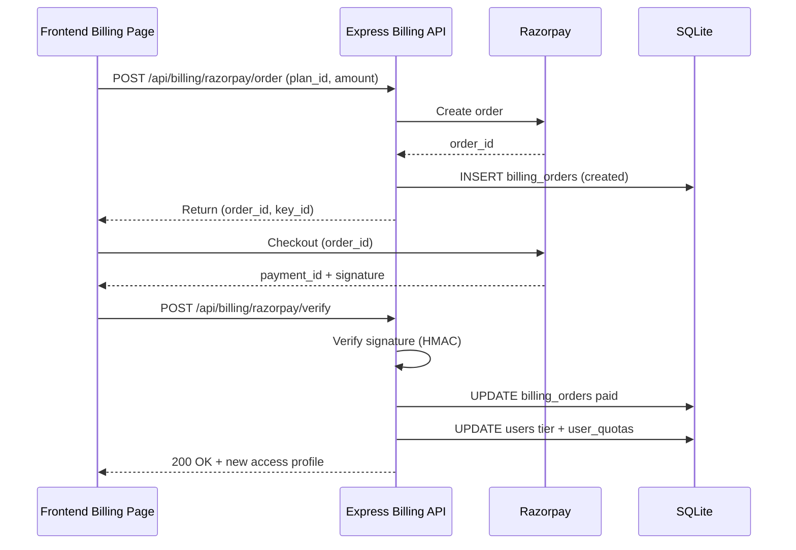
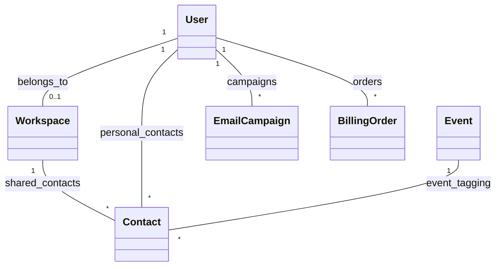

# Presentation-2: IntelliScan (Final Presentation + Demo) (April 4, 2026)

## 1. Project Details

- Project Title: IntelliScan: AI-Powered Business Card Scanning and CRM Platform
- Team Members: [Fill Names]
- Enrollment Numbers: [Fill Enrollment Nos.]
- Guide Name: Prof. Khushbu Patel
- Presentation Date: April 4, 2026

## 2. Presentation Agenda (Presentation-2)

1. Project recap (problem, objectives, outcomes)
2. Full architecture and module overview
3. Detailed workflows (scan, group scan, email marketing, billing)
4. RBAC and tier model (who can access what)
5. Database design (tables, relationships, data dictionary)
6. Demo walkthrough (script)
7. Testing, reliability, and future scope

## 3. Recap (Problem -> Solution -> Outcome)

### Problem

1. Business cards are physical and unsearchable.
2. Manual typing wastes time and introduces errors.
3. CRMs get stale because follow-up is not automated.
4. Enterprises need collaboration, policies, and auditability.

### Solution

IntelliScan provides:

1. AI extraction of contact data from images (single card and group photo).
2. A CRM layer to organize, edit, tag, export, and enrich.
3. Follow-up automation modules (AI drafts, email marketing, booking links).
4. Enterprise governance (RBAC, data policies, audit logs, dedupe/merge).
5. Billing upgrades (Razorpay) to unlock tiers and quotas.

### Outcome

1. A working end-to-end full stack product: React frontend + Express backend + SQLite persistence.
2. A large set of pages (explicit + generated) with major flows wired to real APIs.
3. A presentation-ready documentation set: diagrams, data dictionary, architecture docs, and feature matrix.

## 4. Full Architecture Overview

### 4.1 System Architecture Diagram

```mermaid
flowchart LR
    U[User Browser] --> FE[React SPA (Vite)]
    FE -->|JWT Auth| API[Express API Server]
    API --> DB[(SQLite Database)]
    API -->|Vision/Text| GEM[Gemini AI]
    API -->|Fallback Text/Vision| OAI[OpenAI]
    API -->|Offline OCR (single)| TES[Tesseract.js Worker]
    API --> SMTP[SMTP (Nodemailer)]
    API --> RZP[Razorpay Orders API]
    API --> SOCK[Socket.IO]
    FE --> SOCK
```

### 4.2 Folder-Level Architecture

Frontend (`intelliscan-app`):

1. `src/App.jsx`: routing tree and generated route loader
2. `src/layouts/*`: Public, Dashboard, Admin layouts
3. `src/pages/*`: main screens (scan, contacts, calendar, email marketing, workspace/admin)
4. `src/context/*`: role/auth context, contacts context, batch queue context
5. `src/utils/auth.js`: token storage and API auth helpers

Backend (`intelliscan-server`):

1. `index.js`: primary Express server, endpoints, DB setup, AI pipelines, billing
2. `src/utils/db.js`: SQLite helpers
3. `src/middleware/auth.js`: JWT auth + role gates
4. `src/workers/tesseract_ocr_worker.js`: isolated OCR fallback worker
5. `tests/*`: Jest + supertest coverage for critical flows

## 5. Detailed Workflows (Core Features)

### 5.1 Single Card Scan Workflow

Purpose: Convert 1 business card image into 1 structured contact.

```mermaid
flowchart TD
    A([Upload Image]) --> B{Validate image}
    B -- invalid --> X([Reject + show error])
    B -- valid --> C{Quota OK?}
    C -- no --> Y([Upgrade prompt])
    C -- yes --> D[POST /api/scan]
    D --> E[Gemini Vision]
    E --> F{Success?}
    F -- no --> G[OpenAI fallback]
    G --> H{Success?}
    H -- no --> I[Tesseract fallback (single only)]
    F -- yes --> J[Normalize JSON]
    H -- yes --> J
    I --> J
    J --> K[Preview in UI]
    K --> L{User saves?}
    L -- yes --> M[Persist contact + deduct quota]
    L -- no --> N([Rescan/Edit])
```

### 5.2 Group Photo (Multi-card) Scan Workflow

Purpose: Convert 1 group photo containing many cards into a list of contacts.

```mermaid
flowchart TD
    A([Upload Group Photo]) --> B{Enterprise tier?}
    B -- no --> C([Lock and upsell])
    B -- yes --> D{Group quota OK?}
    D -- no --> C
    D -- yes --> E[POST /api/scan-multi]
    E --> F[Bulk prompt extraction (AI)]
    F --> G[Normalize each extracted contact]
    G --> H[Insert contacts to DB]
    H --> I[Increment group_scans_used]
    I --> J([Render results grid])
```

### 5.3 Email Marketing Workflow

Purpose: Create templates, build lists, run campaigns, and track engagement.



### 5.4 Billing Upgrade Workflow (Razorpay)

Purpose: Upgrade tier and quotas after a payment.



## 6. RBAC and Tier Model (Access Control)

Roles:

1. Anonymous: public pages, booking links, kiosk token scan
2. Personal user: scan, contacts, drafts, coach, basic analytics
3. Enterprise user: adds workspace features, group scan, calendar, marketing
4. Enterprise admin: adds policies, data quality, integrations, billing workspace
5. Super admin: platform monitoring, model status, incidents, queues

Reference:

1. RBAC matrix: `ALL_DOCUMENT_OF_PROJECT/IntelliScan_RBAC_Matrix.md`
2. Live access profile: `GET /api/access/me`
3. Example profiles: `GET /api/access/matrix`

## 7. Database Design (Data Dictionary Summary)

### 7.1 Key Entities and Relationships



### 7.2 Data Dictionary

Full and authoritative dictionary:

1. `DATA_DICTIONARY_INTELLISCAN_DB.md` (schema dump from `intelliscan.db`)
2. `IntelliScan_Data_Dictionary.md` (human-friendly summary, older)
3. `ALL_DOCUMENT_OF_PROJECT/IntelliScan_Ultimate_Data_Dictionary.md` (internal bundle copy)

Key tables used in demo:

1. `users`, `sessions`, `user_quotas`
2. `contacts`, `events`
3. `ai_drafts`
4. `email_templates`, `email_lists`, `email_campaigns`, `email_sends`, `email_clicks`
5. `workspace_policies`, `data_quality_dedupe_queue`
6. `billing_orders`, `billing_invoices`, `billing_payment_methods`
7. `audit_trail`

## 8. Demo Walkthrough (Script)

Recommended demo flow (fast, clear, covers the major modules):

1. Login as Free user (`free@intelliscan.io`) and show quota limits.
2. Single scan and save a contact.
3. Open Contacts and export CSV.
4. Generate an AI draft.
5. Login as Enterprise Admin (`enterprise@intelliscan.io`).
6. Group scan and show multi-contact output.
7. Open Data Policies and save settings.
8. Open Data Quality and show dedupe queue operations (merge/dismiss).
9. Open Email Marketing and create/send a campaign (SMTP configured or demo mode).
10. Open Billing and show Razorpay upgrade (real keys or simulated order).
11. (Optional) Login as Super Admin and show admin monitoring pages.

## 9. Testing, Reliability, and Future Scope

### Testing

1. Backend tests live in `intelliscan-server/tests/*` (Jest + supertest).
2. Recommended future: add UI tests (React Testing Library) and E2E (Playwright/Cypress).

### Reliability and Security (Current)

1. JWT-based auth + role gates on critical endpoints.
2. Rate limiting middleware exists.
3. Audit logs exist for sensitive operations (enterprise focus).

### Future Scope (Production Scaling)

1. Split backend `index.js` into route modules and services.
2. Move SQLite to Postgres + migrations.
3. Add background job queue for email sends and CRM sync retries.
4. Add better observability (structured logs, metrics, tracing).
5. Add SSO/SAML verification for enterprise customers.

## 10. Conclusion

IntelliScan demonstrates a major, production-style full stack SaaS application:

1. A real AI-powered ingestion pipeline.
2. Real persistence and a structured relational schema.
3. Enterprise-grade feature surfaces (policies, dedupe, audit, billing).
4. A large and navigable UI with role-based gating.
