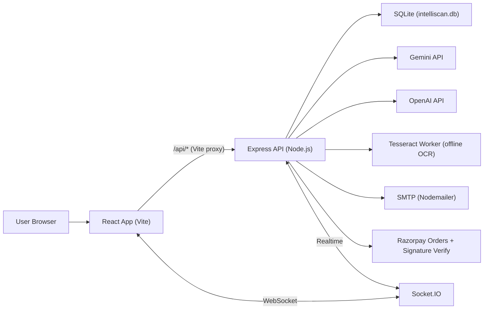
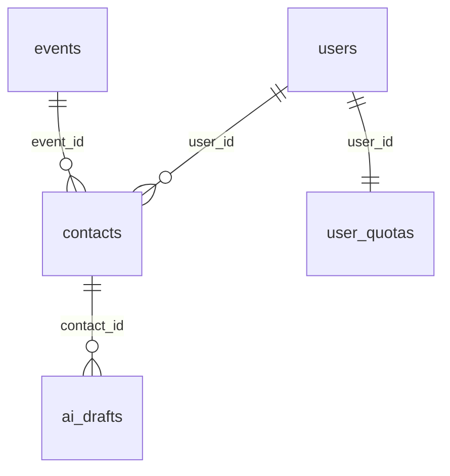
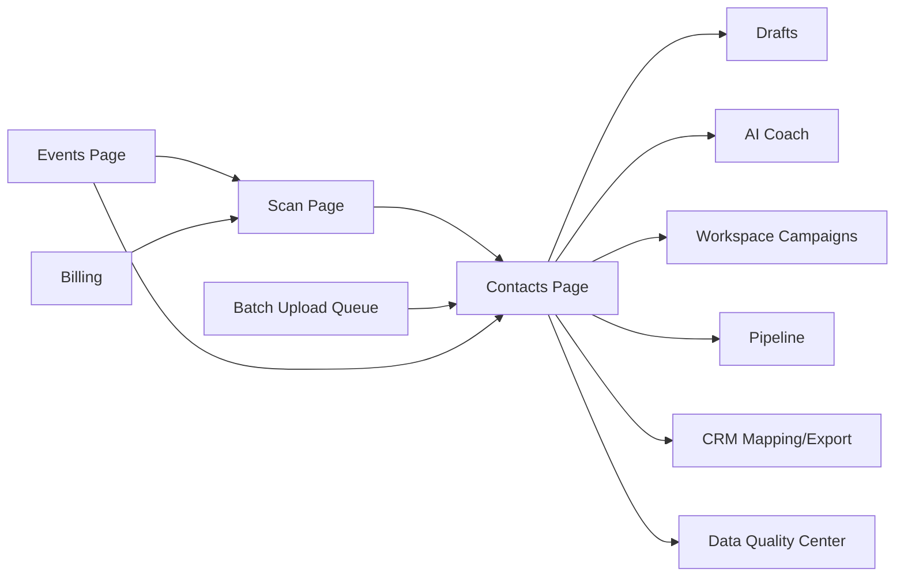

# IntelliScan System Architecture & System Design (Frontend + Backend)

Generated: 2026-04-04
Repo Root: `D:/Anant/Project/CardToExcel/stitch (1)MoreSCreens`

---

## 1) System Summary

IntelliScan is a business-card intelligence platform that captures contacts from images (single, group, and batch), stores them in a workspace-scoped database, and powers downstream workflows like AI drafts, outbound campaigns, routing rules, CRM export, webhooks, and billing-based plan enforcement.

---

## 2) High-Level Architecture



---

## 3) Frontend System Design

### 3.1 Frontend Entry + Providers

- Entry: `intelliscan-app/src/main.jsx`
- Routing: `intelliscan-app/src/App.jsx`
- Providers: RoleProvider (auth bootstrap), ContactProvider (contacts), BatchQueueProvider (batch upload scanning).

### 3.2 Auth Persistence (Stay Signed In)

The frontend persists the session using localStorage and cookies. On app load it validates the stored token via `GET /api/auth/me` and only clears auth on explicit invalid responses (401/403). This prevents being logged out when changing routes or reopening the browser.

- Storage helpers: `intelliscan-app/src/utils/auth.js`
- Bootstrap logic: `intelliscan-app/src/context/RoleContext.jsx`

### 3.3 Routing Areas

- Public: landing, sign-in, sign-up, docs, public profile/booking.
- Dashboard: `/dashboard/*` (personal users).
- Workspace: `/workspace/*` (business/enterprise admin).
- Super Admin: `/admin/*` (platform admin).
- Generated prototype routes: loaded from `src/pages/generated/routes.json`.

---

## 4) Backend System Design

### 4.1 Backend Entry + Modules

- Server entry: `intelliscan-server/index.js`
- DB helper: `intelliscan-server/src/utils/db.js`
- Auth middleware: `intelliscan-server/src/middleware/auth.js`
- Audit log writer: `intelliscan-server/src/utils/logger.js`
- SMTP helper: `intelliscan-server/src/utils/smtp.js`
- OCR worker: `intelliscan-server/src/workers/tesseract_ocr_worker.js`

### 4.2 Tier Limits (Quota Enforcement)

| Tier       | Single Scans / Cycle | Group Scans / Cycle |
| ---------- | -------------------- | ------------------- |
| personal   | 10                   | 1                   |
| pro        | 100                  | 10                  |
| enterprise | 99999                | 99999               |

### 4.3 Feature Flags (Server-Side)

Backend builds an access profile and uses `requireFeature(feature_key)` middleware to allow or deny access. Current feature keys in code:

- `admin_platform`
- `ai_coach`
- `ai_drafts`
- `api_integrations`
- `batch_upload`
- `contacts`
- `dashboard_scan`
- `digital_card`
- `events`
- `kiosk_mode`
- `workspace_analytics`
- `workspace_billing`
- `workspace_campaigns`
- `workspace_contacts`
- `workspace_crm_mapping`
- `workspace_data_policies`
- `workspace_data_quality`
- `workspace_members`
- `workspace_org_chart`
- `workspace_routing_rules`
- `workspace_scanner_links`
- `workspace_shared_rolodex`

### 4.4 Feature Catalog (Human-Friendly)

| Feature Key                | Meaning                                                            |
| -------------------------- | ------------------------------------------------------------------ |
| `admin_platform`           | Super admin platform features (models, incidents, system health)   |
| `ai_coach`                 | AI networking coach insights                                       |
| `ai_drafts`                | AI follow-up drafts (generate, edit, send, queue)                  |
| `api_integrations`         | API sandbox/integrations tooling                                   |
| `batch_upload`             | Batch upload queue for scanning multiple images                    |
| `contacts`                 | Contacts CRM (view/search/delete/export/enrich)                    |
| `dashboard_scan`           | Scan business cards (single + group + batch)                       |
| `digital_card`             | Digital business card + card creator                               |
| `events`                   | Events & campaigns (tag scans to events, filter contacts by event) |
| `kiosk_mode`               | Kiosk/event capture mode                                           |
| `workspace_analytics`      | Analytics dashboards                                               |
| `workspace_billing`        | Billing & usage overview, payment methods, invoices                |
| `workspace_campaigns`      | Workspace AI campaign builder (audience preview + AI copy + send)  |
| `workspace_contacts`       | Workspace-scoped contact access                                    |
| `workspace_crm_mapping`    | CRM mapping + provider connect/disconnect + schema + export        |
| `workspace_data_policies`  | Compliance policies (retention, masking toggles, audit storage)    |
| `workspace_data_quality`   | Data Quality Center (dedupe queue + merge/dismiss)                 |
| `workspace_members`        | Team members and invitations                                       |
| `workspace_org_chart`      | Org chart and relationship intelligence                            |
| `workspace_routing_rules`  | Lead routing rules (if/then) + run rules                           |
| `workspace_scanner_links`  | Scanner links / public scan tokens (workspace tooling)             |
| `workspace_shared_rolodex` | Shared rolodex + workspace chat room                               |

### 4.5 Data Model (Core Tables)

SQLite tables detected in `intelliscan-server/db_schema.txt`. These tables back the pages and workflows described later.

```text
ai_drafts
analytics_logs
api_sandbox_calls
audit_trail
availability_slots
billing_invoices
billing_payment_methods
booking_links
calendar_events
calendar_shares
calendars
campaign_recipients
contact_relationships
contacts
crm_mappings
crm_sync_log
data_quality_dedupe_queue
digital_cards
email_automations
email_campaigns
email_clicks
email_list_contacts
email_lists
email_sends
email_templates
engine_config
event_attendees
event_contact_links
event_reminders
events
integration_sync_jobs
model_versions
onboarding_prefs
platform_incidents
routing_rules
saved_cards
sessions
user_quotas
users
workspace_chats
workspace_policies
```

High-impact relationships (conceptual):



Schema details are documented in `DATA_DICTIONARY_INTELLISCAN_DB.md`.

---

## 5) End-to-End Flows

### 5.1 Scan -> Save -> Contacts (Core Interdependency)

1. Scan pages call `/api/scan` (single) or `/api/scan-multi` (group).
2. The backend runs the unified extraction pipeline (Gemini, then OpenAI, then optional offline OCR).
3. The frontend saves results via `POST /api/contacts` using `ContactContext.addContact()`.
4. Contacts are immediately visible in Contacts page and all downstream workspace tools.

### 5.2 Batch Upload Queue

Batch uploads are handled by a global queue context that runs scans in the background and auto-saves contacts as each scan completes.

### 5.3 Billing Upgrade (Razorpay)

1. Frontend creates an order via `POST /api/billing/create-order`.
2. Razorpay checkout completes on the client.
3. Frontend verifies via `POST /api/billing/verify-payment`.
4. Backend upgrades `users.tier` and refreshes quotas.

---

## 6) Page Catalog (Core Pages + APIs Used)

| Route                                    | Component              | Roles                             | APIs (detected in page file)                                                                                                                                                                                                                                                                  |
| ---------------------------------------- | ---------------------- | --------------------------------- | --------------------------------------------------------------------------------------------------------------------------------------------------------------------------------------------------------------------------------------------------------------------------------------------- |
| /dashboard/scan                          | ScanPage               | user, business_admin, super_admin | /api/contacts, /api/contacts/mutual?company=${encodeURIComponent(extracted.company, /api/events, /api/scan, /api/scan-multi, /api/user/quota                                                                                                                                                  |
| /dashboard/contacts                      | ContactsPage           | user, business_admin, super_admin | /api/contacts/:param/enroll-sequence, /api/contacts/stats, /api/crm/export/${provider, /api/drafts/${generatedDraft.id, /api/drafts/:param/send, /api/drafts/generate, /api/email-sequences                                                                                                   |
| /dashboard/calendar                      | CalendarPage           | business_admin, super_admin       | /api/calendar/calendars, /api/calendar/events, /api/calendar/events/${eventToDelete.id, /api/calendar/events/:param/reschedule, /api/calendar/events?start=:param&end=:param&calendar_ids=${selectedCalendarIds.join(                                                                         |
| /dashboard/calendar/availability         | AvailabilityPage       | business_admin, super_admin       | /api/calendar/availability, /api/calendar/availability/${user.id                                                                                                                                                                                                                              |
| /dashboard/calendar/booking-links        | BookingLinksPage       | business_admin, super_admin       | /api/calendar/booking-links                                                                                                                                                                                                                                                                   |
| /dashboard/events                        | EventsPage             | user, business_admin, super_admin | /api/events                                                                                                                                                                                                                                                                                   |
| /dashboard/drafts                        | DraftsPage             | user, business_admin, super_admin | /api/drafts, /api/drafts/${id, /api/drafts/:param/send                                                                                                                                                                                                                                        |
| /dashboard/coach                         | CoachPage              | user, business_admin, super_admin | /api/coach/insights                                                                                                                                                                                                                                                                           |
| /dashboard/my-card                       | MyCardPage             | user, business_admin, super_admin | /api/cards/generate-design, /api/cards/save, /api/my-card                                                                                                                                                                                                                                     |
| /dashboard/card-creator                  | CardCreatorPage        | user, business_admin, super_admin |                                                                                                                                                                                                                                                                                               |
| /dashboard/kiosk                         | KioskMode              | user, business_admin, super_admin | /api/contacts, /api/events, /api/scan                                                                                                                                                                                                                                                         |
| /dashboard/presence                      | MeetingToolsPage       | user, business_admin, super_admin |                                                                                                                                                                                                                                                                                               |
| /dashboard/signals                       | SignalsPage            | user, business_admin, super_admin |                                                                                                                                                                                                                                                                                               |
| /dashboard/feedback                      | FeedbackPage           | user, business_admin              |                                                                                                                                                                                                                                                                                               |
| /dashboard/settings                      | SettingsPage           | user, business_admin, super_admin | /api/sessions/${id, /api/sessions/me, /api/sessions/others                                                                                                                                                                                                                                    |
| /dashboard/leaderboard                   | Leaderboard            | user, business_admin, super_admin | /api/admin/leaderboard                                                                                                                                                                                                                                                                        |
| /dashboard/email-marketing               | EmailMarketingPage     | business_admin, super_admin       | /api/email/analytics/overview, /api/email/campaigns                                                                                                                                                                                                                                           |
| /dashboard/email-marketing/campaigns     | CampaignListPage       | business_admin, super_admin       | /api/email/campaigns, /api/email/campaigns/${id                                                                                                                                                                                                                                               |
| /dashboard/email-marketing/campaigns/new | CampaignBuilderPage    | business_admin, super_admin       | /api/email/campaigns, /api/email/campaigns/:param/send, /api/email/lists, /api/email/templates, /api/email/templates/generate-ai                                                                                                                                                              |
| /dashboard/email-marketing/campaigns/:id | CampaignDetailPage     | business_admin, super_admin       | /api/email/campaigns/${id                                                                                                                                                                                                                                                                     |
| /dashboard/email-marketing/templates     | TemplateLibraryPage    | business_admin, super_admin       | /api/email/templates                                                                                                                                                                                                                                                                          |
| /dashboard/email-marketing/lists         | ContactListsPage       | business_admin, super_admin       | /api/email/lists, /api/email/lists/${id                                                                                                                                                                                                                                                       |
| /dashboard/email-marketing/lists/:id     | ListDetailPage         | business_admin, super_admin       | /api/contacts, /api/email/lists/${id, /api/email/lists/:param/contacts                                                                                                                                                                                                                        |
| /dashboard/email/sequences               | EmailSequencesPage     | user, business_admin, super_admin | /api/email-sequences                                                                                                                                                                                                                                                                          |
| /workspace/dashboard                     | WorkspaceDashboard     | user, business_admin, super_admin | /api/workspace/analytics                                                                                                                                                                                                                                                                      |
| /workspace/contacts                      | WorkspaceContacts      | user, business_admin, super_admin |                                                                                                                                                                                                                                                                                               |
| /workspace/members                       | MembersPage            | user, business_admin, super_admin | /api/workspace/members, /api/workspace/members/${id, /api/workspace/members/invite                                                                                                                                                                                                            |
| /workspace/scanner-links                 | ScannerLinksPage       | user, business_admin, super_admin |                                                                                                                                                                                                                                                                                               |
| /workspace/crm-mapping                   | CrmMappingPage         | user, business_admin, super_admin | /api/crm/config, /api/crm/config?provider=${provider, /api/crm/connect, /api/crm/disconnect, /api/crm/export/${activeProvider, /api/crm/schema?provider=${activeProvider, /api/crm/schema?provider=${provider, /api/crm/sync-log?provider=:param&limit=20                                     |
| /workspace/routing-rules                 | RoutingRulesPage       | user, business_admin, super_admin | /api/routing-rules, /api/routing-rules/run                                                                                                                                                                                                                                                    |
| /workspace/data-policies                 | DataPoliciesPage       | user, business_admin, super_admin | /api/workspace/data-policies                                                                                                                                                                                                                                                                  |
| /workspace/data-quality                  | DataQualityCenterPage  | user, business_admin, super_admin | /api/workspace/data-quality/dedupe-queue, /api/workspace/data-quality/queue/:param/dismiss, /api/workspace/data-quality/queue/:param/merge                                                                                                                                                    |
| /workspace/analytics                     | AnalyticsPage          | user, business_admin, super_admin | /api/analytics/dashboard?range=${timeRange                                                                                                                                                                                                                                                    |
| /workspace/org-chart                     | OrgChartPage           | user, business_admin, super_admin | /api/org-chart/${encodeURIComponent(company                                                                                                                                                                                                                                                   |
| /workspace/campaigns                     | EmailCampaignsPage     | user, business_admin, super_admin | /api/campaigns, /api/campaigns/audience-preview?${params.toString(, /api/campaigns/auto-write, /api/campaigns/send                                                                                                                                                                            |
| /workspace/billing                       | BillingPage            | user, business_admin, super_admin | /api/billing/create-order, /api/billing/plans, /api/billing/verify-payment, /api/user/quota, /api/workspace/billing/invoices, /api/workspace/billing/invoices/:param/receipt, /api/workspace/billing/invoices/export, /api/workspace/billing/overview, /api/workspace/billing/payment-methods |
| /workspace/shared                        | SharedRolodexPage      | user, business_admin, super_admin | /api/chats/${encodeURIComponent(workspaceRoom, /api/crm/export/${provider, /api/crm/export/csv?token=${encodeURIComponent(getStoredToken(, /api/workspace/contacts, /api/workspace/contacts/duplicates                                                                                        |
| /workspace/pipeline                      | PipelinePage           | user, business_admin, super_admin | /api/contacts/:param/deal, /api/deals                                                                                                                                                                                                                                                         |
| /workspace/webhooks                      | WebhookManagement      | user, business_admin, super_admin | /api/webhooks, /api/webhooks/${id                                                                                                                                                                                                                                                             |
| /admin/dashboard                         | AdminDashboard         | super_admin                       | /api/v2/scan                                                                                                                                                                                                                                                                                  |
| /admin/engine-performance                | EnginePerformance      | super_admin                       | /api/engine/stats                                                                                                                                                                                                                                                                             |
| /admin/feedback                          | SuperAdminFeedbackPage | super_admin                       |                                                                                                                                                                                                                                                                                               |
| /admin/incidents                         | SystemIncidentCenter   | super_admin                       | /api/admin/incidents, /api/admin/incidents/${id, /api/admin/incidents/:param/${action                                                                                                                                                                                                         |
| /admin/custom-models                     | CustomModelsPage       | super_admin                       | /api/admin/models, /api/admin/models/:param/status                                                                                                                                                                                                                                            |
| /admin/integration-health                | JobQueuesPage          | super_admin                       | /api/admin/integrations/failed-syncs/:param/retry, /api/admin/integrations/health                                                                                                                                                                                                             |
| /admin/job-queues                        | JobQueuesPage          | super_admin                       | /api/admin/integrations/failed-syncs/:param/retry, /api/admin/integrations/health                                                                                                                                                                                                             |

Generated prototype routes:

- `/404-system-error-states` (Gen404SystemErrorStates)
- `/advanced-api-explorer-sandbox` (GenAdvancedApiExplorerSandbox)
- `/advanced-api-webhook-monitor` (GenAdvancedApiWebhookMonitor)
- `/advanced-csv-json-export-mapper` (GenAdvancedCsvJsonExportMapper)
- `/advanced-security-audit-logs-1` (GenAdvancedSecurityAuditLogs1)
- `/advanced-security-audit-logs-2` (GenAdvancedSecurityAuditLogs2)
- `/advanced-segment-builder` (GenAdvancedSegmentBuilder)
- `/ai-confidence-audit-feedback-hub` (GenAiConfidenceAuditFeedbackHub)
- `/ai-conflict-resolution-human-in-the-loop` (GenAiConflictResolutionHumanInTheLoop)
- `/ai-maintenance-retraining-logs` (GenAiMaintenanceRetrainingLogs)
- `/ai-model-versioning-rollback` (GenAiModelVersioningRollback)
- `/ai-training-tuning-super-admin` (GenAiTrainingTuningSuperAdmin)
- `/api-integrations` (GenApiIntegrations)
- `/api-performance-webhooks` (GenApiPerformanceWebhooks)
- `/api-webhook-configuration-1` (GenApiWebhookConfiguration1)
- `/api-webhook-configuration-2` (GenApiWebhookConfiguration2)
- `/api-webhook-logs-debugging` (GenApiWebhookLogsDebugging)
- `/audit-logs-security` (GenAuditLogsSecurity)
- `/batch-processing-monitor-user-dashboard` (GenBatchProcessingMonitorUserDashboard)
- `/billing-usage` (GenBillingUsage)
- `/bulk-contact-export-wizard-1` (GenBulkContactExportWizard1)
- `/bulk-contact-export-wizard-2` (GenBulkContactExportWizard2)
- `/bulk-member-invitation-import` (GenBulkMemberInvitationImport)
- `/compliance-data-sovereignty-super-admin` (GenComplianceDataSovereigntySuperAdmin)
- `/compliance-disclosure-legal-center` (GenComplianceDisclosureLegalCenter)
- `/contact-detail-view` (GenContactDetailView)
- `/contact-merge-deduplication` (GenContactMergeDeduplication)
- `/data-export-history-log` (GenDataExportHistoryLog)
- `/data-export-migration` (GenDataExportMigration)
- `/dynamic-dashboard-builder` (GenDynamicDashboardBuilder)
- `/empty-states-no-results-template` (GenEmptyStatesNoResultsTemplate)
- `/enterprise-sso-saml-config` (GenEnterpriseSsoSamlConfig)
- `/enterprise-whitelabel-branding-config` (GenEnterpriseWhitelabelBrandingConfig)
- `/enterprise-whitelabel-branding-config-fixed` (GenEnterpriseWhitelabelBrandingConfigFixed)
- `/error-resolution-center` (GenErrorResolutionCenter)
- `/global-data-retention-archiving` (GenGlobalDataRetentionArchiving)
- `/global-search-intelligence` (GenGlobalSearchIntelligence)
- `/global-search-universal-discovery` (GenGlobalSearchUniversalDiscovery)
- `/global-system-status-page` (GenGlobalSystemStatusPage)
- `/help-center-docs` (GenHelpCenterDocs)
- `/insights-ai-forecasting` (GenInsightsAiForecasting)
- `/interactive-api-payload-explorer` (GenInteractiveApiPayloadExplorer)
- `/interactive-feature-tours-help-overlays` (GenInteractiveFeatureToursHelpOverlays)
- `/maintenance-system-update-mode` (GenMaintenanceSystemUpdateMode)
- `/marketplace-integrations-business-admin` (GenMarketplaceIntegrationsBusinessAdmin)
- `/member-role-permissions-editor-1` (GenMemberRolePermissionsEditor1)
- `/member-role-permissions-editor-2` (GenMemberRolePermissionsEditor2)
- `/member-role-permission-matrix` (GenMemberRolePermissionMatrix)
- `/privacy-gdpr-command-center` (GenPrivacyGdprCommandCenter)
- `/referral-loyalty-dashboard` (GenReferralLoyaltyDashboard)
- `/security-key-mfa-setup` (GenSecurityKeyMfaSetup)
- `/security-threat-monitoring-super-admin` (GenSecurityThreatMonitoringSuperAdmin)
- `/strategic-account-reviews` (GenStrategicAccountReviews)
- `/subscription-plan-comparison` (GenSubscriptionPlanComparison)
- `/system-health-super-admin` (GenSystemHealthSuperAdmin)
- `/system-maintenance-downtime-schedule` (GenSystemMaintenanceDowntimeSchedule)
- `/system-notification-center-super-admin` (GenSystemNotificationCenterSuperAdmin)
- `/usage-quotas-limits` (GenUsageQuotasLimits)
- `/user-feedback-bug-reporting` (GenUserFeedbackBugReporting)
- `/workflow-automations-business-admin` (GenWorkflowAutomationsBusinessAdmin)
- `/workspaces-organizations-super-admin` (GenWorkspacesOrganizationsSuperAdmin)

---

## 7) Page Interdependencies (What Feeds What)

Contacts are the central object. Scanning produces contacts; most other pages consume contacts for workflows like drafts, campaigns, routing, pipeline, CRM export, and org charts.



### 7.1 Interdependency Matrix (Key Pages)

| Page                                       | Produces           | Consumes                 | Why It Depends                                                                               |
| ------------------------------------------ | ------------------ | ------------------------ | -------------------------------------------------------------------------------------------- |
| /dashboard/scan (Scan)                     | Contacts           | Events, Quota/Tier       | Scan uses events for tagging; saved contacts power Contacts and all downstream tools.        |
| /dashboard/contacts (Contacts)             | Drafts, Exports    | Contacts                 | Contacts page is the main consumer of scanned contacts and triggers drafts/campaign exports. |
| /dashboard/events (Events)                 | Events             | Contacts                 | Events tag scans; viewing contacts by event filters the Contacts page.                       |
| /dashboard/drafts (Drafts)                 | Draft status/sends | Contacts                 | Drafts are linked to contacts and used by AI Coach recommendations.                          |
| /dashboard/coach (AI Coach)                | Coaching insights  | Contacts, Draft activity | Coach analyzes engagement and suggests actions based on contacts/drafts.                     |
| /workspace/crm-mapping (CRM Mapping)       | Mappings, Exports  | Contacts                 | CRM export and schema mapping depend on the contacts dataset.                                |
| /workspace/routing-rules (Lead Routing)    | Routing rules      | Contacts                 | Rules are executed against contacts to route/tag leads.                                      |
| /workspace/pipeline (Pipeline)             | Deal updates       | Contacts                 | Deal stages attach to contacts; pipeline is meaningless without contacts.                    |
| /workspace/data-quality (Data Quality)     | Merges/dismissals  | Contacts                 | Dedupe queue is built from existing contacts.                                                |
| /workspace/data-policies (Policies)        | Policy config      | Workspace scope          | Policies affect how data is retained/masked and how audit trails are stored.                 |
| /workspace/campaigns (Workspace Campaigns) | Campaign sends     | Contacts                 | Campaign audience is computed from contacts and their AI-inferred fields.                    |
| /workspace/billing (Billing)               | Orders, invoices   | Tier/quota               | Billing changes tier which changes quotas and feature access across the app.                 |

---

## 8) Backend API Catalog (All `/api/*` Routes in Server)

This list is parsed from the backend server entry (`intelliscan-server/index.js`).

```text
GET /api/access/matrix
GET /api/access/me
GET /api/admin/incidents
POST /api/admin/incidents
DELETE /api/admin/incidents/:id
POST /api/admin/incidents/:id/ack
POST /api/admin/incidents/:id/resolve
GET /api/admin/integrations/failed-syncs
POST /api/admin/integrations/failed-syncs/:id/retry
GET /api/admin/integrations/health
GET /api/admin/leaderboard
GET /api/admin/models
POST /api/admin/models
PUT /api/admin/models/:id/status
GET /api/admin/system/health
GET /api/analytics/dashboard
POST /api/analytics/log
GET /api/analytics/stats
POST /api/auth/login
GET /api/auth/me
POST /api/auth/register
POST /api/billing/create-order
GET /api/billing/plans
POST /api/billing/verify-payment
GET /api/calendar/accept-share/:token
POST /api/calendar/ai/generate-description
POST /api/calendar/ai/suggest-time
PUT /api/calendar/availability
GET /api/calendar/availability/:userId
GET /api/calendar/booking-links
POST /api/calendar/booking-links
GET /api/calendar/booking/:slug
GET /api/calendar/calendars
POST /api/calendar/calendars
DELETE /api/calendar/calendars/:id
PUT /api/calendar/calendars/:id
POST /api/calendar/calendars/:id/share
GET /api/calendar/events
POST /api/calendar/events
DELETE /api/calendar/events/:id
GET /api/calendar/events/:id
PATCH /api/calendar/events/:id/reschedule
GET /api/calendar/respond/:token
GET /api/campaigns
GET /api/campaigns/audience-preview
POST /api/campaigns/auto-write
POST /api/campaigns/send
POST /api/cards/generate-design
POST /api/cards/save
POST /api/chat/support
GET /api/chats/:workspaceId
GET /api/coach/insights
GET /api/contacts
POST /api/contacts
DELETE /api/contacts/:id
PUT /api/contacts/:id/deal
POST /api/contacts/:id/enrich
POST /api/contacts/:id/enroll-sequence
GET /api/contacts/:id/relationships
POST /api/contacts/export-crm
GET /api/contacts/mutual
POST /api/contacts/relationships
GET /api/contacts/semantic-search
GET /api/contacts/stats
POST /api/crm-mappings
GET /api/crm/config
POST /api/crm/config
POST /api/crm/connect
POST /api/crm/disconnect
POST /api/crm/export/:provider
GET /api/crm/schema
GET /api/crm/sync-log
GET /api/deals
GET /api/drafts
POST /api/drafts
DELETE /api/drafts/:id
PUT /api/drafts/:id
POST /api/drafts/:id/send
PUT /api/drafts/:id/send
POST /api/drafts/generate
GET /api/email-sequences
POST /api/email-sequences
GET /api/email/analytics/overview
GET /api/email/campaigns
POST /api/email/campaigns
GET /api/email/campaigns/:id
POST /api/email/campaigns/:id/send
GET /api/email/lists
POST /api/email/lists
GET /api/email/lists/:id
POST /api/email/lists/:id/contacts
GET /api/email/templates
POST /api/email/templates/generate-ai
GET /api/email/track/click/:trackingId
GET /api/email/track/open/:trackingId
GET /api/email/unsubscribe/:trackingId
GET /api/engine/config
PUT /api/engine/config
GET /api/engine/stats
GET /api/engine/versions
POST /api/engine/versions/:id/rollback
GET /api/enterprise/audit-logs
GET /api/enterprise/system-health
GET /api/enterprise/webhooks
GET /api/enterprise/workspaces
GET /api/events
POST /api/events
DELETE /api/events/:id
GET /api/health
GET /api/my-card
POST /api/onboarding
GET /api/org-chart/:company
GET /api/routing-rules
POST /api/routing-rules
POST /api/routing-rules/run
DELETE /api/sandbox/logs
GET /api/sandbox/logs
POST /api/sandbox/test
POST /api/scan
POST /api/scan-multi
GET /api/search/global
DELETE /api/sessions/:id
GET /api/sessions/me
DELETE /api/sessions/others
GET /api/signals
GET /api/user/quota
POST /api/user/simulate-upgrade
GET /api/webhooks
POST /api/webhooks
DELETE /api/webhooks/:id
GET /api/workspace/analytics
GET /api/workspace/billing/invoices
GET /api/workspace/billing/invoices/:id/receipt
GET /api/workspace/billing/invoices/export
GET /api/workspace/billing/overview
GET /api/workspace/billing/payment-methods
POST /api/workspace/billing/payment-methods
POST /api/workspace/billing/payment-methods/:id/set-primary
GET /api/workspace/contacts
GET /api/workspace/contacts/duplicates
GET /api/workspace/data-policies
PUT /api/workspace/data-policies
GET /api/workspace/data-quality/dedupe-queue
POST /api/workspace/data-quality/queue/:id/dismiss
POST /api/workspace/data-quality/queue/:id/merge
```

---

## 9) Folder and File Architecture

This section provides an ASCII tree of the important source folders and a repo-wide file inventory (excluding `node_modules/`, `dist/`, `.git/`, `.sixth/`).

### 9.1 Frontend Source Tree

```text
intelliscan-app/src
├── assets
│   ├── hero.png
│   ├── react.svg
│   └── vite.svg
├── components
│   ├── calendar
│   │   ├── AISchedulingPanel.jsx
│   │   ├── AttendeeInput.jsx
│   │   ├── ColorPicker.jsx
│   │   ├── EventDetailPopover.jsx
│   │   ├── EventModal.jsx
│   │   ├── EventPill.jsx
│   │   ├── MiniCalendar.jsx
│   │   ├── RecurrenceSelector.jsx
│   │   └── TimeGrid.jsx
│   ├── email
│   │   ├── CampaignStatsCard.jsx
│   │   ├── EmailPreview.jsx
│   │   ├── EmailStatusBadge.jsx
│   │   ├── OpenRateBar.jsx
│   │   └── TemplateCard.jsx
│   ├── ActivityTracker.jsx
│   ├── ChatbotWidget.jsx
│   ├── CommandPalette.jsx
│   ├── DevTools.jsx
│   ├── GlobalErrorBoundary.jsx
│   ├── RoleGuard.jsx
│   └── SignalsCard.jsx
├── context
│   ├── BatchQueueContext.jsx
│   ├── ContactContext.jsx
│   └── RoleContext.jsx
├── data
│   └── mockContacts.js
├── hooks
│   └── useDarkMode.jsx
├── layouts
│   ├── AdminLayout.jsx
│   ├── DashboardLayout.jsx
│   └── PublicLayout.jsx
├── pages
│   ├── admin
│   │   ├── CustomModelsPage.jsx
│   │   ├── JobQueuesPage.jsx
│   │   └── SystemIncidentCenter.jsx
│   ├── calendar
│   │   ├── AvailabilityPage.jsx
│   │   ├── BookingLinksPage.jsx
│   │   ├── BookingPage.jsx
│   │   └── CalendarPage.jsx
│   ├── dashboard
│   │   ├── CoachPage.jsx
│   │   ├── DraftsPage.jsx
│   │   ├── EventsPage.jsx
│   │   ├── KioskMode.jsx
│   │   ├── Leaderboard.jsx
│   │   ├── MeetingToolsPage.jsx
│   │   ├── MyCardPage.jsx
│   │   └── SignalsPage.jsx
│   ├── email
│   │   ├── CampaignBuilderPage.jsx
│   │   ├── CampaignDetailPage.jsx
│   │   ├── CampaignListPage.jsx
│   │   ├── ContactListsPage.jsx
│   │   ├── EmailMarketingPage.jsx
│   │   ├── EmailSequencesPage.jsx
│   │   ├── ListDetailPage.jsx
│   │   └── TemplateLibraryPage.jsx
│   ├── generated
│   │   ├── Gen404SystemErrorStates.jsx
│   │   ├── GenAdvancedApiExplorerSandbox.jsx
│   │   ├── GenAdvancedApiWebhookMonitor.jsx
│   │   ├── GenAdvancedCsvJsonExportMapper.jsx
│   │   ├── GenAdvancedSecurityAuditLogs1.jsx
│   │   ├── GenAdvancedSecurityAuditLogs2.jsx
│   │   ├── GenAdvancedSegmentBuilder.jsx
│   │   ├── GenAiConfidenceAuditFeedbackHub.jsx
│   │   ├── GenAiConflictResolutionHumanInTheLoop.jsx
│   │   ├── GenAiMaintenanceRetrainingLogs.jsx
│   │   ├── GenAiModelVersioningRollback.jsx
│   │   ├── GenAiTrainingTuningSuperAdmin.jsx
│   │   ├── GenApiIntegrations.jsx
│   │   ├── GenApiPerformanceWebhooks.jsx
│   │   ├── GenApiWebhookConfiguration1.jsx
│   │   ├── GenApiWebhookConfiguration2.jsx
│   │   ├── GenApiWebhookLogsDebugging.jsx
│   │   ├── GenAuditLogsSecurity.jsx
│   │   ├── GenBatchProcessingMonitorUserDashboard.jsx
│   │   ├── GenBillingUsage.jsx
│   │   ├── GenBulkContactExportWizard1.jsx
│   │   ├── GenBulkContactExportWizard2.jsx
│   │   ├── GenBulkMemberInvitationImport.jsx
│   │   ├── GenComplianceDataSovereigntySuperAdmin.jsx
│   │   ├── GenComplianceDisclosureLegalCenter.jsx
│   │   ├── GenContactDetailView.jsx
│   │   ├── GenContactMergeDeduplication.jsx
│   │   ├── GenDataExportHistoryLog.jsx
│   │   ├── GenDataExportMigration.jsx
│   │   ├── GenDynamicDashboardBuilder.jsx
│   │   ├── GenEmptyStatesNoResultsTemplate.jsx
│   │   ├── GenEnterpriseSsoSamlConfig.jsx
│   │   ├── GenEnterpriseWhitelabelBrandingConfig.jsx
│   │   ├── GenEnterpriseWhitelabelBrandingConfigFixed.jsx
│   │   ├── GenErrorResolutionCenter.jsx
│   │   ├── GenGlobalDataRetentionArchiving.jsx
│   │   ├── GenGlobalSearchIntelligence.jsx
│   │   ├── GenGlobalSearchUniversalDiscovery.jsx
│   │   ├── GenGlobalSystemStatusPage.jsx
│   │   ├── GenHelpCenterDocs.jsx
│   │   ├── GenInsightsAiForecasting.jsx
│   │   ├── GenInteractiveApiPayloadExplorer.jsx
│   │   ├── GenInteractiveFeatureToursHelpOverlays.jsx
│   │   ├── GenMaintenanceSystemUpdateMode.jsx
│   │   ├── GenMarketplaceIntegrationsBusinessAdmin.jsx
│   │   ├── GenMemberRolePermissionMatrix.jsx
│   │   ├── GenMemberRolePermissionsEditor1.jsx
│   │   ├── GenMemberRolePermissionsEditor2.jsx
│   │   ├── GenPrivacyGdprCommandCenter.jsx
│   │   ├── GenReferralLoyaltyDashboard.jsx
│   │   ├── GenSecurityKeyMfaSetup.jsx
│   │   ├── GenSecurityThreatMonitoringSuperAdmin.jsx
│   │   ├── GenStrategicAccountReviews.jsx
│   │   ├── GenSubscriptionPlanComparison.jsx
│   │   ├── GenSystemHealthSuperAdmin.jsx
│   │   ├── GenSystemMaintenanceDowntimeSchedule.jsx
│   │   ├── GenSystemNotificationCenterSuperAdmin.jsx
│   │   ├── GenUsageQuotasLimits.jsx
│   │   ├── GenUserFeedbackBugReporting.jsx
│   │   ├── GenWorkflowAutomationsBusinessAdmin.jsx
│   │   ├── GenWorkspacesOrganizationsSuperAdmin.jsx
│   │   ├── PublicProfile.jsx
│   │   └── routes.json
│   ├── workspace
│   │   ├── CrmMappingPage.jsx
│   │   ├── DataPoliciesPage.jsx
│   │   ├── DataQualityCenterPage.jsx
│   │   ├── EmailCampaignsPage.jsx
│   │   ├── PipelinePage.jsx
│   │   ├── RoutingRulesPage.jsx
│   │   ├── SharedRolodexPage.jsx
│   │   └── WebhookManagement.jsx
│   ├── AdminDashboard.jsx
│   ├── AdvancedApiExplorerSandbox.jsx
│   ├── AiTrainingTuningSuperAdmin.jsx
│   ├── AnalyticsPage.jsx
│   ├── ApiDocsPage.jsx
│   ├── BillingPage.jsx
│   ├── CardCreatorPage.jsx
│   ├── ContactsPage.jsx
│   ├── EnginePerformance.jsx
│   ├── FeedbackPage.jsx
│   ├── ForgotPassword.jsx
│   ├── LandingPage.jsx
│   ├── MarketplacePage.jsx
│   ├── MembersPage.jsx
│   ├── OnboardingPage.jsx
│   ├── OrgChartPage.jsx
│   ├── PublicAnalyticsPage.jsx
│   ├── ScannerLinksPage.jsx
│   ├── ScanPage.jsx
│   ├── SettingsPage.jsx
│   ├── SignInPage.jsx
│   ├── SignUpPage.jsx
│   ├── SuperAdminFeedbackPage.jsx
│   ├── WorkspaceContacts.jsx
│   └── WorkspaceDashboard.jsx
├── utils
│   ├── auth.js
│   └── calendarUtils.js
├── App.css
├── App.jsx
├── index.css
└── main.jsx
```

### 9.2 Backend Source Tree

```text
intelliscan-server/src
├── config
│   └── constants.js
├── middleware
│   └── auth.js
├── routes
│   └── workspaceRoutes.js
├── utils
│   ├── db.js
│   ├── logger.js
│   └── smtp.js
└── workers
    └── tesseract_ocr_worker.js
```

### 9.3 Tools

```text
tools
├── extract_guidelines_pdf_text.mjs
├── generate_data_dictionary_detailed.mjs
├── generate_master_documentation.mjs
└── generate_system_architecture_doc.mjs
```

### 9.4 Repo File Inventory

```text
.env.example
ALL_DOCUMENT_OF_PROJECT/Allfeatures.md
ALL_DOCUMENT_OF_PROJECT/Claude_Prompt_DB_Architecture.md
ALL_DOCUMENT_OF_PROJECT/Claude_Prompt_Full_Project_Audit.md
ALL_DOCUMENT_OF_PROJECT/Competitor_Feature_Analysis_Prompt_and_Report.md
ALL_DOCUMENT_OF_PROJECT/IntelliScan_ActivityDiagrams_AllFeatures.md
ALL_DOCUMENT_OF_PROJECT/IntelliScan_CRM_Mapping_Production_Prompt.md
ALL_DOCUMENT_OF_PROJECT/IntelliScan_ClassDiagrams_AllFeatures.md
ALL_DOCUMENT_OF_PROJECT/IntelliScan_Complete_Architecture.md
ALL_DOCUMENT_OF_PROJECT/IntelliScan_Complete_Project_Overview.md
ALL_DOCUMENT_OF_PROJECT/IntelliScan_Comprehensive_Feature_Diagrams.md
ALL_DOCUMENT_OF_PROJECT/IntelliScan_Context_For_Claude.txt
ALL_DOCUMENT_OF_PROJECT/IntelliScan_Cost_Analysis.md
ALL_DOCUMENT_OF_PROJECT/IntelliScan_Data_Dictionary.md
ALL_DOCUMENT_OF_PROJECT/IntelliScan_Database_Architecture.md
ALL_DOCUMENT_OF_PROJECT/IntelliScan_Detailed_System_Architecture.md
ALL_DOCUMENT_OF_PROJECT/IntelliScan_Feature_Roadmap.md
ALL_DOCUMENT_OF_PROJECT/IntelliScan_Feature_UseCase-Diagrams_InDepth
ALL_DOCUMENT_OF_PROJECT/IntelliScan_Final_Project_Report.md
ALL_DOCUMENT_OF_PROJECT/IntelliScan_Folder_Architecture.md
ALL_DOCUMENT_OF_PROJECT/IntelliScan_Full_Directory_Tree.md
ALL_DOCUMENT_OF_PROJECT/IntelliScan_InteractionDiagrams_AllFeatures.md
ALL_DOCUMENT_OF_PROJECT/IntelliScan_Interview_Questions.md
ALL_DOCUMENT_OF_PROJECT/IntelliScan_Interview_Questions_100.md
ALL_DOCUMENT_OF_PROJECT/IntelliScan_Interview_Questions_100_Vol2.md
ALL_DOCUMENT_OF_PROJECT/IntelliScan_Market_Gap_Analysis.md
ALL_DOCUMENT_OF_PROJECT/IntelliScan_RBAC_Matrix.md
ALL_DOCUMENT_OF_PROJECT/IntelliScan_Ultimate_DB_Architecture.md
ALL_DOCUMENT_OF_PROJECT/IntelliScan_Ultimate_Data_Dictionary.md
ALL_DOCUMENT_OF_PROJECT/IntelliScan_UseCaseDiagrams_AllFeatures.md
ALL_DOCUMENT_OF_PROJECT/PROJECT_ARCHITECTURE.md
ALL_DOCUMENT_OF_PROJECT/bundle_for_claude.js
ALL_DOCUMENT_OF_PROJECT/intelliscan_roadmap_requirements.html
ALL_DOCUMENT_OF_PROJECT/intelliscan_stitch_technicaladdendum.md
APRIL_04_2026_PRESENTATION_PACK.md
DATA_DICTIONARY_INTELLISCAN_DB.md
GUIDELINES_EXTRACT.txt
INTELLISCAN_DATA_DICTIONARY_DETAILED.md
INTELLISCAN_MASTER_DOCUMENTATION.md
INTELLISCAN_SYSTEM_ARCHITECTURE_AND_DESIGN.md
INTELLISCAN_UML_DIAGRAMS_CORE_SET.md
IntelliScan_AI_Future_Roadmap.md
IntelliScan_AI_Integration_Detailed.md
IntelliScan_ActivityDiagrams.md
IntelliScan_ClassDiagrams.md
IntelliScan_Data_Dictionary.md
IntelliScan_Global_ActivityDiagram.md
IntelliScan_Global_InteractionDiagram.md
IntelliScan_InteractionDiagrams.md
IntelliScan_UseCaseDiagrams.md
MCA_GUIDELINES_COMPLIANCE_CHECKLIST.md
MCA_SEM4_MAJOR_PROJECT_REPORT_INTELLISCAN.md
PAGE_HEALTH_REPORT.md
PROJECT_STATUS.md
captures/capture.js
captures/package-lock.json
captures/package.json
captures/screenshots/forgot_password.png
captures/screenshots/landing_page.png
captures/screenshots/onboarding.png
captures/screenshots/sign_in.png
captures/screenshots/sign_up.png
captures/screenshots/super_admin_dashboard.png
captures/screenshots/super_admin_performance.png
captures/screenshots/user_contacts.png
captures/screenshots/user_scan.png
captures/screenshots/user_settings.png
captures/screenshots/workspace_analytics.png
captures/screenshots/workspace_billing.png
captures/screenshots/workspace_contacts.png
captures/screenshots/workspace_dashboard.png
captures/screenshots/workspace_members.png
captures/screenshots/workspace_scanner_links.png
captures/videos/forgot_password.webm
captures/videos/landing_page.webm
captures/videos/onboarding.webm
captures/videos/sign_in.webm
captures/videos/sign_up.webm
captures/videos/super_admin_dashboard.webm
captures/videos/super_admin_performance.webm
captures/videos/user_contacts.webm
captures/videos/user_scan.webm
captures/videos/user_settings.webm
captures/videos/workspace_analytics.webm
captures/videos/workspace_billing.webm
captures/videos/workspace_contacts.webm
captures/videos/workspace_dashboard.webm
captures/videos/workspace_members.webm
captures/videos/workspace_scanner_links.webm
endpoints.txt
intelliscan-app/.env.example
intelliscan-app/.gitignore
intelliscan-app/PROJECT_IMPROVEMENT_PLAN.md
intelliscan-app/README.md
intelliscan-app/build_err.log
intelliscan-app/build_err.txt
intelliscan-app/eslint.config.js
intelliscan-app/index.html
intelliscan-app/lint.txt
intelliscan-app/lint2.txt
intelliscan-app/lint_errors.txt
intelliscan-app/lint_output.txt
intelliscan-app/lint_report.txt
intelliscan-app/lint_results.json
intelliscan-app/package-lock.json
intelliscan-app/package.json
intelliscan-app/postcss.config.js
intelliscan-app/public/favicon.svg
intelliscan-app/public/icons.svg
intelliscan-app/scripts/fix-token-storage.mjs
intelliscan-app/scripts/massReplace.cjs
intelliscan-app/scripts/migrate.js
intelliscan-app/scripts/page-health-audit.mjs
intelliscan-app/src/App.css
intelliscan-app/src/App.jsx
intelliscan-app/src/assets/hero.png
intelliscan-app/src/assets/react.svg
intelliscan-app/src/assets/vite.svg
intelliscan-app/src/components/ActivityTracker.jsx
intelliscan-app/src/components/ChatbotWidget.jsx
intelliscan-app/src/components/CommandPalette.jsx
intelliscan-app/src/components/DevTools.jsx
intelliscan-app/src/components/GlobalErrorBoundary.jsx
intelliscan-app/src/components/RoleGuard.jsx
intelliscan-app/src/components/SignalsCard.jsx
intelliscan-app/src/components/calendar/AISchedulingPanel.jsx
intelliscan-app/src/components/calendar/AttendeeInput.jsx
intelliscan-app/src/components/calendar/ColorPicker.jsx
intelliscan-app/src/components/calendar/EventDetailPopover.jsx
intelliscan-app/src/components/calendar/EventModal.jsx
intelliscan-app/src/components/calendar/EventPill.jsx
intelliscan-app/src/components/calendar/MiniCalendar.jsx
intelliscan-app/src/components/calendar/RecurrenceSelector.jsx
intelliscan-app/src/components/calendar/TimeGrid.jsx
intelliscan-app/src/components/email/CampaignStatsCard.jsx
intelliscan-app/src/components/email/EmailPreview.jsx
intelliscan-app/src/components/email/EmailStatusBadge.jsx
intelliscan-app/src/components/email/OpenRateBar.jsx
intelliscan-app/src/components/email/TemplateCard.jsx
intelliscan-app/src/context/BatchQueueContext.jsx
intelliscan-app/src/context/ContactContext.jsx
intelliscan-app/src/context/RoleContext.jsx
intelliscan-app/src/data/mockContacts.js
intelliscan-app/src/hooks/useDarkMode.jsx
intelliscan-app/src/index.css
intelliscan-app/src/layouts/AdminLayout.jsx
intelliscan-app/src/layouts/DashboardLayout.jsx
intelliscan-app/src/layouts/PublicLayout.jsx
intelliscan-app/src/main.jsx
intelliscan-app/src/pages/AdminDashboard.jsx
intelliscan-app/src/pages/AdvancedApiExplorerSandbox.jsx
intelliscan-app/src/pages/AiTrainingTuningSuperAdmin.jsx
intelliscan-app/src/pages/AnalyticsPage.jsx
intelliscan-app/src/pages/ApiDocsPage.jsx
intelliscan-app/src/pages/BillingPage.jsx
intelliscan-app/src/pages/CardCreatorPage.jsx
intelliscan-app/src/pages/ContactsPage.jsx
intelliscan-app/src/pages/EnginePerformance.jsx
intelliscan-app/src/pages/FeedbackPage.jsx
intelliscan-app/src/pages/ForgotPassword.jsx
intelliscan-app/src/pages/LandingPage.jsx
intelliscan-app/src/pages/MarketplacePage.jsx
intelliscan-app/src/pages/MembersPage.jsx
intelliscan-app/src/pages/OnboardingPage.jsx
intelliscan-app/src/pages/OrgChartPage.jsx
intelliscan-app/src/pages/PublicAnalyticsPage.jsx
intelliscan-app/src/pages/ScanPage.jsx
intelliscan-app/src/pages/ScannerLinksPage.jsx
intelliscan-app/src/pages/SettingsPage.jsx
intelliscan-app/src/pages/SignInPage.jsx
intelliscan-app/src/pages/SignUpPage.jsx
intelliscan-app/src/pages/SuperAdminFeedbackPage.jsx
intelliscan-app/src/pages/WorkspaceContacts.jsx
intelliscan-app/src/pages/WorkspaceDashboard.jsx
intelliscan-app/src/pages/admin/CustomModelsPage.jsx
intelliscan-app/src/pages/admin/JobQueuesPage.jsx
intelliscan-app/src/pages/admin/SystemIncidentCenter.jsx
intelliscan-app/src/pages/calendar/AvailabilityPage.jsx
intelliscan-app/src/pages/calendar/BookingLinksPage.jsx
intelliscan-app/src/pages/calendar/BookingPage.jsx
intelliscan-app/src/pages/calendar/CalendarPage.jsx
intelliscan-app/src/pages/dashboard/CoachPage.jsx
intelliscan-app/src/pages/dashboard/DraftsPage.jsx
intelliscan-app/src/pages/dashboard/EventsPage.jsx
intelliscan-app/src/pages/dashboard/KioskMode.jsx
intelliscan-app/src/pages/dashboard/Leaderboard.jsx
intelliscan-app/src/pages/dashboard/MeetingToolsPage.jsx
intelliscan-app/src/pages/dashboard/MyCardPage.jsx
intelliscan-app/src/pages/dashboard/SignalsPage.jsx
intelliscan-app/src/pages/email/CampaignBuilderPage.jsx
intelliscan-app/src/pages/email/CampaignDetailPage.jsx
intelliscan-app/src/pages/email/CampaignListPage.jsx
intelliscan-app/src/pages/email/ContactListsPage.jsx
intelliscan-app/src/pages/email/EmailMarketingPage.jsx
intelliscan-app/src/pages/email/EmailSequencesPage.jsx
intelliscan-app/src/pages/email/ListDetailPage.jsx
intelliscan-app/src/pages/email/TemplateLibraryPage.jsx
intelliscan-app/src/pages/generated/Gen404SystemErrorStates.jsx
intelliscan-app/src/pages/generated/GenAdvancedApiExplorerSandbox.jsx
intelliscan-app/src/pages/generated/GenAdvancedApiWebhookMonitor.jsx
intelliscan-app/src/pages/generated/GenAdvancedCsvJsonExportMapper.jsx
intelliscan-app/src/pages/generated/GenAdvancedSecurityAuditLogs1.jsx
intelliscan-app/src/pages/generated/GenAdvancedSecurityAuditLogs2.jsx
intelliscan-app/src/pages/generated/GenAdvancedSegmentBuilder.jsx
intelliscan-app/src/pages/generated/GenAiConfidenceAuditFeedbackHub.jsx
intelliscan-app/src/pages/generated/GenAiConflictResolutionHumanInTheLoop.jsx
intelliscan-app/src/pages/generated/GenAiMaintenanceRetrainingLogs.jsx
intelliscan-app/src/pages/generated/GenAiModelVersioningRollback.jsx
intelliscan-app/src/pages/generated/GenAiTrainingTuningSuperAdmin.jsx
intelliscan-app/src/pages/generated/GenApiIntegrations.jsx
intelliscan-app/src/pages/generated/GenApiPerformanceWebhooks.jsx
intelliscan-app/src/pages/generated/GenApiWebhookConfiguration1.jsx
intelliscan-app/src/pages/generated/GenApiWebhookConfiguration2.jsx
intelliscan-app/src/pages/generated/GenApiWebhookLogsDebugging.jsx
intelliscan-app/src/pages/generated/GenAuditLogsSecurity.jsx
intelliscan-app/src/pages/generated/GenBatchProcessingMonitorUserDashboard.jsx
intelliscan-app/src/pages/generated/GenBillingUsage.jsx
intelliscan-app/src/pages/generated/GenBulkContactExportWizard1.jsx
intelliscan-app/src/pages/generated/GenBulkContactExportWizard2.jsx
intelliscan-app/src/pages/generated/GenBulkMemberInvitationImport.jsx
intelliscan-app/src/pages/generated/GenComplianceDataSovereigntySuperAdmin.jsx
intelliscan-app/src/pages/generated/GenComplianceDisclosureLegalCenter.jsx
intelliscan-app/src/pages/generated/GenContactDetailView.jsx
intelliscan-app/src/pages/generated/GenContactMergeDeduplication.jsx
intelliscan-app/src/pages/generated/GenDataExportHistoryLog.jsx
intelliscan-app/src/pages/generated/GenDataExportMigration.jsx
intelliscan-app/src/pages/generated/GenDynamicDashboardBuilder.jsx
intelliscan-app/src/pages/generated/GenEmptyStatesNoResultsTemplate.jsx
intelliscan-app/src/pages/generated/GenEnterpriseSsoSamlConfig.jsx
intelliscan-app/src/pages/generated/GenEnterpriseWhitelabelBrandingConfig.jsx
intelliscan-app/src/pages/generated/GenEnterpriseWhitelabelBrandingConfigFixed.jsx
intelliscan-app/src/pages/generated/GenErrorResolutionCenter.jsx
intelliscan-app/src/pages/generated/GenGlobalDataRetentionArchiving.jsx
intelliscan-app/src/pages/generated/GenGlobalSearchIntelligence.jsx
intelliscan-app/src/pages/generated/GenGlobalSearchUniversalDiscovery.jsx
intelliscan-app/src/pages/generated/GenGlobalSystemStatusPage.jsx
intelliscan-app/src/pages/generated/GenHelpCenterDocs.jsx
intelliscan-app/src/pages/generated/GenInsightsAiForecasting.jsx
intelliscan-app/src/pages/generated/GenInteractiveApiPayloadExplorer.jsx
intelliscan-app/src/pages/generated/GenInteractiveFeatureToursHelpOverlays.jsx
intelliscan-app/src/pages/generated/GenMaintenanceSystemUpdateMode.jsx
intelliscan-app/src/pages/generated/GenMarketplaceIntegrationsBusinessAdmin.jsx
intelliscan-app/src/pages/generated/GenMemberRolePermissionMatrix.jsx
intelliscan-app/src/pages/generated/GenMemberRolePermissionsEditor1.jsx
intelliscan-app/src/pages/generated/GenMemberRolePermissionsEditor2.jsx
intelliscan-app/src/pages/generated/GenPrivacyGdprCommandCenter.jsx
intelliscan-app/src/pages/generated/GenReferralLoyaltyDashboard.jsx
intelliscan-app/src/pages/generated/GenSecurityKeyMfaSetup.jsx
intelliscan-app/src/pages/generated/GenSecurityThreatMonitoringSuperAdmin.jsx
intelliscan-app/src/pages/generated/GenStrategicAccountReviews.jsx
intelliscan-app/src/pages/generated/GenSubscriptionPlanComparison.jsx
intelliscan-app/src/pages/generated/GenSystemHealthSuperAdmin.jsx
intelliscan-app/src/pages/generated/GenSystemMaintenanceDowntimeSchedule.jsx
intelliscan-app/src/pages/generated/GenSystemNotificationCenterSuperAdmin.jsx
intelliscan-app/src/pages/generated/GenUsageQuotasLimits.jsx
intelliscan-app/src/pages/generated/GenUserFeedbackBugReporting.jsx
intelliscan-app/src/pages/generated/GenWorkflowAutomationsBusinessAdmin.jsx
intelliscan-app/src/pages/generated/GenWorkspacesOrganizationsSuperAdmin.jsx
intelliscan-app/src/pages/generated/PublicProfile.jsx
intelliscan-app/src/pages/generated/routes.json
intelliscan-app/src/pages/workspace/CrmMappingPage.jsx
intelliscan-app/src/pages/workspace/DataPoliciesPage.jsx
intelliscan-app/src/pages/workspace/DataQualityCenterPage.jsx
intelliscan-app/src/pages/workspace/EmailCampaignsPage.jsx
intelliscan-app/src/pages/workspace/PipelinePage.jsx
intelliscan-app/src/pages/workspace/RoutingRulesPage.jsx
intelliscan-app/src/pages/workspace/SharedRolodexPage.jsx
intelliscan-app/src/pages/workspace/WebhookManagement.jsx
intelliscan-app/src/utils/auth.js
intelliscan-app/src/utils/calendarUtils.js
intelliscan-app/tailwind.config.js
intelliscan-app/temp_lint_reader.cjs
intelliscan-app/temp_lint_reader.js
intelliscan-app/vite.config.js
intelliscan-server/.env
intelliscan-server/.env.example
intelliscan-server/College_Document/IntelliScan_ActivityDiagram_Complete.md
intelliscan-server/College_Document/IntelliScan_System_Architecture_Complete.md
intelliscan-server/College_Document/IntelliScan_UseCaseDiagram_Complete.md
intelliscan-server/College_Document/Presentation-1_intelliscan.md
intelliscan-server/College_Document/Presentation-2_intelliscan.md
intelliscan-server/api_routes.txt
intelliscan-server/bracket_audit.txt
intelliscan-server/bracket_audit_utf8.txt
intelliscan-server/database.sqlite
intelliscan-server/db_schema.txt
intelliscan-server/dump_schema_intelliscan_db.cjs
intelliscan-server/eng.traineddata
intelliscan-server/ensure_tables.js
intelliscan-server/fix_admin.js
intelliscan-server/full_err.txt
intelliscan-server/get_schema.js
intelliscan-server/index.js
intelliscan-server/intelliscan-database.sqlite
intelliscan-server/intelliscan.db
intelliscan-server/package-lock.json
intelliscan-server/package.json
intelliscan-server/parsed_schema.sql
intelliscan-server/seed_requested_users.js
intelliscan-server/server-err.log
intelliscan-server/server-out.log
intelliscan-server/src/config/constants.js
intelliscan-server/src/middleware/auth.js
intelliscan-server/src/routes/workspaceRoutes.js
intelliscan-server/src/utils/db.js
intelliscan-server/src/utils/logger.js
intelliscan-server/src/utils/smtp.js
intelliscan-server/src/workers/tesseract_ocr_worker.js
intelliscan-server/syntax_err.txt
intelliscan-server/syntax_errors.txt
intelliscan-server/target_tail.txt
intelliscan-server/test_models.js
intelliscan-server/test_output.txt
intelliscan-server/tests/auth.test.js
intelliscan-server/tests/pipeline.test.js
matches.txt
mock_search_results.csv
routes.txt
tools/extract_guidelines_pdf_text.mjs
tools/generate_data_dictionary_detailed.mjs
tools/generate_master_documentation.mjs
tools/generate_system_architecture_doc.mjs
```

---

## 10) References (Authoritative)

- DB dictionary: `DATA_DICTIONARY_INTELLISCAN_DB.md`
- Master documentation: `INTELLISCAN_MASTER_DOCUMENTATION.md`
- MCA guideline-aligned report: `MCA_SEM4_MAJOR_PROJECT_REPORT_INTELLISCAN.md`
