# IntelliScan UML Diagrams (Core Set)

Generated: 2026-04-04  
Format: Mermaid.js (`flowchart`, `stateDiagram-v2`, `sequenceDiagram`, `classDiagram`)

This file contains:

1. One Use Case Diagram (full system, core roles).
2. Five Activity Diagrams (based on five key use cases).
3. Five Interaction (Sequence) Diagrams (same five use cases).
4. Five Class Diagrams (same five use cases).

---

## A) Use Case Diagram (1)

### Use Case Diagram: IntelliScan (All Roles, Core Capabilities)

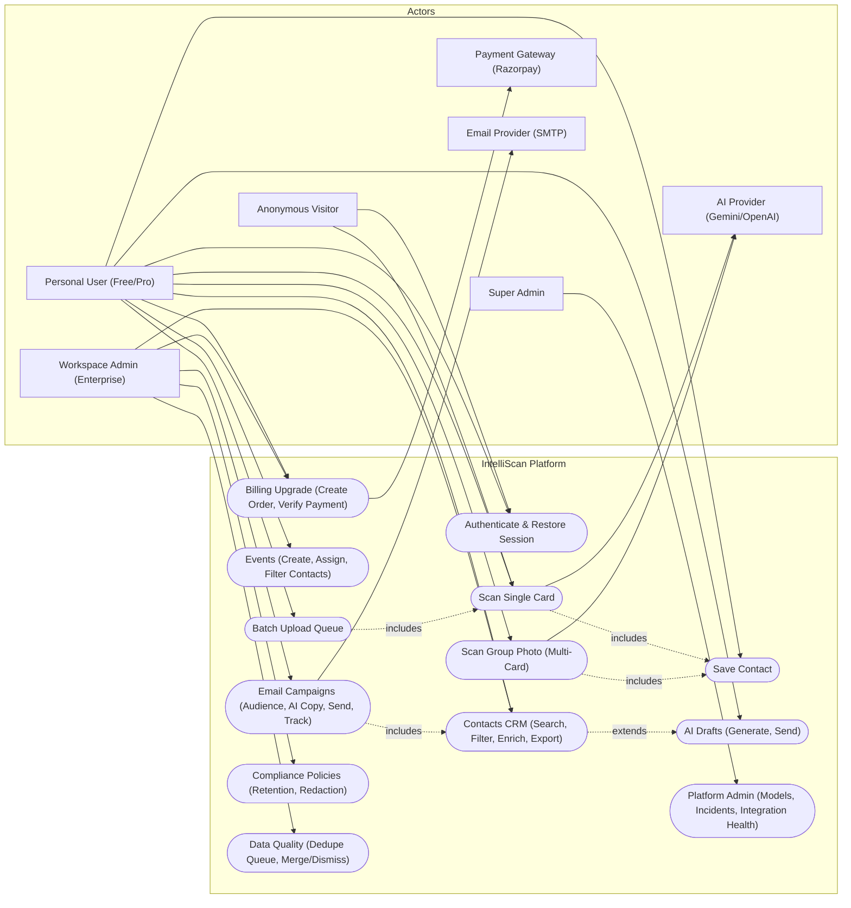

Key use cases selected for the remaining diagrams:

1. Authenticate & Restore Session
2. Scan Single Card -> Save Contact -> Contacts
3. Scan Group Photo -> Save All -> Contacts
4. Email Campaigns -> Send -> Track
5. Billing Upgrade -> Tier/Quota Update

---

## B) Activity Diagrams (5)

### Activity 1: Authenticate & Restore Session

```mermaid
flowchart TD
  A([Open App]) --> B{Token Present in Storage?}
  B -- No --> C([Route to /sign-in])
  B -- Yes --> D[Load stored user role/tier (optimistic)]
  D --> E[GET /api/auth/me]
  E --> F{Response}
  F -- 200 OK --> G[Update local user profile]
  G --> H([Resolve home route and render layout])
  F -- 401/403 --> I[Clear storage + cookies]
  I --> C
  F -- 5xx/Network --> J[Keep optimistic session]
  J --> H
```

### Activity 2: Single Card Scan -> Save Contact

```mermaid
flowchart TD
  A([Upload single-card image]) --> B{Validate file type/size}
  B -- Invalid --> C([Show UI error])
  B -- Valid --> D[GET /api/user/quota]
  D --> E{Quota OK?}
  E -- No --> F([Show upgrade prompt])
  E -- Yes --> G[POST /api/scan (imageBase64, mimeType)]
  G --> H{Extraction OK?}
  H -- No --> I([Show failure banner])
  H -- Yes --> J[Render extraction preview]
  J --> K([User clicks Save Contact])
  K --> L[POST /api/contacts (normalized fields + event_id + image_url)]
  L --> M{Saved?}
  M -- 409 Duplicate --> N([Show duplicate warning])
  M -- 403 Limit --> F
  M -- 200 OK --> O[Update ContactContext state]
  O --> P([Contact appears in Contacts + downstream pages])
```

### Activity 3: Group Photo Scan -> Save All New

```mermaid
flowchart TD
  A([Upload group-photo image]) --> B[GET /api/user/quota]
  B --> C{Group quota OK?}
  C -- No --> D([Show upgrade prompt])
  C -- Yes --> E[POST /api/scan-multi]
  E --> F{Cards detected?}
  F -- No --> G([Show "no cards detected" help state])
  F -- Yes --> H[Normalize cards + mark duplicates]
  H --> I([Render results table: 2-25 cards])
  I --> J([User clicks Save All New])
  J --> K{For each card not duplicate}
  K --> L[POST /api/contacts]
  L --> M{Saved?}
  M -- Duplicate --> N[Mark as duplicate in UI]
  M -- Success --> O[Mark as saved in UI]
  O --> P([Contacts list updates immediately])
```

### Activity 4: Email Campaign (Audience -> AI Copy -> Send -> Track)

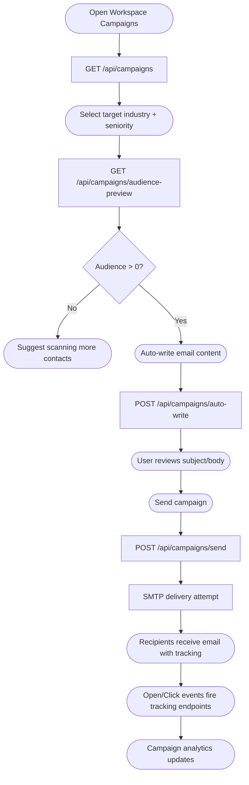

### Activity 5: Billing Upgrade (Razorpay) -> Tier/Quota Refresh

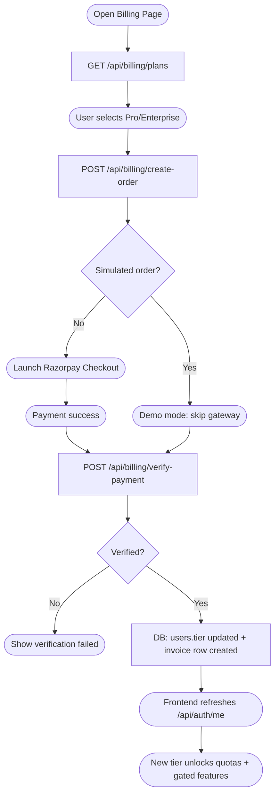

---

## C) Interaction (Sequence) Diagrams (5)

### Interaction 1: Session Restore on App Load

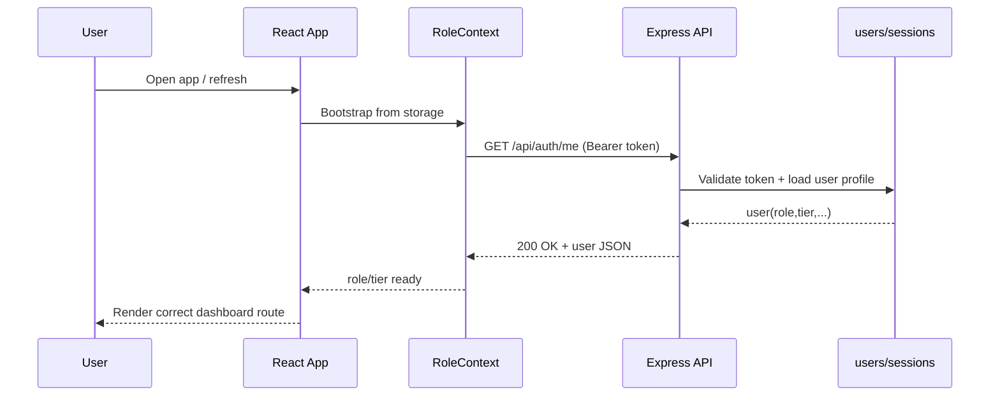

### Interaction 2: Single Scan -> Save Contact

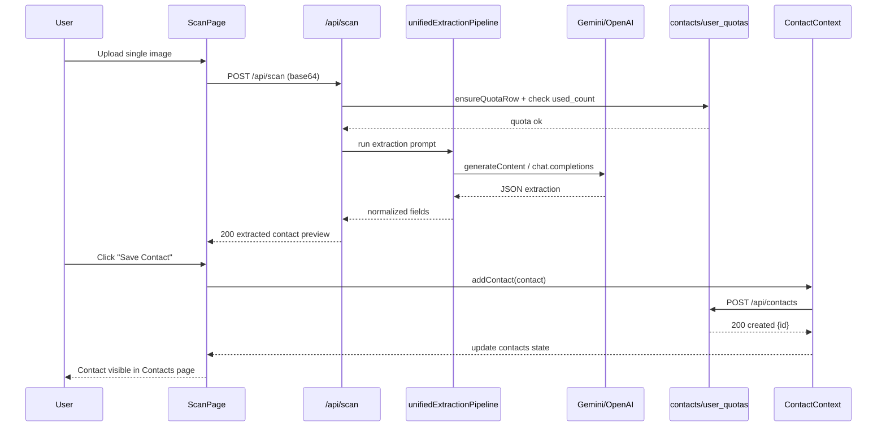

### Interaction 3: Group Scan -> Save All

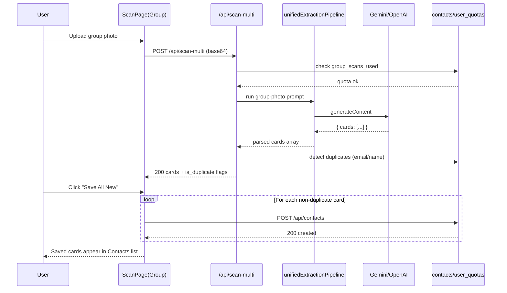

### Interaction 4: Email Campaign Send + Tracking

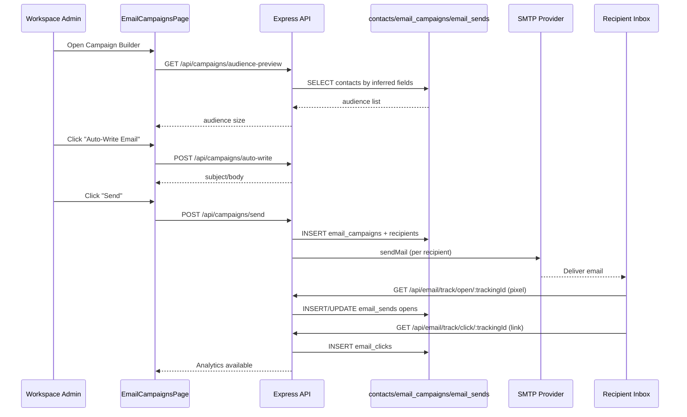

### Interaction 5: Billing Upgrade (Razorpay)

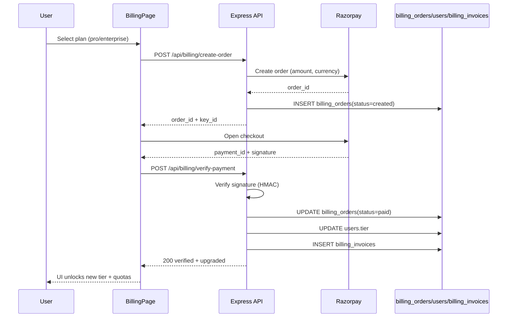

---

## D) Class Diagrams (5)

### Class 1: Authentication & Access Profile

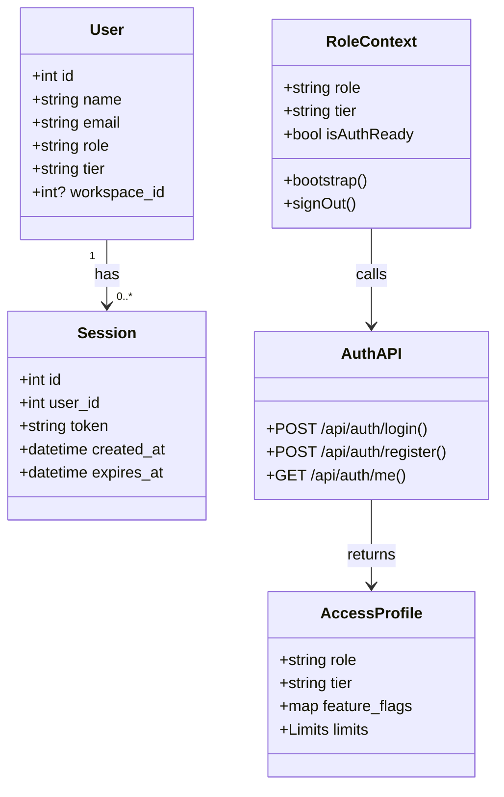

### Class 2: Single Scan Pipeline

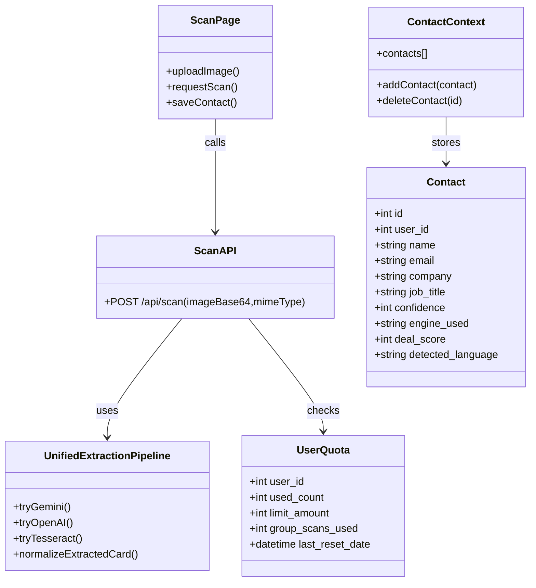

### Class 3: Group Scan Pipeline

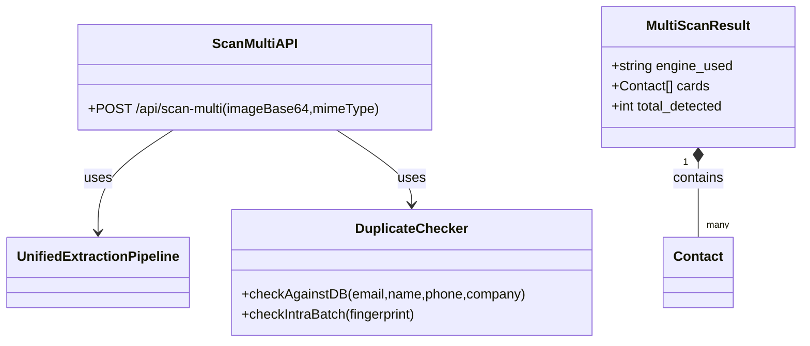

### Class 4: Email Campaign System

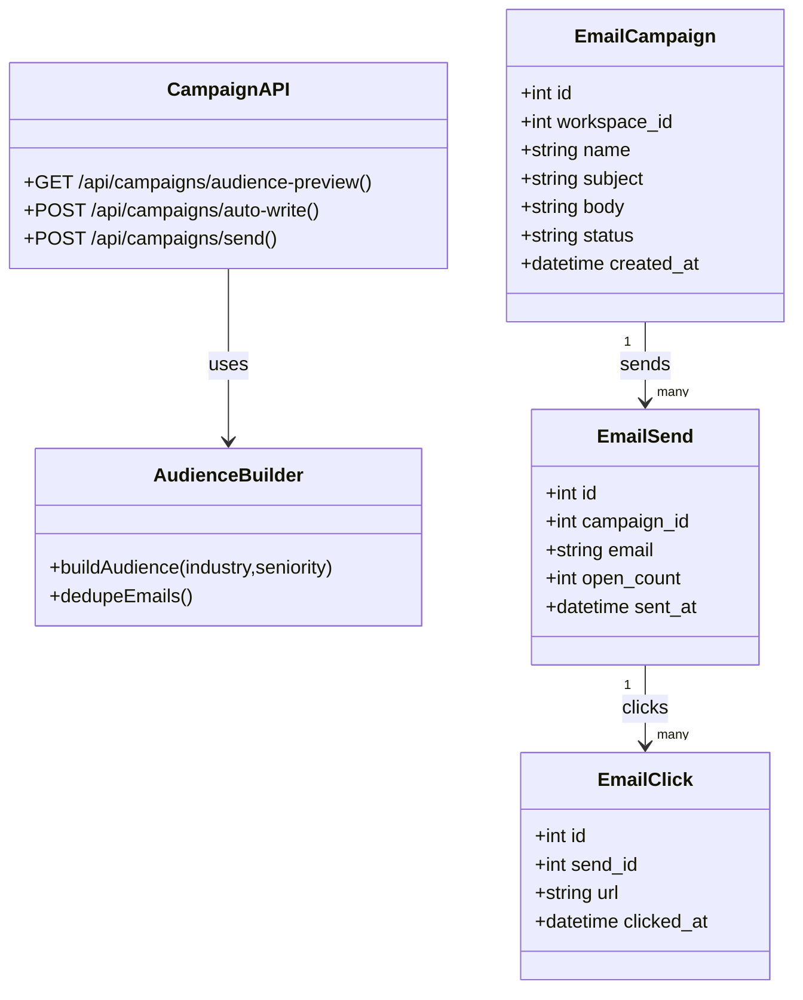

### Class 5: Billing (Razorpay) + Invoices

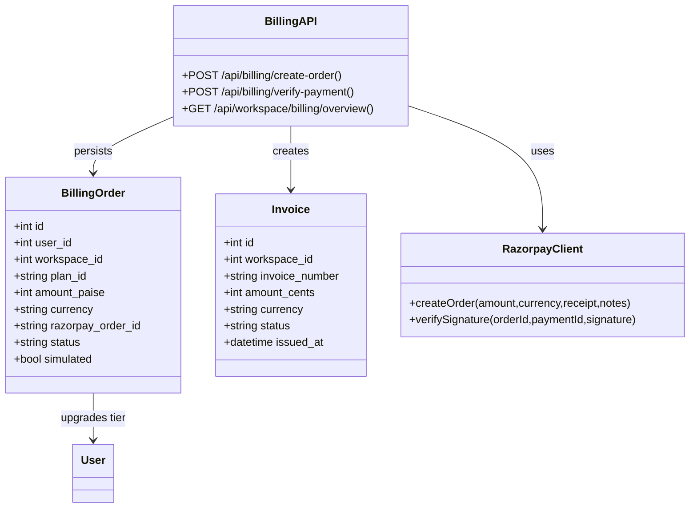

