# IntelliScan — Complete Activity Diagrams (All Features)

> Every diagram below uses valid **Mermaid.js** `stateDiagram-v2` or `flowchart TD` syntax to represent the Activity workflows and state changes for the 20 core features of IntelliScan.
> Paste any block into [mermaid.live](https://mermaid.live) to see the rendered graphic.

---

## FEATURE 1: Authentication & User Onboarding Workflow
**Description**: The process flow from an anonymous user hitting the landing page through registration and completing the onboarding wizard.

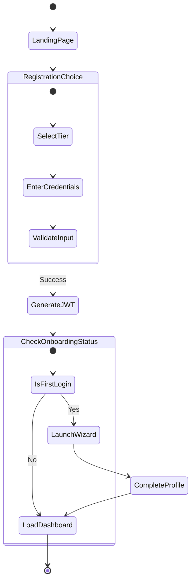

---

## FEATURE 2: Single Card OCR Scanning Workflow
**Description**: The step-by-step pipeline when a user uploads a photo of a single business card.

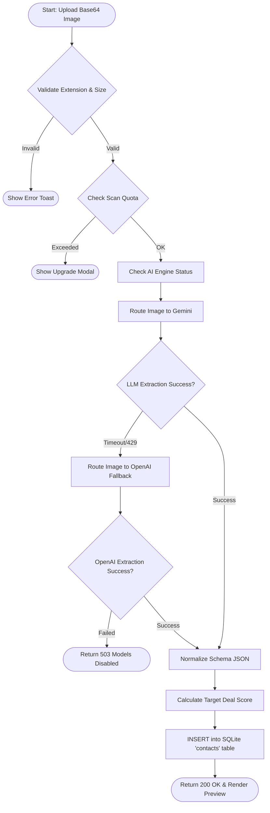

---

## FEATURE 3: Multi-Card Group Scanner Workflow
**Description**: The logic flow for enterprise users taking a photo of a large group of cards scattered on a table.

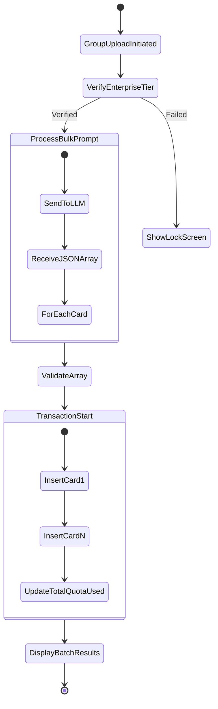

---

## FEATURE 4: Contact Management (CRUD) Workflow
**Description**: The interaction flow for users browsing and modifying their digital Rolodex.

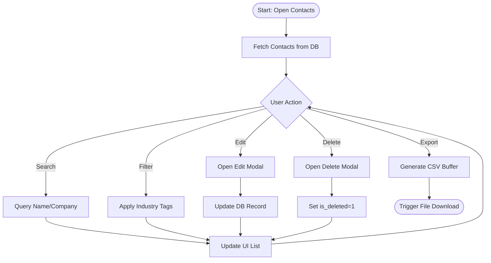

---

## FEATURE 5: AI Dual-Engine Fallback Workflow
**Description**: The high-level resilience workflow that forces failovers during API outages.

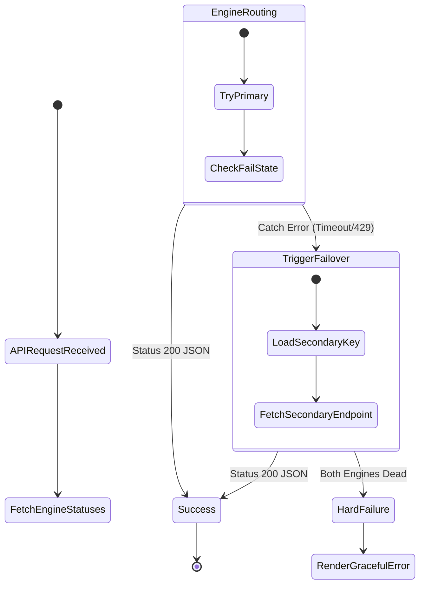

---

## FEATURE 6: Calendar & Event Scheduling Workflow
**Description**: How the app creates an event, triggers the ghostwriter, and handles SMTP email distribution.

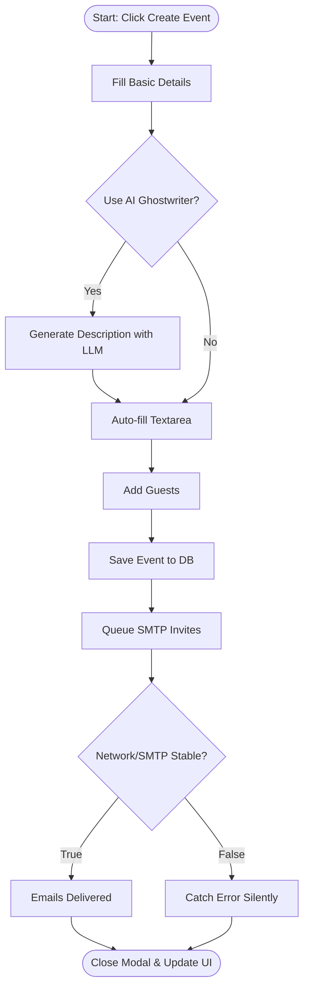

---

## FEATURE 7: AI Networking Coach Workflow
**Description**: The automated logic that parses the database to build a user's actionable "health" dashboard.

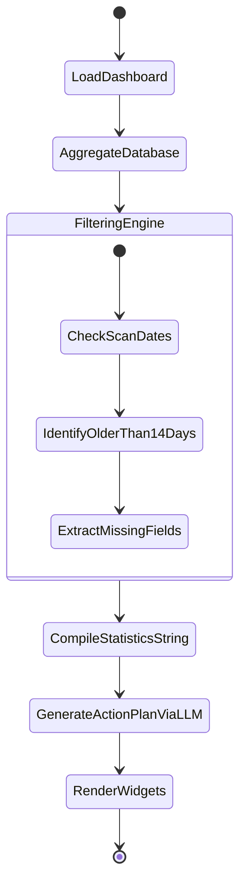

---

## FEATURE 8: Email Marketing Campaigns Workflow
**Description**: The flow for creating an HTML campaign, targeting users, and firing the tracking dispatch.

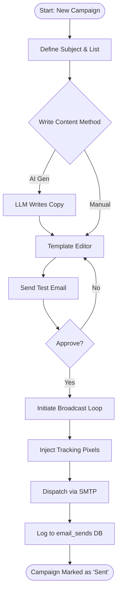

---

## FEATURE 9: CRM Integration (Salesforce / HubSpot) Workflow
**Description**: Step-by-step logic for mapping custom fields and performing an API-based push to an external CRM.

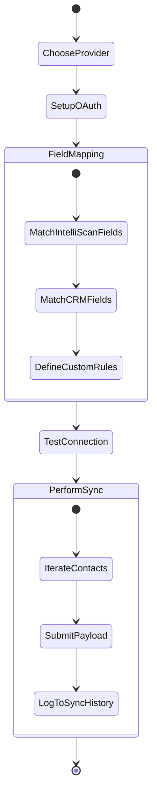

---

## FEATURE 10: Gamified Leaderboard Workflow
**Description**: Execution flow for calculating points across a workspace based on scans.

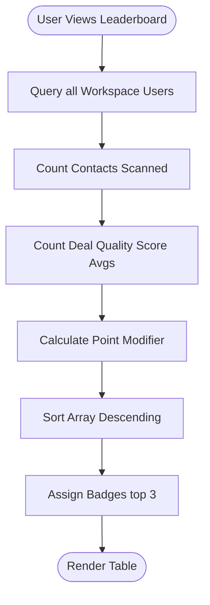

---

## FEATURE 11: Digital Card Creator Workflow
**Description**: Flow for personalizing a digital profile and creating a shareable public link.

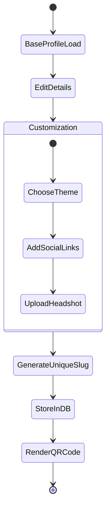

---

## FEATURE 12: SuperAdmin Engine Management Workflow
**Description**: The logic handling when a Super Admin deploys or pauses a global AI Engine.

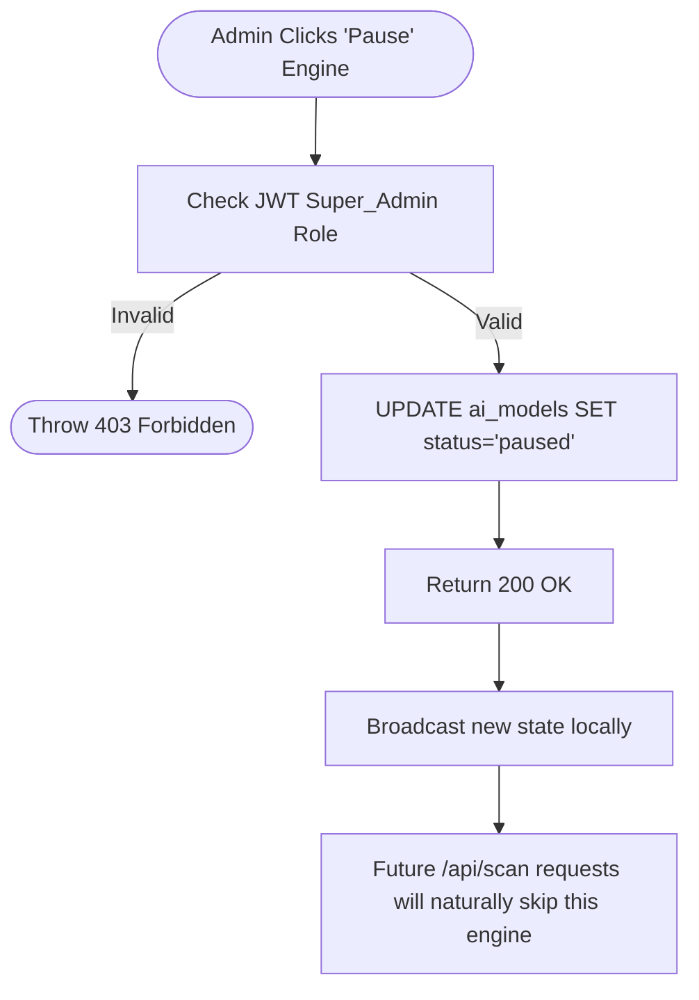

---

## FEATURE 13: Workspace Collaboration Workflow
**Description**: Inviting users to join a team pipeline and sharing contacts to the collective Rolodex.

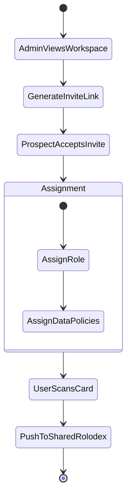

---

## FEATURE 14: Analytics & Reporting Workflow
**Description**: Executing complex aggregation queries to display real-time global telemetry.

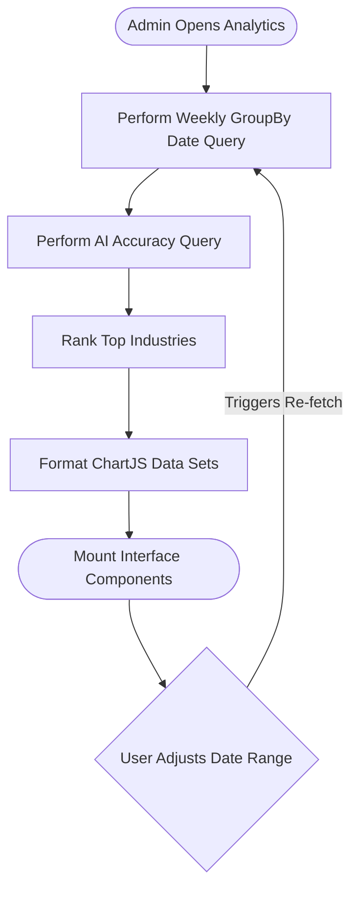

---

## FEATURE 15: Billing & Subscriptions Workflow
**Description**: Attempting an upgrade, checking with Payment Gateway, and altering the quota limits.

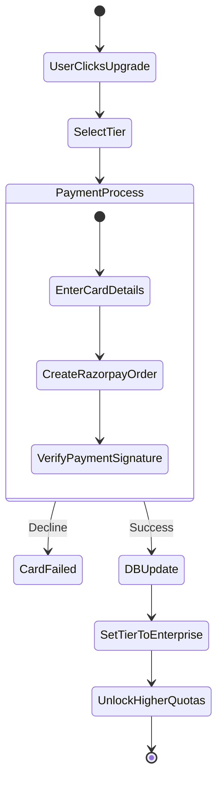

---

## FEATURE 16: AI Drafts & Auto-Responder Workflow
**Description**: Selecting a contact, fetching their context, and drafting an outreach email.

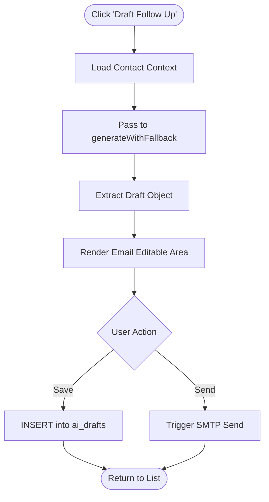

---

## FEATURE 17: Kiosk Mode Conference Workflow
**Description**: The specialized rapid-fire UI loop that never leaves the camera screen.

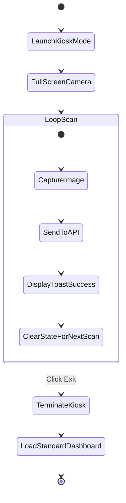

---

## FEATURE 18: Meeting Presence & Signals Workflow
**Description**: Tracking event attendees and assessing lead quality based on interaction.

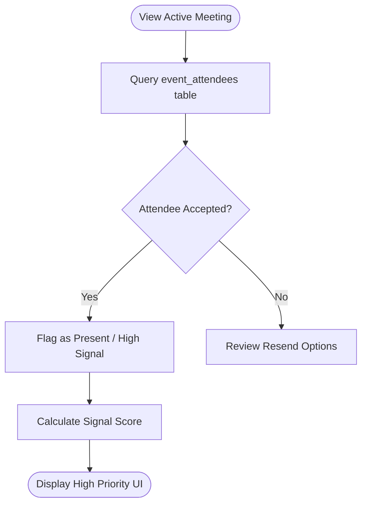

---

## FEATURE 19: Settings & Profile Config Workflow
**Description**: Altering core user configurations such as themes and API Keys.

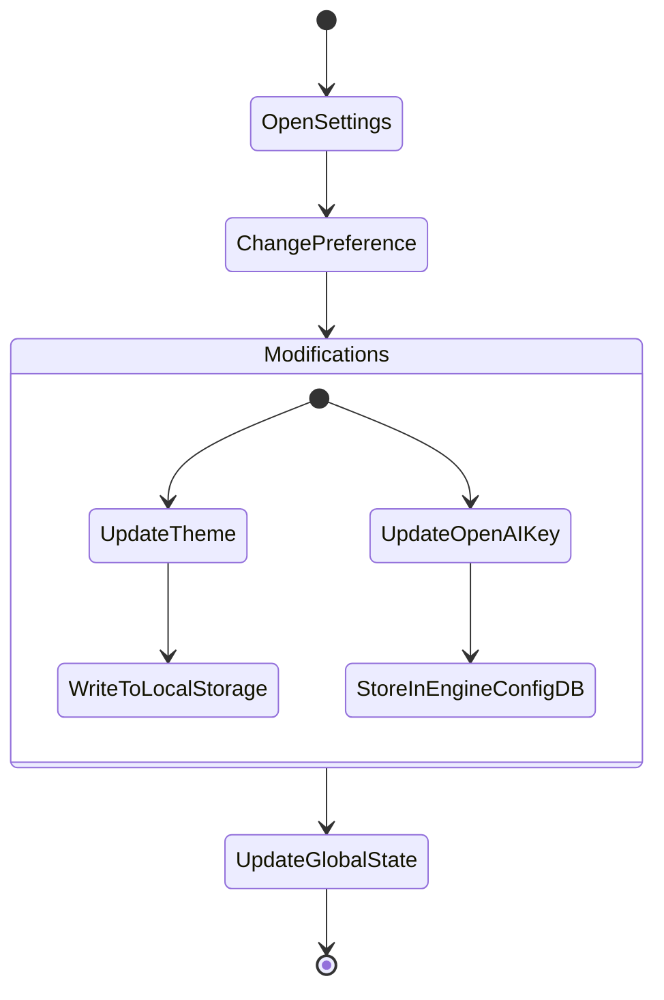

---

## FEATURE 20: Support Chatbot Workflow
**Description**: Users seeking help via the platform's omnipresent AI assistant widget.

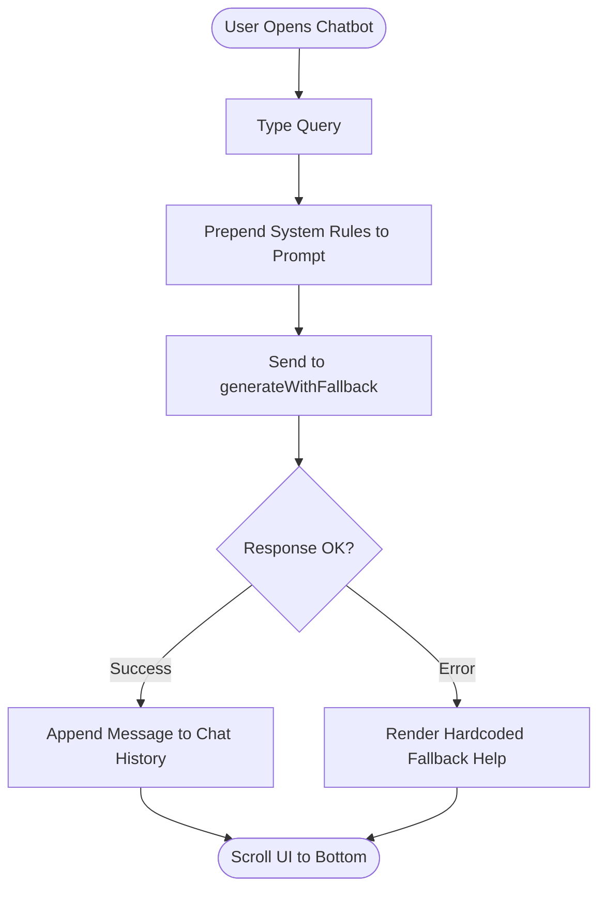
