# IntelliScan — Complete Class Diagrams (All Features)

> Every diagram below uses valid **Mermaid.js** `classDiagram` syntax to map out the static object structures, inheritance, attributes, and methods of the platform’s 20 core features.
> Paste any block into [mermaid.live](https://mermaid.live) to render the object relationship map.

---

## FEATURE 1: Authentication & User Onboarding

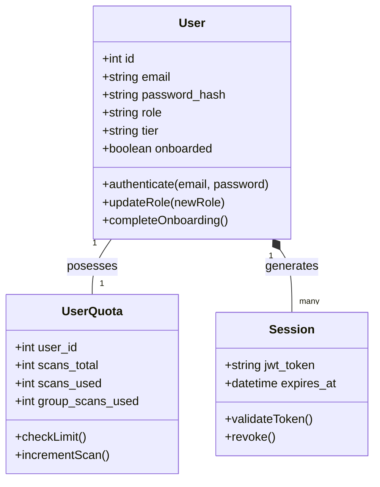
```mermaid
classDiagram
    class User {
        +int id
        +string email
        +string password_hash
        +string role
        +string tier
        +boolean onboarded
        +authenticate(email, password)
        +updateRole(newRole)
        +completeOnboarding()
    }
    class UserQuota {
        +int user_id
        +int scans_total
        +int scans_used
        +int group_scans_used
        +checkLimit()
        +incrementScan()
    }
    class Session {
        +string jwt_token
        +datetime expires_at
        +validateToken()
        +revoke()
    }

    User "1" -- "1" UserQuota : posesses
    User "1" *-- "many" Session : generates
```

---

## FEATURE 2: Single Card OCR Scanner

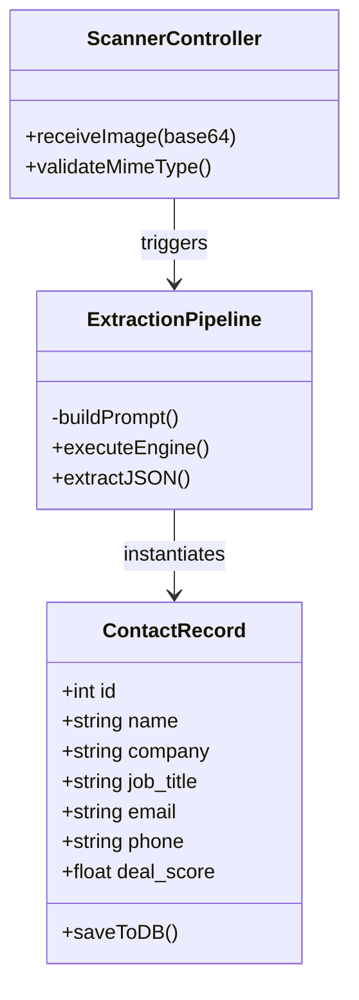
```mermaid
classDiagram
    class ScannerController {
        +receiveImage(base64)
        +validateMimeType()
    }
    class ExtractionPipeline {
        -buildPrompt()
        +executeEngine()
        +extractJSON()
    }
    class ContactRecord {
        +int id
        +string name
        +string company
        +string job_title
        +string email
        +string phone
        +float deal_score
        +saveToDB()
    }

    ScannerController --> ExtractionPipeline : triggers
    ExtractionPipeline --> ContactRecord : instantiates
```

---

## FEATURE 3: Multi-Card Group Scanner

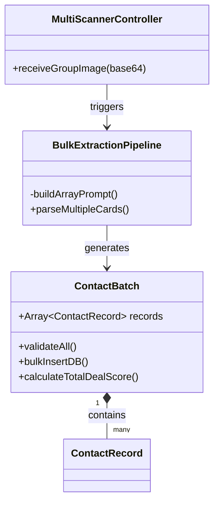
```mermaid
classDiagram
    class MultiScannerController {
        +receiveGroupImage(base64)
    }
    class BulkExtractionPipeline {
        -buildArrayPrompt()
        +parseMultipleCards()
    }
    class ContactBatch {
        +Array~ContactRecord~ records
        +validateAll()
        +bulkInsertDB()
        +calculateTotalDealScore()
    }

    MultiScannerController --> BulkExtractionPipeline : triggers
    BulkExtractionPipeline --> ContactBatch : generates
    ContactBatch "1" *-- "many" ContactRecord : contains
```

---

## FEATURE 4: Contact Management (CRUD)

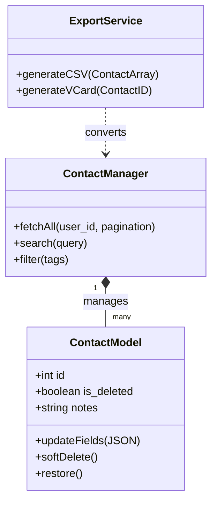
```mermaid
classDiagram
    class ContactManager {
        +fetchAll(user_id, pagination)
        +search(query)
        +filter(tags)
    }
    class ContactModel {
        +int id
        +boolean is_deleted
        +string notes
        +updateFields(JSON)
        +softDelete()
        +restore()
    }
    class ExportService {
        +generateCSV(ContactArray)
        +generateVCard(ContactID)
    }

    ContactManager "1" *-- "many" ContactModel : manages
    ExportService ..> ContactManager : converts
```

---

## FEATURE 5: AI Dual-Engine Fallback

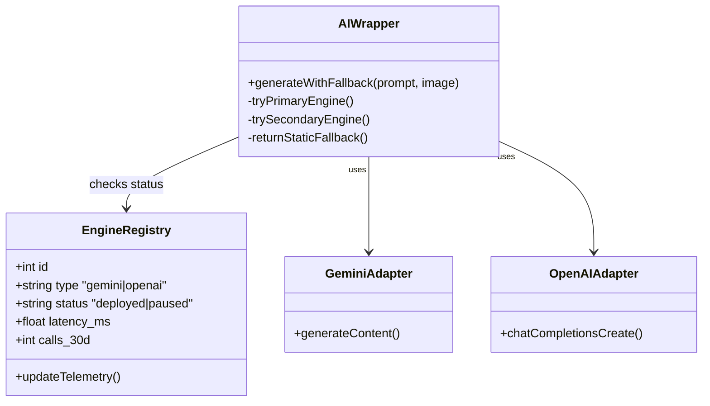
```mermaid
classDiagram
    class EngineRegistry {
        +int id
        +string type "gemini|openai"
        +string status "deployed|paused"
        +float latency_ms
        +int calls_30d
        +updateTelemetry()
    }
    class AIWrapper {
        +generateWithFallback(prompt, image)
        -tryPrimaryEngine()
        -trySecondaryEngine()
        -returnStaticFallback()
    }
    class GeminiAdapter {
        +generateContent()
    }
    class OpenAIAdapter {
        +chatCompletionsCreate()
    }

    AIWrapper --> EngineRegistry : checks status
    AIWrapper "uses" --> GeminiAdapter
    AIWrapper "uses" --> OpenAIAdapter
```

---

## FEATURE 6: Calendar & Event Scheduling

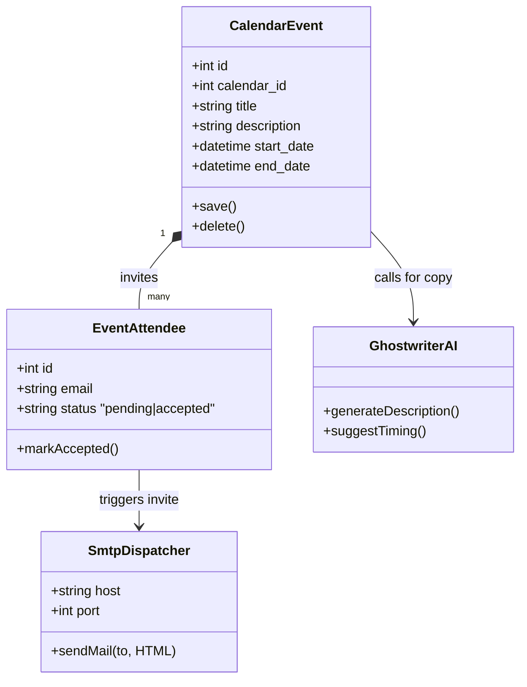
```mermaid
classDiagram
    class CalendarEvent {
        +int id
        +int calendar_id
        +string title
        +string description
        +datetime start_date
        +datetime end_date
        +save()
        +delete()
    }
    class EventAttendee {
        +int id
        +string email
        +string status "pending|accepted"
        +markAccepted()
    }
    class SmtpDispatcher {
        +string host
        +int port
        +sendMail(to, HTML)
    }
    class GhostwriterAI {
        +generateDescription()
        +suggestTiming()
    }

    CalendarEvent "1" *-- "many" EventAttendee : invites
    CalendarEvent --> GhostwriterAI : calls for copy
    EventAttendee --> SmtpDispatcher : triggers invite
```

---

## FEATURE 7: AI Networking Coach & Insights

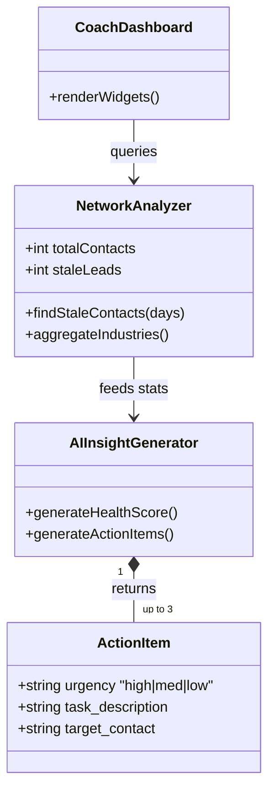
```mermaid
classDiagram
    class CoachDashboard {
        +renderWidgets()
    }
    class NetworkAnalyzer {
        +int totalContacts
        +int staleLeads
        +findStaleContacts(days)
        +aggregateIndustries()
    }
    class AIInsightGenerator {
        +generateHealthScore()
        +generateActionItems()
    }
    class ActionItem {
        +string urgency "high|med|low"
        +string task_description
        +string target_contact
    }

    CoachDashboard --> NetworkAnalyzer : queries
    NetworkAnalyzer --> AIInsightGenerator : feeds stats
    AIInsightGenerator "1" *-- "up to 3" ActionItem : returns
```

---

## FEATURE 8: Email Marketing Campaigns

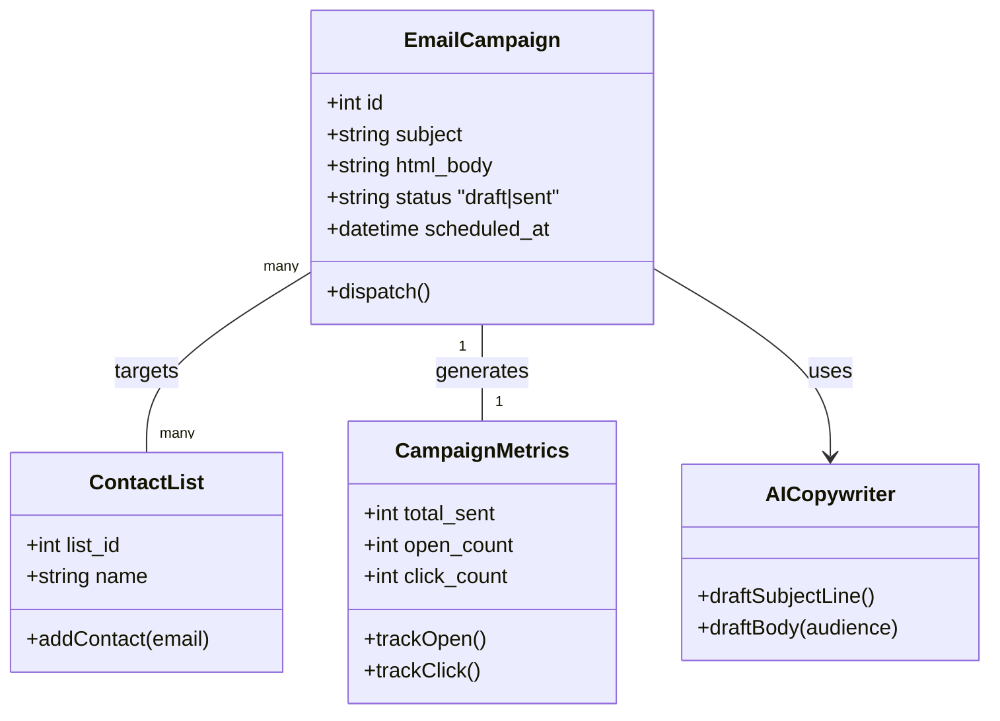
```mermaid
classDiagram
    class EmailCampaign {
        +int id
        +string subject
        +string html_body
        +string status "draft|sent"
        +datetime scheduled_at
        +dispatch()
    }
    class ContactList {
        +int list_id
        +string name
        +addContact(email)
    }
    class CampaignMetrics {
        +int total_sent
        +int open_count
        +int click_count
        +trackOpen()
        +trackClick()
    }
    class AICopywriter {
        +draftSubjectLine()
        +draftBody(audience)
    }

    EmailCampaign "many" -- "many" ContactList : targets
    EmailCampaign "1" -- "1" CampaignMetrics : generates
    EmailCampaign --> AICopywriter : uses
```

---

## FEATURE 9: CRM Integration

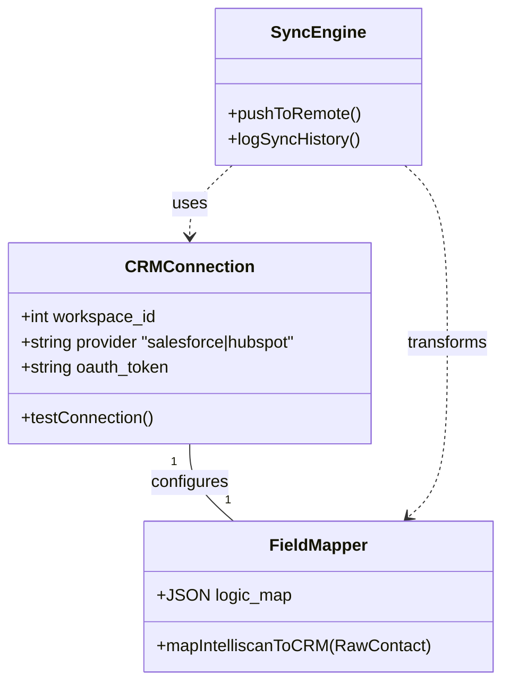
```mermaid
classDiagram
    class CRMConnection {
        +int workspace_id
        +string provider "salesforce|hubspot"
        +string oauth_token
        +testConnection()
    }
    class FieldMapper {
        +JSON logic_map
        +mapIntelliscanToCRM(RawContact)
    }
    class SyncEngine {
        +pushToRemote()
        +logSyncHistory()
    }

    CRMConnection "1" -- "1" FieldMapper : configures
    SyncEngine ..> CRMConnection : uses
    SyncEngine ..> FieldMapper : transforms
```

---

## FEATURE 10: Gamified Leaderboard

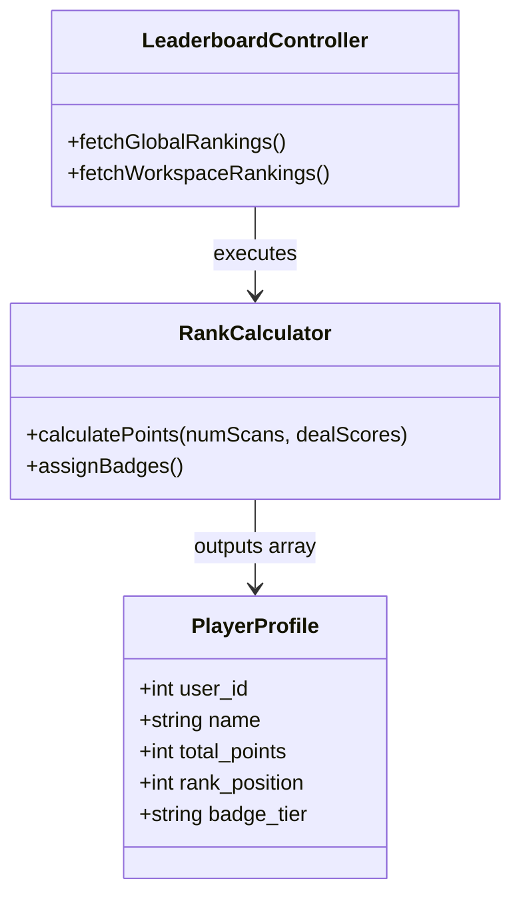
```mermaid
classDiagram
    class LeaderboardController {
        +fetchGlobalRankings()
        +fetchWorkspaceRankings()
    }
    class RankCalculator {
        +calculatePoints(numScans, dealScores)
        +assignBadges()
    }
    class PlayerProfile {
        +int user_id
        +string name
        +int total_points
        +int rank_position
        +string badge_tier
    }

    LeaderboardController --> RankCalculator : executes
    RankCalculator --> PlayerProfile : outputs array
```

---

## FEATURE 11: Digital Card Creator

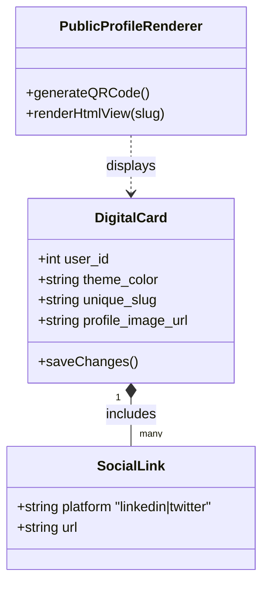
```mermaid
classDiagram
    class DigitalCard {
        +int user_id
        +string theme_color
        +string unique_slug
        +string profile_image_url
        +saveChanges()
    }
    class SocialLink {
        +string platform "linkedin|twitter"
        +string url
    }
    class PublicProfileRenderer {
        +generateQRCode()
        +renderHtmlView(slug)
    }

    DigitalCard "1" *-- "many" SocialLink : includes
    PublicProfileRenderer ..> DigitalCard : displays
```

---

## FEATURE 12: SuperAdmin Engine Management

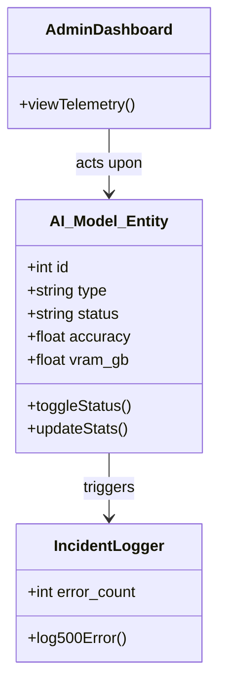
```mermaid
classDiagram
    class AdminDashboard {
        +viewTelemetry()
    }
    class AI_Model_Entity {
        +int id
        +string type
        +string status
        +float accuracy
        +float vram_gb
        +toggleStatus()
        +updateStats()
    }
    class IncidentLogger {
        +int error_count
        +log500Error()
    }

    AdminDashboard --> AI_Model_Entity : acts upon
    AI_Model_Entity --> IncidentLogger : triggers
```

---

## FEATURE 13: Workspace Collaboration

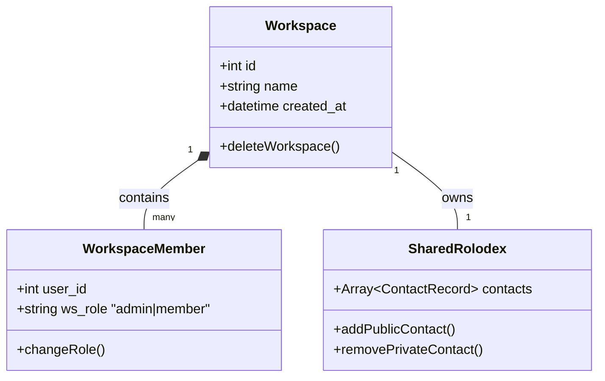
```mermaid
classDiagram
    class Workspace {
        +int id
        +string name
        +datetime created_at
        +deleteWorkspace()
    }
    class WorkspaceMember {
        +int user_id
        +string ws_role "admin|member"
        +changeRole()
    }
    class SharedRolodex {
        +Array~ContactRecord~ contacts
        +addPublicContact()
        +removePrivateContact()
    }

    Workspace "1" *-- "many" WorkspaceMember : contains
    Workspace "1" -- "1" SharedRolodex : owns
```

---

## FEATURE 14: Analytics & Reporting

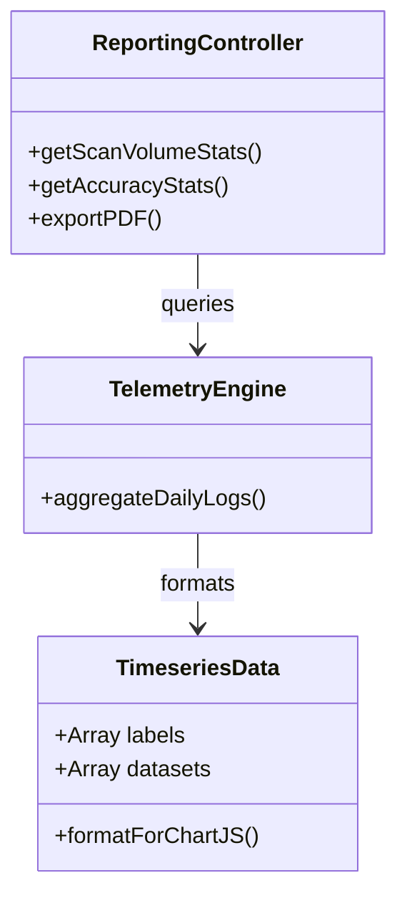
```mermaid
classDiagram
    class ReportingController {
        +getScanVolumeStats()
        +getAccuracyStats()
        +exportPDF()
    }
    class TimeseriesData {
        +Array labels
        +Array datasets
        +formatForChartJS()
    }
    class TelemetryEngine {
        +aggregateDailyLogs()
    }

    ReportingController --> TelemetryEngine : queries
    TelemetryEngine --> TimeseriesData : formats
```

---

## FEATURE 15: Billing & Subscriptions

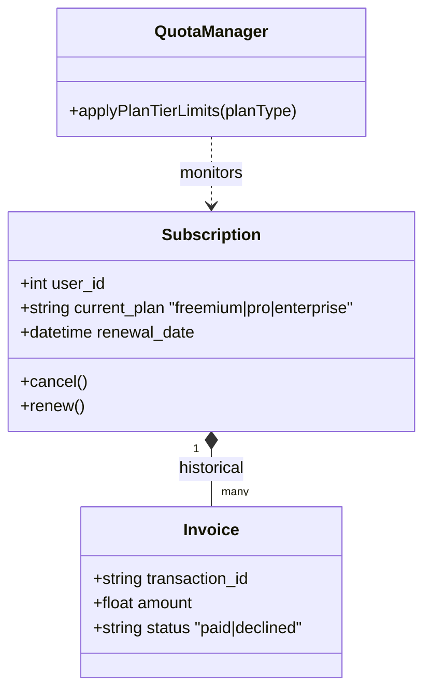
```mermaid
classDiagram
    class Subscription {
        +int user_id
        +string current_plan "freemium|pro|enterprise"
        +datetime renewal_date
        +cancel()
        +renew()
    }
    class Invoice {
        +string transaction_id
        +float amount
        +string status "paid|declined"
    }
    class QuotaManager {
        +applyPlanTierLimits(planType)
    }

    Subscription "1" *-- "many" Invoice : historical
    QuotaManager ..> Subscription : monitors
```

---

## FEATURE 16: AI Drafts & Ghostwriter

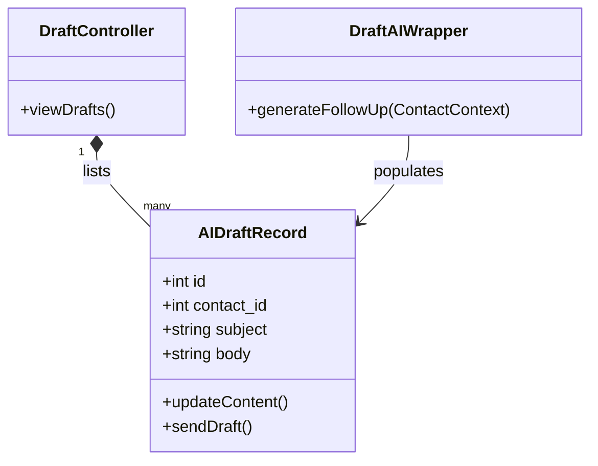
```mermaid
classDiagram
    class DraftController {
        +viewDrafts()
    }
    class AIDraftRecord {
        +int id
        +int contact_id
        +string subject
        +string body
        +updateContent()
        +sendDraft()
    }
    class DraftAIWrapper {
        +generateFollowUp(ContactContext)
    }

    DraftController "1" *-- "many" AIDraftRecord : lists
    DraftAIWrapper --> AIDraftRecord : populates
```

---

## FEATURE 17: Kiosk Mode (Conference Scanner)

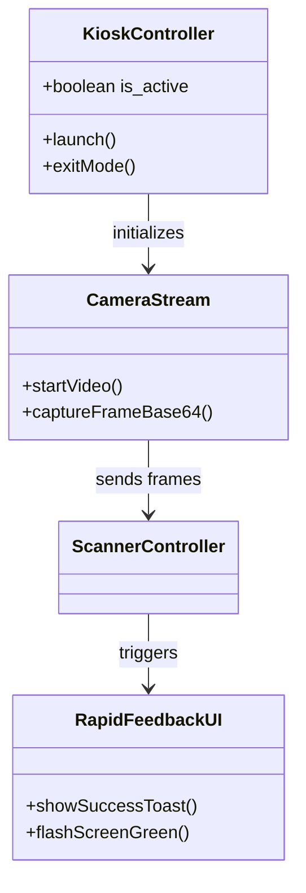
```mermaid
classDiagram
    class KioskController {
        +boolean is_active
        +launch()
        +exitMode()
    }
    class CameraStream {
        +startVideo()
        +captureFrameBase64()
    }
    class RapidFeedbackUI {
        +showSuccessToast()
        +flashScreenGreen()
    }

    KioskController --> CameraStream : initializes
    CameraStream --> ScannerController : sends frames
    ScannerController --> RapidFeedbackUI : triggers
```

---

## FEATURE 18: Meeting Presence & Signals

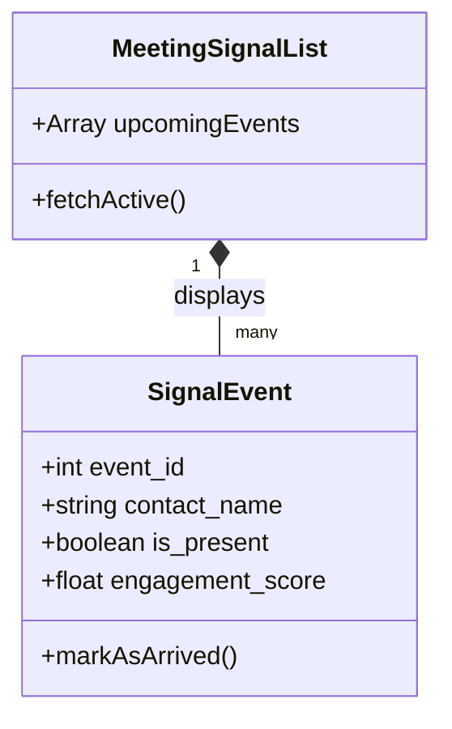
```mermaid
classDiagram
    class MeetingSignalList {
        +Array upcomingEvents
        +fetchActive()
    }
    class SignalEvent {
        +int event_id
        +string contact_name
        +boolean is_present
        +float engagement_score
        +markAsArrived()
    }

    MeetingSignalList "1" *-- "many" SignalEvent : displays
```

---

## FEATURE 19: Settings & Profile Config

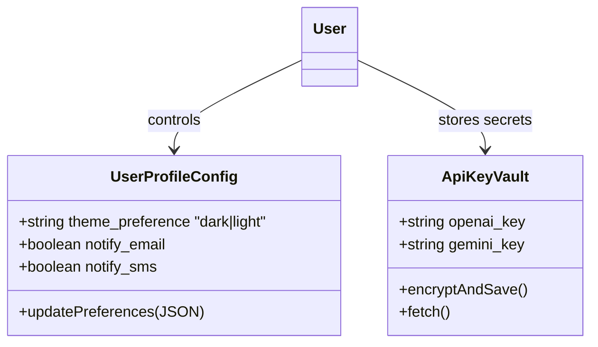
```mermaid
classDiagram
    class UserProfileConfig {
        +string theme_preference "dark|light"
        +boolean notify_email
        +boolean notify_sms
        +updatePreferences(JSON)
    }
    class ApiKeyVault {
        +string openai_key
        +string gemini_key
        +encryptAndSave()
        +fetch()
    }

    User --> UserProfileConfig : controls
    User --> ApiKeyVault : stores secrets
```

---

## FEATURE 20: Support Chatbot

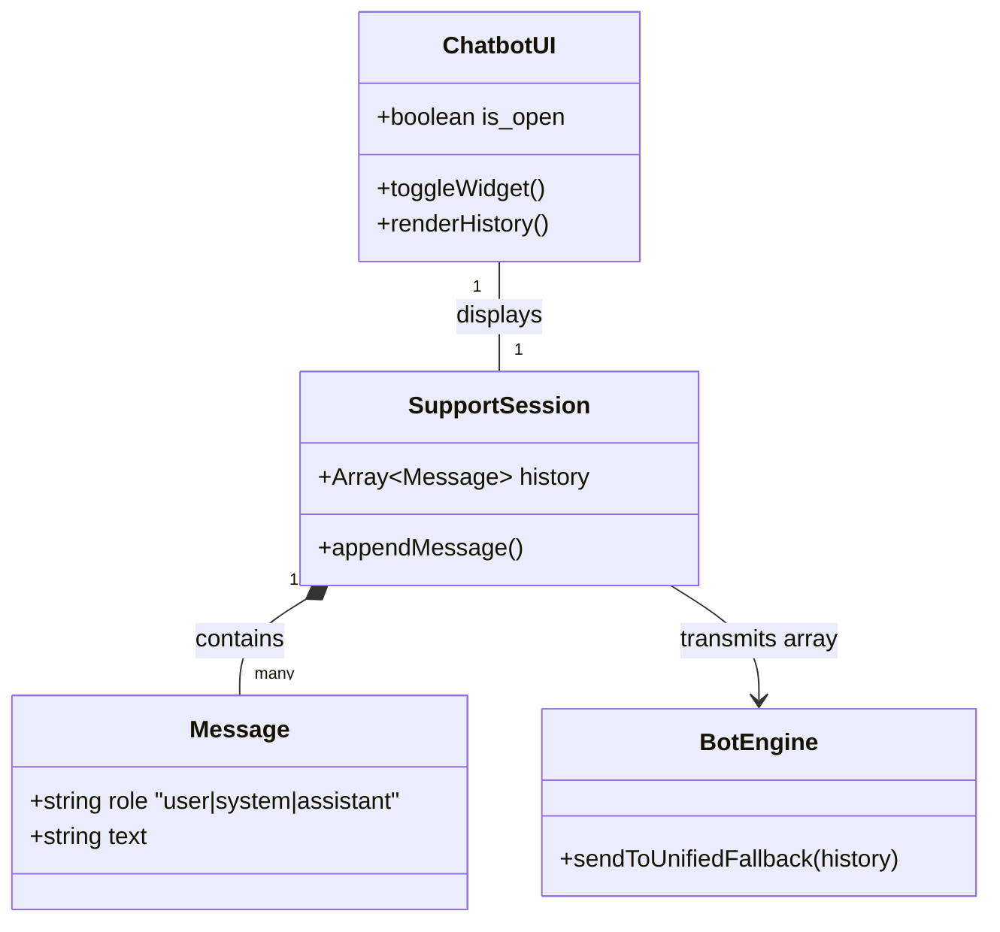
```mermaid
classDiagram
    class ChatbotUI {
        +boolean is_open
        +toggleWidget()
        +renderHistory()
    }
    class SupportSession {
        +Array~Message~ history
        +appendMessage()
    }
    class Message {
        +string role "user|system|assistant"
        +string text
    }
    class BotEngine {
        +sendToUnifiedFallback(history)
    }

    ChatbotUI "1" -- "1" SupportSession : displays
    SupportSession "1" *-- "many" Message : contains
    SupportSession --> BotEngine : transmits array
```
