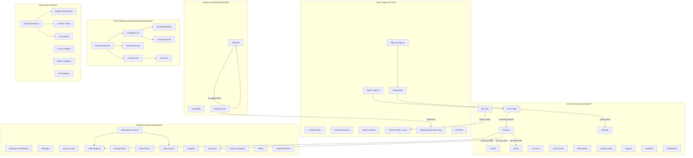

# IntelliScan — Complete System Architecture & Documentation

> **Version**: 1.0.0 | **Last Updated**: April 2026 | **Platform**: Full-Stack SaaS CRM

---

## 1. Project Overview

**IntelliScan** is an enterprise-grade, AI-powered business card scanning and CRM platform. It captures business card data using multi-engine AI (Gemini, OpenAI, Tesseract.js), organizes contacts into a collaborative workspace, and provides tools for email marketing, calendar scheduling, digital card creation, and relationship intelligence.

### Technology Stack

| Layer | Technology | Version | Why It's Used |
|-------|-----------|---------|---------------|
| **Frontend Framework** | React | 19.2.4 | Component-based UI with hooks, concurrent rendering |
| **Build Tool** | Vite | 8.0.1 | Instant HMR, ES module-native bundling |
| **CSS Framework** | TailwindCSS | 3.4.19 | Utility-first rapid styling with dark mode |
| **Routing** | React Router DOM | 7.13.2 | Declarative nested routing with role guards |
| **Icons** | Lucide React | 1.6.0 | Tree-shakeable SVG icon library |
| **HTTP Client** | Axios | 1.13.6 | Promise-based HTTP with interceptors |
| **Real-time** | Socket.IO Client | 4.8.3 | WebSocket-based live workspace chat |
| **Charts/Export** | XLSX | 0.18.5 | Excel/CSV contact export |
| **QR Codes** | qrcode.react | 4.2.0 | QR code generation for digital cards |
| **Image Export** | html-to-image | 1.11.13 | DOM-to-PNG for card creator |
| **Date Handling** | date-fns | 4.1.0 | Lightweight date manipulation |
| **Backend** | Express.js | 5.2.1 | Minimal, flexible Node.js web framework |
| **Database** | SQLite3 | 6.0.1 | Zero-config embedded SQL database |
| **Auth** | JWT + bcryptjs | 9.0.3 / 3.0.3 | Stateless token auth with password hashing |
| **AI Engine 1** | Google Generative AI (Gemini) | 0.24.1 | Primary vision + text AI for card scanning |
| **AI Engine 2** | OpenAI (GPT-4o-mini) | 6.33.0 | Secondary fallback AI engine |
| **AI Engine 3** | Tesseract.js | 7.0.0 | Offline OCR fallback (no API needed) |
| **Email** | Nodemailer | 6.10.1 | SMTP-based transactional & campaign emails |
| **Real-time Server** | Socket.IO | 4.8.3 | WebSocket server for live chat |
| **Environment** | dotenv | 17.3.1 | Environment variable management |
| **Dev Server** | Nodemon | 3.1.14 | Auto-restart on file changes |

### AI Fallback Architecture (3-Tier)

```
┌─────────────────────────────────────────────┐
│            Incoming AI Request              │
└──────────────────┬──────────────────────────┘
                   ▼
        ┌─────────────────────┐
        │  Tier 1: Gemini AI  │ ── Primary (Vision + Text)
        │  gemini-2.5-flash   │
        └────────┬────────────┘
                 │ On failure / rate limit
                 ▼
        ┌─────────────────────┐
        │  Tier 2: OpenAI     │ ── Secondary Fallback
        │  gpt-4o-mini        │
        └────────┬────────────┘
                 │ On failure / rate limit
                 ▼
        ┌─────────────────────┐
        │  Tier 3: Tesseract  │ ── Offline OCR (Vision only)
        │  tesseract.js v7    │
        └─────────────────────┘
```

> The UI never reveals which engine is active. All switching happens silently in the backend via `unifiedExtractionPipeline` (vision) and `unifiedTextAIPipeline` (text).

---

## 2. Role-Based Access Control (RBAC)

| Role | Route Prefix | Access Level | Default Credentials |
|------|-------------|--------------|-------------------|
| **Super Admin** | `/admin/*` | Full platform: engine tuning, incidents, all workspaces | `superadmin@intelliscan.io` / `admin123` |
| **Enterprise Admin** | `/workspace/*` | Workspace: team contacts, billing, CRM, campaigns | `enterprise@intelliscan.io` / `admin123` |
| **Personal User** | `/dashboard/*` | Individual: scan, contacts, drafts, calendar | `personal@intelliscan.io` / `user123` |

### Subscription Tiers

| Tier | Single Scans/Cycle | Group Scans/Cycle | Batch Upload | API Access |
|------|-------------------|-------------------|--------------|------------|
| Personal | 10 | 1 | 10 | ✗ |
| Pro | 100 | 10 | 50 | ✓ |
| Enterprise | 99,999 | 99,999 | 100 | ✓ |

---

## 3. Complete Feature Inventory (115+ Features)

### 3.1 Authentication & Onboarding
| # | Feature | Page | Description |
|---|---------|------|-------------|
| 1 | User Registration | `SignUpPage.jsx` | Name, email, password with bcrypt hashing, role selection |
| 2 | User Login | `SignInPage.jsx` | JWT token auth with 30-day expiry, session tracking |
| 3 | Password Recovery | `ForgotPassword.jsx` | Email-based reset flow |
| 4 | Onboarding Wizard | `OnboardingPage.jsx` | Multi-step preference setup (industry, use-case, team size) |
| 5 | Session Management | `SettingsPage.jsx` | View/revoke active sessions across devices |

### 3.2 AI-Powered Card Scanning
| # | Feature | Page | Description |
|---|---------|------|-------------|
| 6 | Single Card Scan | `ScanPage.jsx` | Upload/capture → AI extracts name, email, phone, company, title |
| 7 | Multi-Card Batch Scan | `ScanPage.jsx` | Upload multiple cards simultaneously with progress tracking |
| 8 | 3-Tier AI Fallback | Backend | Gemini → OpenAI → Tesseract.js automatic failover |
| 9 | Confidence Scoring | `ScanPage.jsx` | 0–100% AI confidence displayed per extracted field |
| 10 | Industry Inference | Backend | AI infers contact's industry from card content |
| 11 | Seniority Detection | Backend | AI infers seniority level (Junior → CXO/Founder) |
| 12 | Scan Quota Tracking | `ScanPage.jsx` | Real-time usage meter with tier-based limits |

### 3.3 Contact Management (CRM)
| # | Feature | Page | Description |
|---|---------|------|-------------|
| 13 | Contact List | `ContactsPage.jsx` | Searchable, filterable table with sorting |
| 14 | Contact Detail View | `ContactsPage.jsx` | Inline expansion with full contact info |
| 15 | AI Follow-Up Composer | `ContactsPage.jsx` | Generate personalized follow-up emails via AI |
| 16 | Contact Relationships | `OrgChartPage.jsx` | Map "reports_to", "colleague", "introduced_by" links |
| 17 | Org Chart Visualization | `OrgChartPage.jsx` | Company hierarchy tree from relationship data |
| 18 | Mutual Connections | Backend | Discover shared contacts between users |
| 19 | Excel/CSV Export | `ContactsPage.jsx` | Download contacts as .xlsx via SheetJS |
| 20 | Contact Tags | `ContactsPage.jsx` | Custom tagging system for categorization |
| 21 | Contact Notes | `ContactsPage.jsx` | Free-text notes per contact |
| 22 | Contact Delete | `ContactsPage.jsx` | Soft delete with confirmation |

### 3.4 Workspace & Team Collaboration
| # | Feature | Page | Description |
|---|---------|------|-------------|
| 23 | Workspace Dashboard | `WorkspaceDashboard.jsx` | KPIs: total contacts, scan velocity, team activity |
| 24 | Team Contacts | `WorkspaceContacts.jsx` | Shared contact pool scoped to workspace |
| 25 | Team Members | `MembersPage.jsx` | Invite, manage roles, seat limits |
| 26 | Shared Rolodex | `SharedRolodexPage.jsx` | Cross-team contact sharing with permissions |
| 27 | Real-time Chat | `WorkspaceDashboard.jsx` | Socket.IO powered workspace messaging |
| 28 | Scanner Links | `ScannerLinksPage.jsx` | Branded scan URLs for events/conferences |

### 3.5 Enterprise Calendar System
| # | Feature | Page | Description |
|---|---------|------|-------------|
| 29 | Multi-Calendar Support | `CalendarPage.jsx` | Create/manage multiple calendars with colors |
| 30 | Event CRUD | `CalendarPage.jsx` | Create, edit, delete events with modals |
| 31 | Recurring Events | `CalendarPage.jsx` | Daily, weekly, monthly, yearly recurrence rules |
| 32 | Attendee Management | `CalendarPage.jsx` | Email invitations with RSVP tracking |
| 33 | AI Time Suggestions | `CalendarPage.jsx` | AI analyzes busy slots, suggests optimal times |
| 34 | AI Event Descriptions | `CalendarPage.jsx` | Auto-generate professional event descriptions |
| 35 | Calendar Sharing | `CalendarPage.jsx` | Share calendars with view/edit permissions |
| 36 | Availability Slots | `AvailabilityPage.jsx` | Set weekly availability per day-of-week |
| 37 | Booking Links | `BookingLinksPage.jsx` | Calendly-style shareable booking pages |
| 38 | Public Booking Page | `BookingPage.jsx` | External users book time via `/book/:slug` |
| 39 | Email Reminders | Backend (cron) | Auto-send reminders N minutes before events |

### 3.6 Email Marketing Suite
| # | Feature | Page | Description |
|---|---------|------|-------------|
| 40 | Marketing Dashboard | `EmailMarketingPage.jsx` | Overview of lists, campaigns, open rates |
| 41 | Contact Lists | `ContactListsPage.jsx` | Create/manage subscriber lists |
| 42 | List Detail | `ListDetailPage.jsx` | Add/remove contacts, view subscription status |
| 43 | Campaign Builder | `CampaignBuilderPage.jsx` | Visual HTML email composer with variables |
| 44 | Campaign List | `CampaignListPage.jsx` | All campaigns with status & metrics |
| 45 | Campaign Analytics | `CampaignDetailPage.jsx` | Opens, clicks, bounces, unsubscribes per campaign |
| 46 | Template Library | `TemplateLibraryPage.jsx` | Pre-built and AI-generated email templates |
| 47 | AI Template Generator | Backend | Generate email HTML from purpose/tone/industry inputs |
| 48 | Open Tracking | Backend | 1×1 pixel tracking for email opens |
| 49 | Click Tracking | Backend | URL rewriting for link click analytics |
| 50 | Unsubscribe Handling | Backend | One-click unsubscribe with confirmation page |
| 51 | Scheduled Sending | Backend (cron) | Future-dated campaign delivery |

### 3.7 AI Drafts & Communication
| # | Feature | Page | Description |
|---|---------|------|-------------|
| 52 | AI Draft Generation | `DraftsPage.jsx` | Generate follow-up emails using AI context |
| 53 | Draft Management | `DraftsPage.jsx` | Save, edit, delete draft emails |
| 54 | Draft Send via SMTP | `DraftsPage.jsx` | Send drafts through configured SMTP |
| 55 | AI Coach Insights | `CoachPage.jsx` | Networking suggestions based on contact patterns |
| 56 | AI Signals | `SignalsPage.jsx` | Automated relationship health indicators |

### 3.8 Digital Identity
| # | Feature | Page | Description |
|---|---------|------|-------------|
| 57 | Digital Business Card | `MyCardPage.jsx` | Create/edit personal digital card with themes |
| 58 | AI Card Creator | `CardCreatorPage.jsx` | AI-designed card layouts from user data |
| 59 | Public Profile | `PublicProfile.jsx` | Shareable profile at `/u/:slug` |
| 60 | QR Code Generation | `MyCardPage.jsx` | Auto-generated QR linking to digital card |
| 61 | Card Export as PNG | `CardCreatorPage.jsx` | Download designed card as image |
| 62 | Kiosk Mode | `KioskMode.jsx` | Full-screen scanning station for events |

### 3.9 CRM Integration & Data Pipeline
| # | Feature | Page | Description |
|---|---------|------|-------------|
| 63 | CRM Field Mapping | `CrmMappingPage.jsx` | Map IntelliScan fields → Salesforce/HubSpot/Zoho/Pipedrive |
| 64 | CRM Connect/Disconnect | `CrmMappingPage.jsx` | Simulate provider connection lifecycle |
| 65 | CRM Export | Backend | Push contacts to external CRM with retry logic |
| 66 | Routing Rules | `RoutingRulesPage.jsx` | Auto-assign contacts based on field conditions |
| 67 | Data Policies | `DataPoliciesPage.jsx` | PII redaction, retention periods, audit controls |
| 68 | Data Quality Center | `DataQualityCenterPage.jsx` | AI-powered duplicate detection & merge |
| 69 | Sync Health Monitor | `JobQueuesPage.jsx` | View failed syncs with retry capabilities |

### 3.10 Platform Administration (Super Admin)
| # | Feature | Page | Description |
|---|---------|------|-------------|
| 70 | Admin Dashboard | `AdminDashboard.jsx` | Global KPIs, user counts, system health |
| 71 | Engine Performance | `EnginePerformance.jsx` | OCR accuracy, latency, engine config sliders |
| 72 | AI Training & Tuning | `AiTrainingTuningSuperAdmin.jsx` | Adjust OCR threshold, denoising sensitivity |
| 73 | Model Version Control | `CustomModelsPage.jsx` | View/rollback AI model versions |
| 74 | Incident Center | `SystemIncidentCenter.jsx` | Create, acknowledge, resolve platform incidents |
| 75 | Job Queues | `JobQueuesPage.jsx` | Monitor background processing tasks |
| 76 | Feedback Management | `SuperAdminFeedbackPage.jsx` | View/respond to user feedback |
| 77 | API Sandbox | `AdvancedApiExplorerSandbox.jsx` | Interactive API testing with live responses |

### 3.11 Analytics & Reporting
| # | Feature | Page | Description |
|---|---------|------|-------------|
| 78 | Workspace Analytics | `AnalyticsPage.jsx` | Charts: scans over time, contacts by source/industry |
| 79 | Public Analytics | `PublicAnalyticsPage.jsx` | Unauthenticated platform-wide stats |
| 80 | Activity Tracking | `ActivityTracker.jsx` | Auto-log page views and actions |
| 81 | Analytics Dashboard API | Backend | Aggregated stats endpoint for charting |

### 3.12 Settings & Configuration
| # | Feature | Page | Description |
|---|---------|------|-------------|
| 82 | Profile Settings | `SettingsPage.jsx` | Name, email, avatar management |
| 83 | Security Settings | `SettingsPage.jsx` | Password change, session management |
| 84 | Billing & Payments | `BillingPage.jsx` | Payment methods, invoices, tier management |
| 85 | Marketplace | `MarketplacePage.jsx` | Integration marketplace with install/configure |
| 86 | Meeting Tools | `MeetingToolsPage.jsx` | Pre-meeting contact lookup |
| 87 | Feedback Form | `FeedbackPage.jsx` | Submit bug reports and feature requests |
| 88 | API Documentation | `ApiDocsPage.jsx` | Interactive API reference |

### 3.13 Developer & Platform Tools
| # | Feature | Page | Description |
|---|---------|------|-------------|
| 89 | Command Palette | `CommandPalette.jsx` | `Ctrl+K` global search and navigation |
| 90 | Dev Tools Panel | `DevTools.jsx` | Role switcher, layout inspection |
| 91 | Dark Mode | `useDarkMode.jsx` | System-wide dark theme (default) |
| 92 | Rate Limiting | Backend | Per-endpoint rate limits with sliding windows |
| 93 | Audit Trail | Backend | Security event logging with actor tracking |
| 94 | Health Check | Backend | `/api/health` for load balancers |

---

## 4. Page Interconnection Map



---

## 5. Complete File & Folder Architecture

### 5.1 Summary Statistics

| Metric | Count |
|--------|-------|
| **Total Frontend Pages** | 25 hand-crafted + 62 auto-migrated = **87 pages** |
| **Total Components** | 6 shared + 9 calendar + 5 email = **20 components** |
| **Total Layouts** | **3** (Public, Dashboard, Admin) |
| **Total Context Providers** | **3** (Role, Contact, BatchQueue) |
| **Total Backend API Endpoints** | **110+** |
| **Total Database Tables** | **25+** |
| **Total Frontend Folders** | **14** |
| **Total Server Files** | **17** (excluding node_modules) |

### 5.2 Directory Tree

```
📁 stitch (1)MoreSCreens/                    ← Project Root
│
├── 📄 .env.example                          ← Environment template
│
├── 📁 ALL_DOCUMENT_OF_PROJECT/              ← Project documentation
│   ├── 📄 Allfeatures.md                    ← Feature inventory (46KB)
│   ├── 📄 PROJECT_ARCHITECTURE.md           ← Prior architecture doc
│   ├── 📄 IntelliScan_Complete_Project_Overview.md
│   ├── 📄 IntelliScan_Detailed_System_Architecture.md
│   ├── 📄 IntelliScan_Folder_Architecture.md
│   ├── 📄 IntelliScan_Full_Directory_Tree.md
│   ├── 📄 IntelliScan_CRM_Mapping_Production_Prompt.md
│   ├── 📄 Competitor_Feature_Analysis_Prompt_and_Report.md
│   ├── 📄 intelliscan_stitch_technicaladdendum.md
│   ├── 📄 intelliscan_roadmap_requirements.html
│   ├── 📄 IntelliScan_Context_For_Claude.txt ← Context bundle (110KB)
│   └── 📄 bundle_for_claude.js               ← Bundler script
│
├── 📁 captures/                              ← Screenshot captures
│
├── 📁 intelliscan-app/                       ← FRONTEND (React + Vite)
│   ├── 📄 index.html                         ← SPA entry point
│   ├── 📄 package.json                       ← Dependencies manifest
│   ├── 📄 vite.config.js                     ← Vite + API proxy config
│   ├── 📄 tailwind.config.js                 ← TailwindCSS theme
│   ├── 📄 postcss.config.js                  ← PostCSS plugins
│   ├── 📄 eslint.config.js                   ← Linting rules
│   │
│   ├── 📁 public/                            ← Static assets
│   │
│   ├── 📁 scripts/                           ← Build/Migration scripts
│   │   ├── 📄 migrate.js                     ← HTML→React mass migrator
│   │   └── 📄 massReplace.cjs                ← Bulk string replacer
│   │
│   └── 📁 src/                               ← Application source
│       ├── 📄 main.jsx                       ← React DOM root + providers
│       ├── 📄 App.jsx                        ← Master router (220 lines)
│       ├── 📄 App.css                        ← Global animations
│       ├── 📄 index.css                      ← Tailwind directives
│       │
│       ├── 📁 assets/                        ← Images & SVGs
│       │   ├── 📄 hero.png
│       │   ├── 📄 react.svg
│       │   └── 📄 vite.svg
│       │
│       ├── 📁 utils/                         ← Shared utilities
│       │   └── 📄 auth.js                    ← Token/cookie management
│       │
│       ├── 📁 hooks/                         ← Custom React hooks
│       │   └── 📄 useDarkMode.jsx            ← Dark mode toggle
│       │
│       ├── 📁 data/                          ← Static data
│       │   └── 📄 mockContacts.js            ← Sample contact data
│       │
│       ├── 📁 context/                       ← React Context providers
│       │   ├── 📄 RoleContext.jsx            ← Auth state + role/tier
│       │   ├── 📄 ContactContext.jsx         ← Contact selection state
│       │   └── 📄 BatchQueueContext.jsx      ← Batch scan queue state
│       │
│       ├── 📁 layouts/                       ← Page layout wrappers
│       │   ├── 📄 PublicLayout.jsx           ← Minimal header + footer
│       │   ├── 📄 DashboardLayout.jsx        ← Sidebar + topbar (user)
│       │   └── 📄 AdminLayout.jsx            ← Sidebar + topbar (admin)
│       │
│       ├── 📁 components/                    ← Reusable UI components
│       │   ├── 📄 ActivityTracker.jsx        ← Page view analytics
│       │   ├── 📄 ChatbotWidget.jsx          ← AI support chatbot
│       │   ├── 📄 CommandPalette.jsx         ← Ctrl+K global search
│       │   ├── 📄 DevTools.jsx               ← Developer role switcher
│       │   ├── 📄 RoleGuard.jsx              ← Route-level RBAC guard
│       │   ├── 📄 SignalsCard.jsx            ← Relationship signal cards
│       │   │
│       │   ├── 📁 calendar/                  ← Calendar components
│       │   │   ├── 📄 AISchedulingPanel.jsx
│       │   │   ├── 📄 AttendeeInput.jsx
│       │   │   ├── 📄 ColorPicker.jsx
│       │   │   ├── 📄 EventDetailPopover.jsx
│       │   │   ├── 📄 EventModal.jsx
│       │   │   ├── 📄 EventPill.jsx
│       │   │   ├── 📄 MiniCalendar.jsx
│       │   │   ├── 📄 RecurrenceSelector.jsx
│       │   │   └── 📄 TimeGrid.jsx
│       │   │
│       │   └── 📁 email/                     ← Email marketing components
│       │       ├── 📄 CampaignStatsCard.jsx
│       │       ├── 📄 EmailPreview.jsx
│       │       ├── 📄 EmailStatusBadge.jsx
│       │       ├── 📄 OpenRateBar.jsx
│       │       └── 📄 TemplateCard.jsx
│       │
│       └── 📁 pages/                         ← All page components
│           │
│           │── 📄 LandingPage.jsx            ← Marketing homepage
│           │── 📄 SignInPage.jsx              ← Login form
│           │── 📄 SignUpPage.jsx              ← Registration form
│           │── 📄 ForgotPassword.jsx          ← Password recovery
│           │── 📄 OnboardingPage.jsx          ← Setup wizard
│           │── 📄 ScanPage.jsx               ← AI card scanner (36KB)
│           │── 📄 ContactsPage.jsx           ← CRM contacts (40KB)
│           │── 📄 SettingsPage.jsx            ← User settings (24KB)
│           │── 📄 AnalyticsPage.jsx           ← Workspace analytics
│           │── 📄 BillingPage.jsx             ← Payment & invoices
│           │── 📄 CardCreatorPage.jsx         ← AI card designer
│           │── 📄 MarketplacePage.jsx         ← Integration marketplace
│           │── 📄 MembersPage.jsx             ← Team management
│           │── 📄 OrgChartPage.jsx            ← Org chart visualization
│           │── 📄 ScannerLinksPage.jsx        ← Branded scan URLs
│           │── 📄 WorkspaceDashboard.jsx      ← Workspace overview
│           │── 📄 WorkspaceContacts.jsx       ← Shared contacts
│           │── 📄 AdminDashboard.jsx          ← Super admin overview
│           │── 📄 EnginePerformance.jsx       ← OCR engine monitor
│           │── 📄 AiTrainingTuningSuperAdmin.jsx
│           │── 📄 AdvancedApiExplorerSandbox.jsx
│           │── 📄 SuperAdminFeedbackPage.jsx
│           │── 📄 PublicAnalyticsPage.jsx
│           │── 📄 FeedbackPage.jsx
│           │── 📄 ApiDocsPage.jsx
│           │
│           ├── 📁 dashboard/                 ← User sub-pages (7 files)
│           │   ├── 📄 CoachPage.jsx          ← AI networking coach
│           │   ├── 📄 DraftsPage.jsx         ← AI email drafts
│           │   ├── 📄 EventsPage.jsx         ← Event management
│           │   ├── 📄 KioskMode.jsx          ← Full-screen scanner
│           │   ├── 📄 MeetingToolsPage.jsx   ← Pre-meeting prep
│           │   ├── 📄 MyCardPage.jsx         ← Digital business card
│           │   └── 📄 SignalsPage.jsx        ← Relationship signals
│           │
│           ├── 📁 calendar/                  ← Calendar sub-pages (4 files)
│           │   ├── 📄 CalendarPage.jsx       ← Main calendar view
│           │   ├── 📄 AvailabilityPage.jsx   ← Availability settings
│           │   ├── 📄 BookingLinksPage.jsx    ← Manage booking links
│           │   └── 📄 BookingPage.jsx        ← Public booking form
│           │
│           ├── 📁 email/                     ← Email marketing (7 files)
│           │   ├── 📄 EmailMarketingPage.jsx ← Marketing dashboard
│           │   ├── 📄 CampaignListPage.jsx   ← All campaigns
│           │   ├── 📄 CampaignBuilderPage.jsx← Campaign composer
│           │   ├── 📄 CampaignDetailPage.jsx ← Campaign analytics
│           │   ├── 📄 TemplateLibraryPage.jsx← Email templates
│           │   ├── 📄 ContactListsPage.jsx   ← Subscriber lists
│           │   └── 📄 ListDetailPage.jsx     ← List management
│           │
│           ├── 📁 workspace/                 ← Enterprise admin (6 files)
│           │   ├── 📄 CrmMappingPage.jsx     ← CRM field mapping
│           │   ├── 📄 RoutingRulesPage.jsx   ← Auto-routing rules
│           │   ├── 📄 DataPoliciesPage.jsx   ← PII & retention
│           │   ├── 📄 DataQualityCenterPage.jsx ← Dedupe center
│           │   ├── 📄 EmailCampaignsPage.jsx ← Campaign management
│           │   └── 📄 SharedRolodexPage.jsx  ← Shared contacts
│           │
│           ├── 📁 admin/                     ← Super admin (3 files)
│           │   ├── 📄 CustomModelsPage.jsx   ← AI model versions
│           │   ├── 📄 JobQueuesPage.jsx      ← Background jobs
│           │   └── 📄 SystemIncidentCenter.jsx← Incident management
│           │
│           └── 📁 generated/                 ← Auto-migrated (62 files)
│               ├── 📄 routes.json            ← Route config manifest
│               ├── 📄 GenSystemHealthSuperAdmin.jsx
│               ├── 📄 GenPrivacyGdprCommandCenter.jsx
│               ├── 📄 GenSubscriptionPlanComparison.jsx
│               ├── 📄 GenWorkspacesOrganizationsSuperAdmin.jsx
│               ├── 📄 GenAiModelVersioningRollback.jsx
│               ├── 📄 GenAdvancedSecurityAuditLogs1.jsx
│               ├── 📄 GenBatchProcessingMonitorUserDashboard.jsx
│               ├── 📄 GenHelpCenterDocs.jsx
│               ├── 📄 GenGlobalSearchUniversalDiscovery.jsx
│               ├── 📄 GenUsageQuotasLimits.jsx
│               ├── 📄 GenGlobalSystemStatusPage.jsx
│               ├── 📄 GenContactMergeDeduplication.jsx
│               ├── 📄 GenApiPerformanceWebhooks.jsx
│               ├── 📄 GenReferralLoyaltyDashboard.jsx
│               ├── 📄 ... (47 more auto-migrated pages)
│               └── 📄 PublicProfile.jsx
│
└── 📁 intelliscan-server/                   ← BACKEND (Express + SQLite)
    ├── 📄 .env                               ← API keys & config
    ├── 📄 .env.example                       ← Environment template
    ├── 📄 package.json                       ← Server dependencies
    ├── 📄 index.js                           ← Monolithic server (6140 lines, 243KB)
    ├── 📄 database.sqlite                    ← SQLite database (762KB)
    ├── 📄 eng.traineddata                    ← Tesseract English model (5.2MB)
    ├── 📄 seed_requested_users.js            ← User account seeder
    └── 📄 test_models.js                     ← AI model tester
```

---

## 6. Database Schema (25+ Tables)

| Table | Purpose | Key Columns |
|-------|---------|-------------|
| `users` | User accounts | id, name, email, password, role, tier, workspace_id |
| `sessions` | Active login sessions | user_id, token, device_info, ip_address |
| `contacts` | Scanned business cards | name, email, phone, company, job_title, confidence, engine_used |
| `user_quotas` | Scan usage limits | user_id, used_count, limit_amount, group_scans_used |
| `contact_relationships` | Org chart links | from_contact_id, to_contact_id, type |
| `events` | Networking events | name, date, location, type |
| `ai_drafts` | AI-generated emails | contact_id, subject, body, tone, status |
| `workspace_chats` | Real-time messages | workspace_id, user_name, message, color |
| `digital_cards` | Digital business cards | user_id, url_slug, views, saves, design_json |
| `routing_rules` | Contact auto-routing | condition_field, condition_op, action, target |
| `analytics_logs` | Activity tracking | user_role, action, path, duration_ms |
| `platform_incidents` | System incidents | title, severity, service, status, impact |
| `engine_config` | AI engine settings | key (ocr_threshold, denoising_sensitivity, active_engine) |
| `model_versions` | AI model history | version_tag, ocr_accuracy, avg_latency_ms, status |
| `api_sandbox_calls` | Sandbox test logs | payload, response, status_code, latency_ms |
| `audit_trail` | Security audit log | actor_user_id, action, resource, status, ip_address |
| `workspace_policies` | Data governance | retention_days, pii_redaction_enabled |
| `billing_payment_methods` | Payment cards | brand, last4, exp_month, exp_year, is_primary |
| `billing_invoices` | Invoice history | invoice_number, amount_cents, status |
| `integration_sync_jobs` | CRM sync queue | provider, status, retry_count, last_error |
| `data_quality_dedupe_queue` | Duplicate detection | fingerprint, contact_ids_json, confidence |
| `saved_cards` | AI card designs | card_data, design_data |
| `onboarding_prefs` | User preferences | preferences_json |
| `calendars` | Calendar containers | name, color, is_primary, type, timezone |
| `calendar_events` | Calendar entries | title, start/end_datetime, recurrence_rule |
| `event_attendees` | RSVP tracking | email, status, response_token |
| `event_reminders` | Auto-reminders | minutes_before, method, sent_at |
| `calendar_shares` | Calendar sharing | shared_with_email, permission |
| `availability_slots` | Weekly availability | day_of_week, start_time, end_time |
| `booking_links` | Booking pages | slug, title, duration_minutes, questions |
| `email_lists` | Subscriber lists | name, type, segment_rules |
| `email_list_contacts` | List members | email, subscribed, unsubscribed_at |
| `email_templates` | Email templates | name, subject, html_body, category |
| `email_campaigns` | Campaign records | subject, html_body, list_ids, status |
| `email_sends` | Send tracking | tracking_id, open_count, click_count |
| `email_clicks` | Click analytics | send_id, url, clicked_at |
| `email_automations` | Automation flows | trigger_type, steps, status |
| `crm_mappings` | CRM field maps | provider, field_mappings, is_connected |
| `crm_sync_log` | CRM sync activity | provider, status, message |

---

## 7. API Endpoint Summary (110+ Routes)

| Category | Count | Prefix | Auth Required |
|----------|-------|--------|--------------|
| Health & System | 1 | `/api/health` | No |
| Authentication | 3 | `/api/auth/*` | No (register/login) |
| User Profile & Quota | 4 | `/api/user/*`, `/api/access/*` | Yes |
| CRM Configuration | 6 | `/api/crm/*` | Yes |
| Calendar System | 16 | `/api/calendar/*` | Yes (Enterprise) |
| Contacts & Relationships | 10 | `/api/contacts/*` | Yes |
| Workspace Billing | 7 | `/api/workspace/billing/*` | Yes |
| Data Governance | 5 | `/api/workspace/data-*` | Yes |
| Enterprise APIs | 4 | `/api/enterprise/*` | Yes |
| Scanning | 2 | `/api/scan`, `/api/scan-multi` | Yes |
| AI Chat Support | 1 | `/api/chat/support` | Yes |
| Analytics | 3 | `/api/analytics/*` | Mixed |
| Sessions | 3 | `/api/sessions/*` | Yes |
| Engine Admin | 6 | `/api/engine/*` | Yes |
| API Sandbox | 3 | `/api/sandbox/*` | Yes |
| CRM Export/Sync | 4 | `/api/contacts/export-crm`, `/api/admin/integrations/*` | Yes |
| Events & Drafts | 8 | `/api/events/*`, `/api/drafts/*` | Yes |
| Digital Cards | 3 | `/api/my-card`, `/api/cards/*` | Yes |
| Admin Incidents | 5 | `/api/admin/incidents/*` | Super Admin |
| AI Coach & Signals | 2 | `/api/coach/*`, `/api/signals` | Yes |
| Routing & Campaigns | 5 | `/api/routing-rules`, `/api/campaigns/*` | Yes |
| Email Marketing | 15 | `/api/email/*` | Yes (Enterprise) |
| Search | 1 | `/api/search/global` | Yes |
| Onboarding | 1 | `/api/onboarding` | Yes |

---

## 8. Workflow Descriptions

### 8.1 Card Scanning Workflow
```
User uploads image → POST /api/scan
  → Tier 1: Gemini Vision API analyzes image → extracts JSON
  → (If Gemini fails) Tier 2: OpenAI Vision API analyzes image
  → (If OpenAI fails) Tier 3: Tesseract.js performs local OCR
  → AI infers industry + seniority
  → Contact saved to SQLite with workspace_scope
  → Quota incremented
  → Response sent with extracted fields + confidence score
  → Frontend displays editable contact card
  → User confirms → Contact added to CRM
```

### 8.2 Email Campaign Workflow
```
Admin creates contact list → /api/email/lists
  → Adds subscribers → /api/email/lists/:id/contacts
  → Creates campaign with HTML body → /api/email/campaigns
  → Optionally uses AI to generate template → /api/email/templates/generate-ai
  → Sends campaign → /api/email/campaigns/:id/send
  → Backend loops through contacts:
     → Inserts tracking pixel
     → Rewrites links for click tracking
     → Sends via SMTP (or simulates)
  → Opens tracked via 1×1 pixel GET requests
  → Clicks tracked via redirect endpoints
  → Unsubscribes handled via token-based links
  → Real-time analytics available in Campaign Detail page
```

### 8.3 Calendar Booking Workflow
```
User sets availability → PUT /api/calendar/availability
  → Creates booking link → POST /api/calendar/booking-links
  → Shares link publicly → /book/:slug
  → External person visits booking page
  → Selects available slot → Event created
  → Attendee invitations sent via email with RSVP tokens
  → Attendees respond via GET /api/calendar/respond/:token
  → Reminders auto-sent N minutes before via cron job
```

### 8.4 CRM Integration Workflow
```
Admin connects provider → POST /api/crm/connect
  → Configures field mappings → POST /api/crm/config
  → Selects contacts → POST /api/contacts/export-crm
  → Backend creates integration_sync_job
  → Simulates provider API call with realistic latency
  → On success: marks contacts as crm_synced
  → On failure: queues for retry with exponential backoff
  → Admin monitors health via /api/admin/integrations/health
  → Failed syncs retryable via /api/admin/integrations/failed-syncs/:id/retry
```

---

> **Document generated from live codebase analysis on April 1, 2026.**
