# IntelliScan: Comprehensive Feature-by-Feature Diagrams

As per the academic requirement that **"all mentioned diagrams must be built for each feature,"** this document provides exactly four complete UML diagrams (`Use Case`, `Activity`, `Interaction/Sequence`, and `Class`) meticulously mapped to every core functionality of the IntelliScan Platform.

> **Note on Rendering**: These are generated using standard `Mermaid.js` syntax. To view the visual graphics, paste these code blocks into [Mermaid Live Editor](https://mermaid.live) or use any Markdown viewer that supports Mermaid (like GitHub, Notion, or VS Code).

---

# FEATURE 1: Intelligent OCR Scanner (Single & Multi-Card)

## 1.1 Use Case Diagram
```mermaid
usecaseDiagram
    actor PersonalUser as Personal User
    actor EnterpriseUser as Enterprise User
    
    usecase "Upload Image" as UC1
    usecase "Perform Batch Scan" as UC2
    usecase "Validate Dimensions" as UC3
    usecase "Extract Text via LLM" as UC4
    usecase "Normalize Contact JSON" as UC5
    usecase "Save to SQLite" as UC6
    
    PersonalUser --> UC1
    EnterpriseUser --> UC1
    EnterpriseUser --> UC2
    
    UC1 ..> UC3 : <<include>>
    UC2 ..> UC3 : <<include>>
    UC3 ..> UC4 : <<include>>
    UC4 ..> UC5 : <<include>>
    UC5 ..> UC6 : <<include>>
```

## 1.2 Activity Diagram
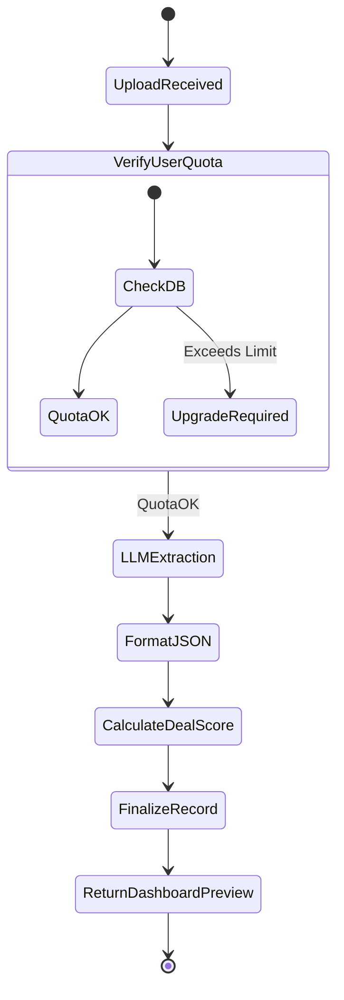

## 1.3 Interaction Diagram (Sequence)
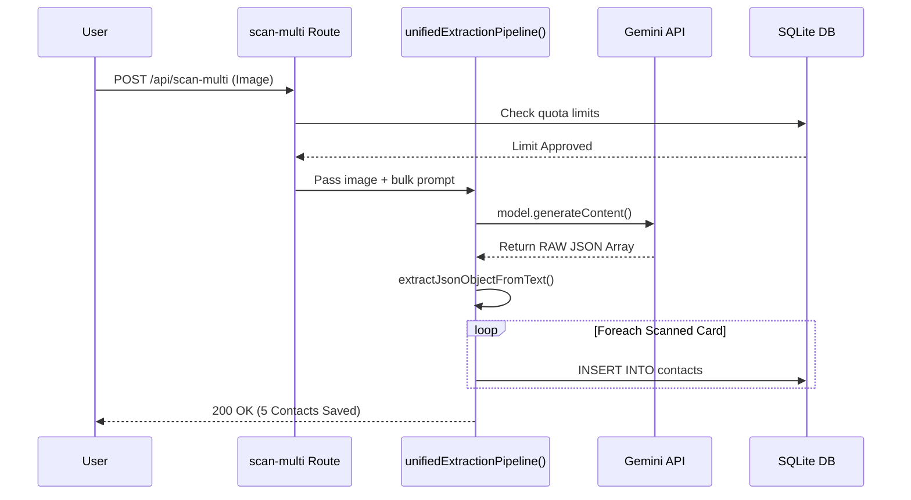

## 1.4 Class Diagram
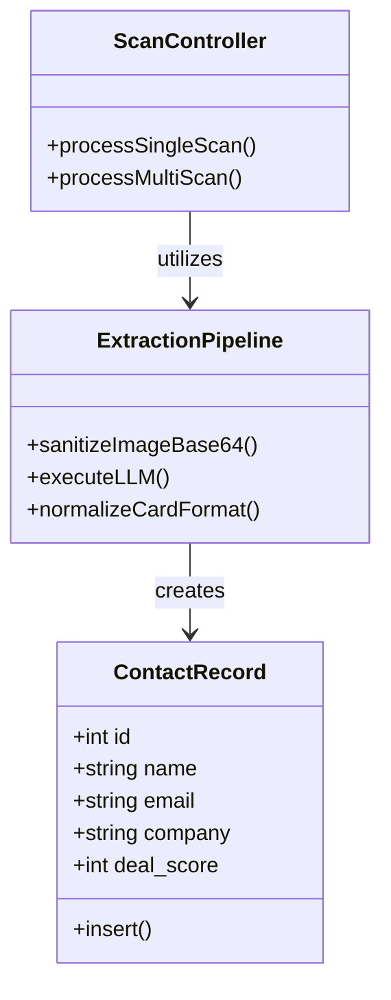

---

# FEATURE 2: Dual-Engine AI Fallback System

## 2.1 Use Case Diagram
```mermaid
usecaseDiagram
    actor AppBackend as Express Server
    actor AppAdmin as SuperAdmin
    
    usecase "Route AI Prompt" as UC1
    usecase "Execute Primary (Gemini)" as UC2
    usecase "Execute Fallback (OpenAI)" as UC3
    usecase "Pause Failing Engine" as UC4
    usecase "Return 500 Error" as UC5
    
    AppBackend --> UC1
    UC1 ..> UC2 : Primary Execution
    UC2 ..> UC3 : <<extend>> If 429/Timeout
    UC3 ..> UC5 : <<extend>> If Complete Failure
    AppAdmin --> UC4
```

## 2.2 Activity Diagram
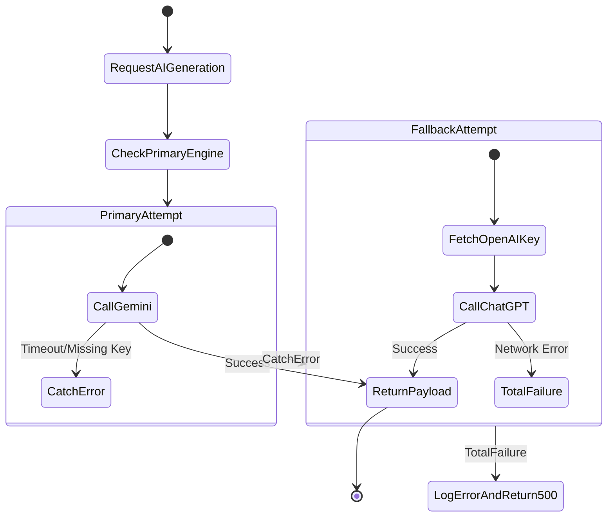

## 2.3 Interaction Diagram
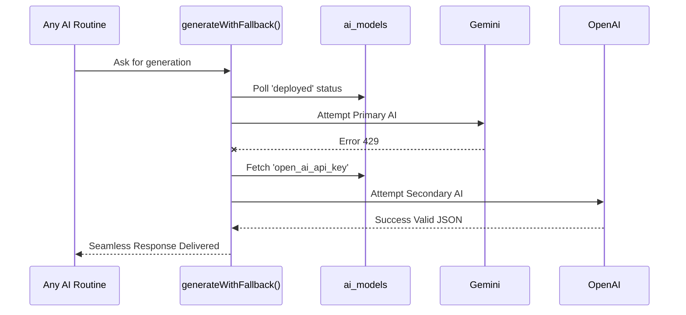

## 2.4 Class Diagram
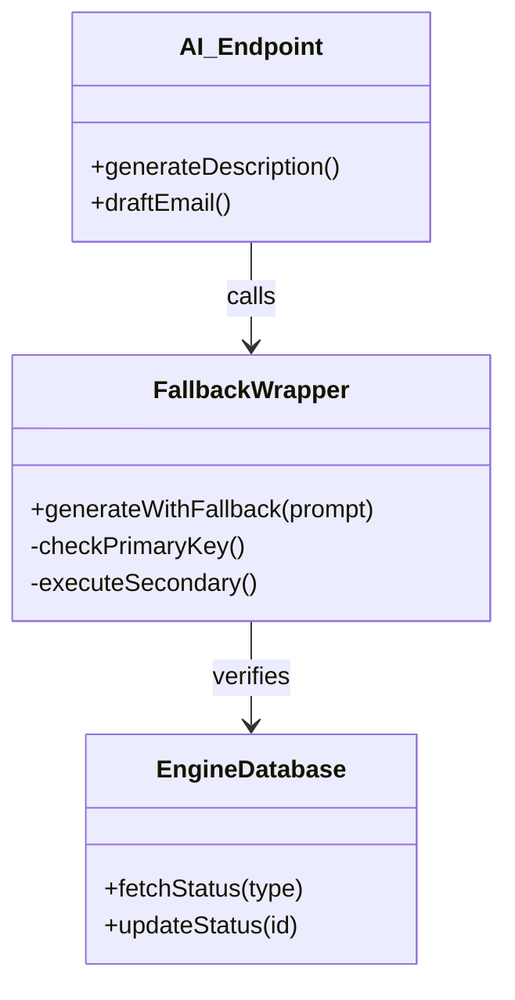

---

# FEATURE 3: Smart Calendar & CRM Scheduling

## 3.1 Use Case Diagram
```mermaid
usecaseDiagram
    actor User as Calendar User
    
    usecase "Create Event" as UC1
    usecase "Generate Ghostwriter Desc." as UC2
    usecase "Delete Event" as UC3
    usecase "Send Email Notification" as UC4
    usecase "Skip Email Failure" as UC5
    
    User --> UC1
    User --> UC3
    
    UC1 ..> UC2 : <<include>>
    UC1 ..> UC4 : <<include>>
    UC3 ..> UC4 : <<include>>
    UC4 ..> UC5 : <<extend>> Server Catch Block
```

## 3.2 Activity Diagram
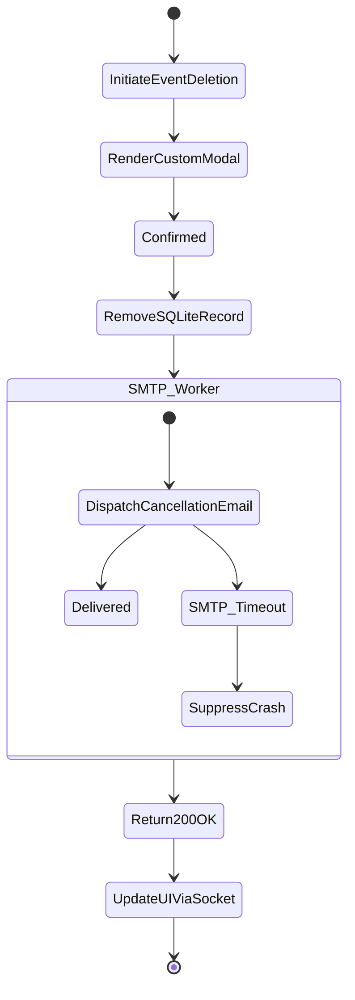

## 3.3 Interaction Diagram
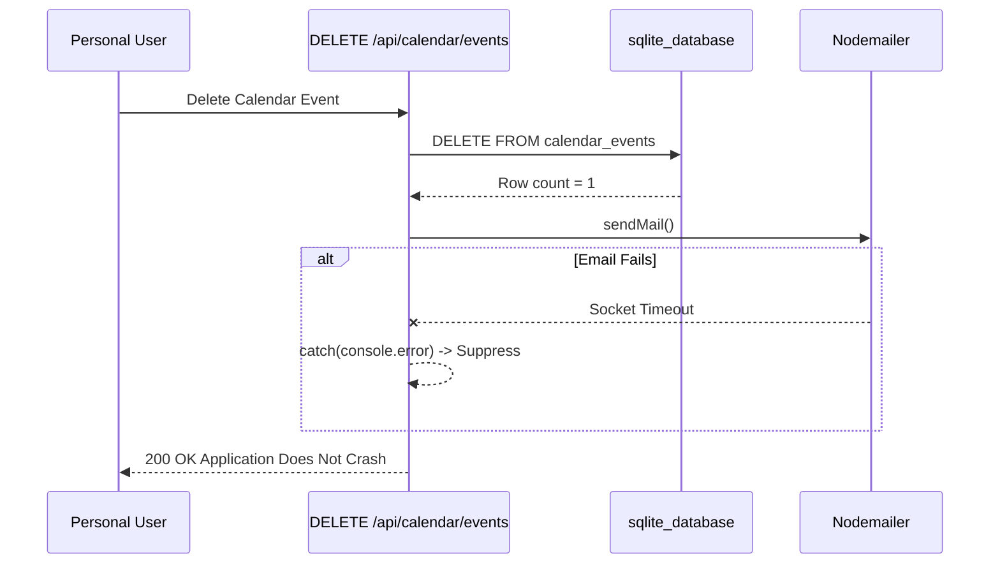

## 3.4 Class Diagram
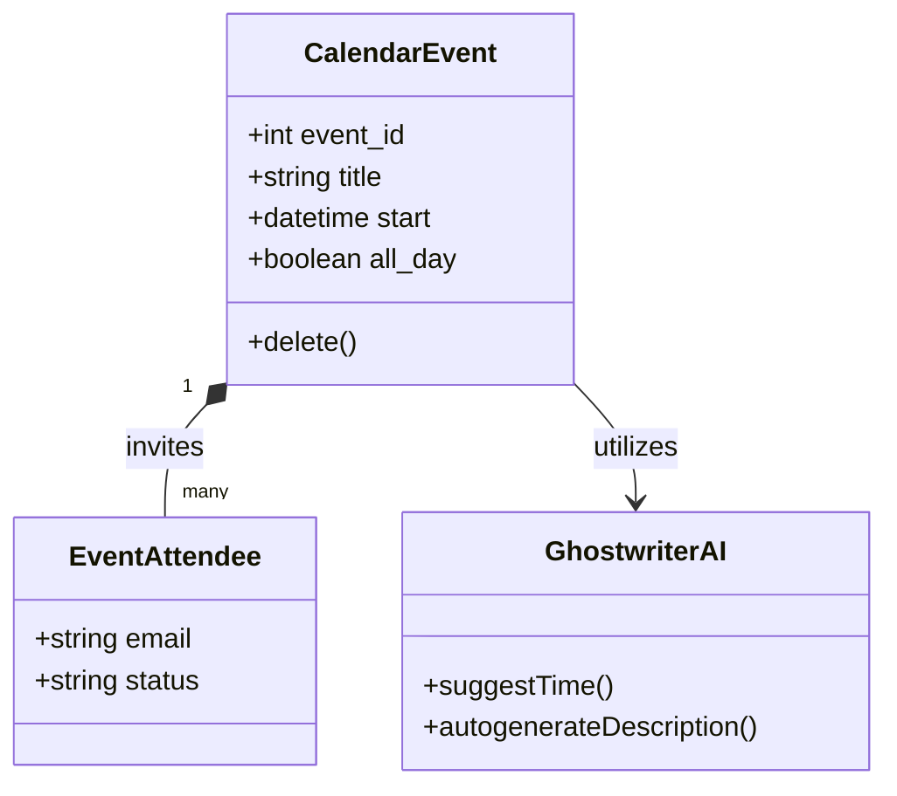

---

# FEATURE 4: AI Coaching & Analytics Suite

## 4.1 Use Case Diagram
```mermaid
usecaseDiagram
    actor SalesActor as B2B Professional
    
    usecase "View Leaderboard" as UC1
    usecase "Filter Missing Context" as UC2
    usecase "Flag Stale Connections" as UC3
    usecase "Draft Follow-up Output" as UC4
    
    SalesActor --> UC1
    SalesActor --> UC2
    SalesActor --> UC3
    UC3 ..> UC4 : <<extend>>
```

## 4.2 Activity Diagram
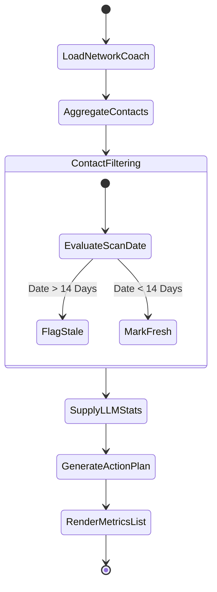

## 4.3 Interaction Diagram
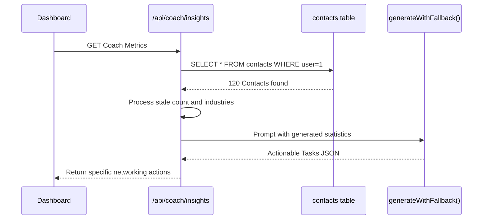

## 4.4 Class Diagram
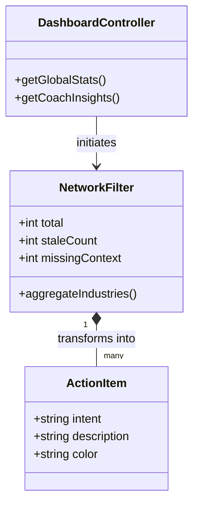
