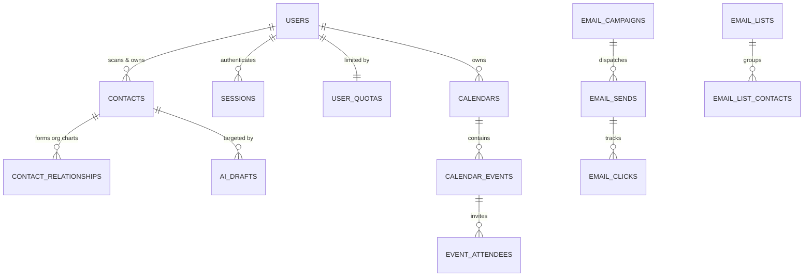
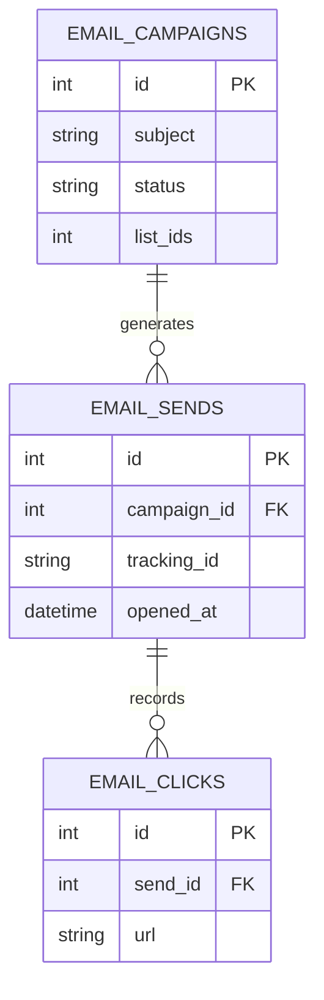
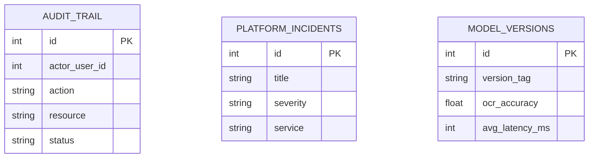

# IntelliScan — Database Architecture & Schema Design

> **Version**: 1.0.0 | **Generated**: April 2026 | **Engine**: SQLite3

This document covers the complete theoretical data model and literal database schema propelling the IntelliScan platform. The database structure relies on an intelligent relational design capable of handling enterprise CRMs, event tracking, email marketing, multi-tenant workspaces, and complex AI auditing.

---

## 🏗️ 1. Theoretical Data Model & Design Principles

IntelliScan’s database is logically divided into **Six Core Domains**:

1. **Identity & Provisioning**: Manages users, sessions, RBAC (Role-Based Access Control), quotas, and workspace boundaries.
2. **CRM & Networking Base**: The single source of truth for parsed contact data, relationship mapping (org-charts), and data hygiene (deduplication).
3. **Calendar & Scheduling**: Handles complex recurring events, calendar shares, attendees, and public booking pipelines.
4. **Email Marketing & Campaigns**: A full email engine schema mapping lists to campaigns, drops to recipients, and events (clicks/opens/bounces) back to contacts.
5. **AI Generative & Automation**: Tracks prompt executions, generated drafts, AI digital cards, and background synchronization jobs.
6. **Platform Operations & Telemetry**: Super Admin level tracking. Tracks infrastructure health, AI model degradation, error logs, and strict compliance-level audit trails.

> [!TIP]
> **Multi-Tenant Design**
> While IntelliScan utilizes a single-database design for simplicity (SQLite), data isolation is strictly enforced via `workspace_id` properties across core tables (`users`, `crm_sync_log`, `integration_sync_jobs`, `email_lists`, etc.) protecting Enterprise data boundaries. 

---

## 📊 2. High-Level Entity-Relationship (ER) Diagram

*Shows core structural relationships across the primary platform.*

---

## 🗄️ 3. Detailed Schema by Domain

### 3.1. Identity & Provisioning

**`users`**
Core identity provider for the application.
* `id` (INTEGER, PK, AI) 
* `name`, `email` (UNIQUE), `password`
* `role` (TEXT) - *RBAC level ('user', 'business_admin', 'super_admin')*
* `tier` (TEXT) - *Subscription tier ('personal', 'pro', 'enterprise')*
* `workspace_id` (INTEGER) - *Logical grouping ID for enterprise sharing*

**`sessions`**
Tracks authentication state to allow remote logout and multi-device management.
* `id`, `user_id`, `token` (JWT signature match)
* `device_info`, `ip_address`, `location`
* `is_active` (BOOLEAN), `last_active`

**`user_quotas`**
Metering platform AI usage.
* `user_id` (PK)
* `used_count` (INTEGER) - *Monthly single scans used*
* `group_scans_used` (INTEGER) - *Monthly batch scans used*
* `limit_amount` (INTEGER) - *Rolling hard limit*

**`workspace_policies`**
Enterprise-level compliance controls.
* `workspace_id` (PK)
* `retention_days` (INTEGER)
* `pii_redaction_enabled` (INTEGER) - *Masks phone/email in logs*
* `strict_audit_storage_enabled` (INTEGER)

---

### 3.2. CRM & Relationship Base

**`contacts`**
The primary output of the AI vision scan. 
* `id` (PK), `user_id`
* `name`, `email`, `phone`, `company`, `job_title`
* `confidence` (INTEGER) - *AI extraction accuracy metric (0-100)*
* `engine_used` (TEXT) - *Which tier (gemini/openai/tesseract) pulled this*
* `inferred_industry`, `inferred_seniority` - *AI computed metadata*
* `workspace_scope`, `crm_synced`, `crm_synced_at`

**`contact_relationships`**
Constructs dynamic Org-Charts via directed graphs.
* `id`, `from_contact_id`, `to_contact_id`
* `type` (TEXT) - *'reports_to', 'colleague', 'introduced_by'*
* *(UNIQUE constraint on from, to, and type)*

**`data_quality_dedupe_queue`**
Resolves conflicting database entries.
* `id`, `workspace_id`, `fingerprint` (TEXT) - *Hash of email/name*
* `contact_ids_json` - *Array of overlapping IDs*
* `status` (TEXT) - *'pending', 'merged', 'dismissed'*
* `confidence` (INTEGER) - *AI deduplication certainty*

---

### 3.3. Email Marketing Engine

**`email_campaigns`**
Stores the master blueprint of a broadcast.
* `id`, `user_id`, `name`, `subject`
* `html_body`, `text_body`, `template_id`
* `status` - *'draft', 'scheduled', 'sending', 'completed'*
* `sent_at`, `scheduled_at`, `open_rate`, `click_rate`

**`email_lists` & `email_list_contacts`**
Segmentation strategy logic.
* `email_lists`: `id`, `workspace_id`, `name`, `type` (static/dynamic), `segment_rules`
* `email_list_contacts`: `list_id`, `email`, `unsubscribed_at`, `subscribed`

**`email_sends` & `email_clicks`**
Delivery telemetry via 1x1 pixels and link overwrites.
* `email_sends`: `tracking_id` (UNIQUE hit target), `opened_at`, `click_count`, `bounce_reason`, `unsubscribed_at`
* `email_clicks`: `send_id`, `url`, `clicked_at`

---

### 3.4. Advanced Calendar & Booking

**`calendars`**
* `id`, `user_id`, `name`, `color`, `timezone`
* `is_shared`, `shared_with`

**`calendar_events`**
* `id`, `calendar_id`, `title`, `start_datetime`, `end_datetime`
* `recurrence_rule`, `recurrence_id`, `is_recurring_exception` - *Standard rrule protocol support*
* `conference_link`, `conference_type`

**`booking_links`**
* `id`, `user_id`, `slug` (UNIQUE URL path)
* `duration_minutes`, `buffer_minutes`, `max_bookings_per_day`
* `questions` - *JSON array of intake form logic*

---

### 3.5. Extensibility & Third-Party Sync

**`crm_mappings`**
Allows workspaces to map custom fields to destination CRMs.
* `user_id` (PK)
* `provider` (TEXT) - *'salesforce', 'hubspot', 'zoho', 'pipedrive'*
* `mapping_json` (TEXT) - *Object dictionary linking local ID to remote ID*

**`integration_sync_jobs`**
Resilient background worker queue for 3rd party API updates.
* `id`, `user_id`, `workspace_id`, `provider`
* `payload_json`, `status` (*queued, processing, succeeded, failed*)
* `retry_count`, `max_retries`, `last_error`, `next_retry_at` *(Exponential backoff)*

---

### 3.6. Operations, Audit & AI Tuning Platform (Super Admin)

**`audit_trail`**
Immutable SOC2 compliance tracking.
* `id` (PK), `actor_user_id`, `actor_role`, `action`, `resource`
* `status` (*SUCCESS, ERROR, DENIED*), `ip_address`, `details_json`

**`model_versions` & `engine_config`**
Manages live LLM deployments and hyper-parameters.
* `model_versions`: `version_tag`, `ocr_accuracy`, `avg_latency_ms`, `status` (*active, standby, deprecated*)
* `engine_config`: Stores KV pairs like `ocr_threshold`, `denoising_sensitivity`

**`api_sandbox_calls`**
Dev-tooling metric retention.
* `id`, `user_id`, `payload`, `response`, `status_code`, `latency_ms`, `engine`
