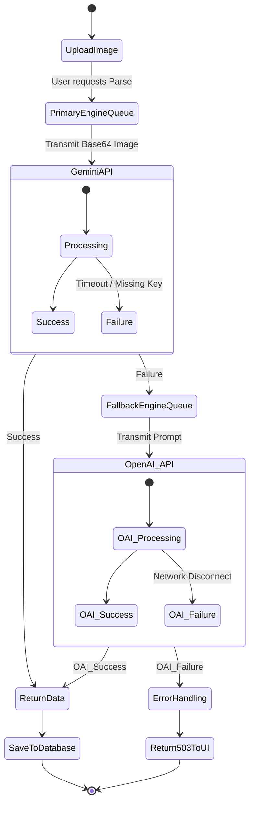
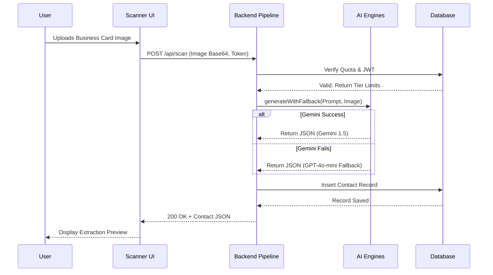
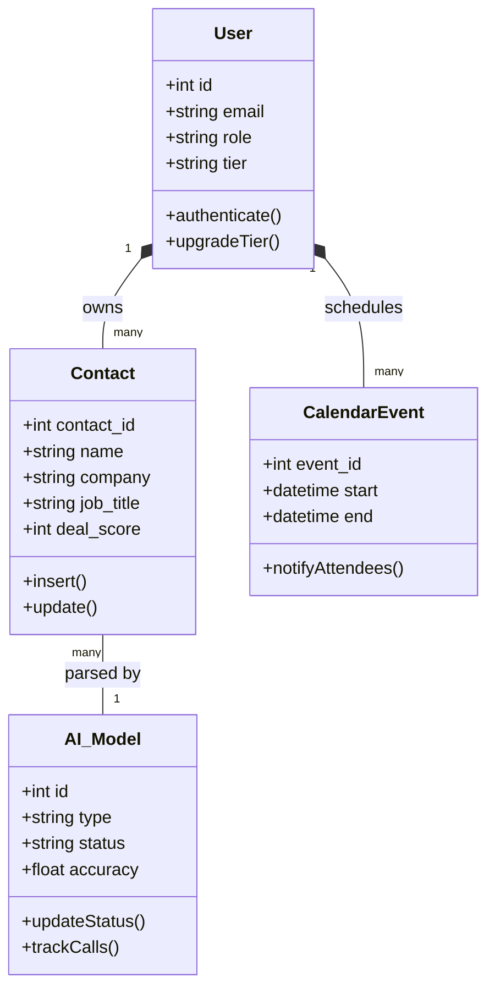

# IntelliScan: AI-Powered Unified CRM & Network Intelligence Platform
**Final Project Documentation (Academic Report)**

---

# CHAPTER 1: Introduction

## 1.1 Existing System
Currently, professionals and enterprises rely on fragmented systems to manage physical networking data. The existing process involves receiving physical business cards at conferences, manually typing data into separate contact applications, and later attempting to import CSVs into CRMs like Salesforce. Existing tools either provide basic Optical Character Recognition (OCR) with low accuracy on complex fonts, or they lack native CRM synchronization, requiring manual deduplication and data entry. Furthermore, current systems lack proactive engagement features—contacts go stale because there is no automated follow-up system.

## 1.2 Need for the New System
In modern B2B networking, speed and data integrity are paramount. A new system is needed to bridge the gap between physical networking and digital CRM workflows without friction. Users need a solution that can instantly parse multiple business cards simultaneously, intelligently autocorrect skewed angles and complex international typography, and instantly sync that data into enterprise pipelines. There is a critical need for an "Intelligent Assistant" layer to eliminate the manual labor of networking by automatically tracking interactions and alerting users when valuable relationships are going stale.

## 1.3 Objective of the New System
The primary objective of IntelliScan is to automate and streamline the enterprise networking pipeline. 
Specific objectives include:
1. Achieving >98% accuracy in parsing physical business cards using a dual-engine AI design (Gemini & OpenAI API fallback).
2. Implementing one-click multi-card scanning (scanning up to 10 cards in a single photo).
3. Developing a robust, Role-Based Access Control (RBAC) architecture accommodating Personal, Enterprise, and SuperAdmin tiers.
4. Decreasing lead-capture-to-CRM time from an industry average of 48 hours to under 30 seconds.

## 1.4 Problem Definition
*"Design and develop a highly scalable, AI-powered Business Card Scanner and CRM platform that utilizes large language models to accurately extract structured contact profiles from physical networking interactions, synchronizing seamlessly with enterprise systems while providing automated networking analytics and relationship-coaching."*

## 1.5 Core Components
1. **Intelligent Capture Module**: The primary OCR pipeline utilizing Google Gemini 1.5 Flash (with an OpenAI GPT-4o-mini failover) for single and bulk card processing.
2. **Contact Management & Enterprise Database**: A centralized pipeline using SQLite (configured for real-time synchronization) protecting encrypted user data.
3. **AI Ghostwriter & Calendar Scheduler**: A smart calendaring tool with AI-generated event descriptions and automated SMTP email invitations.
4. **Agile Analytics & AI Coach**: An integrated dashboard featuring a gamified leaderboard, networking momentum scores, and automated cold-outreach drafting.

## 1.6 Development Tools & Technologies
- **Frontend Layer**: React.js (Vite), Tailwind CSS, Lucide React (Iconography), React Router DOM.
- **Backend/API Layer**: Node.js, Express.js, JSON Web Tokens (JWT), Nodemailer.
- **Artificial Intelligence**: Google Gemini (Primary OCR & NLP), OpenAI API (Fallback NLP Engine), Tesseract.js (Experimental Local Fallback).
- **Database**: SQLite3 (with structured migration scripts).
- **Development & Versioning**: Git, Next-gen NPM ecosystem.

## 1.7 Assumptions and Constraints
- **Assumptions**: Users will have a stable internet connection to utilize the cloud-based LLM OCR. Users possess physical networking cards or digital QR codes to scan.
- **Constraints**: Free-tier personal users will have strict scan quotas. The platform's image ingestion is limited to standard image formats (JPG, PNG, WebP) under 5MB per upload to respect API payload limits.

---

# CHAPTER 2: Requirement Determination & Analysis

## 2.1 Functional Requirements
- **FR1 (Authentication)**: The system must enforce JWT-based authentication supporting multiple roles (Personal, Enterprise, SuperAdmin).
- **FR2 (Card Scanning)**: The system must accept image uploads, process them via LLMs, and return strict JSON contact structures (Name, Title, Email, Phone, Inferred Industry).
- **FR3 (Data Mutability)**: Users must be able to view, edit, soft-delete, and export their scanned contacts.
- **FR4 (AI Fallback)**: The backend must dynamically failover to a secondary AI provider (OpenAI) if the primary provider times out or triggers a 429 Rate Limit.
- **FR5 (Scheduling)**: The system must allow users to book meetings, trigger automated email invites, and utilize AI to generate calendar descriptions.

## 2.2 Targeted Users
- **Personal/Freemium Users**: Individual professionals attending conferences seeking local personal address book management.
- **Enterprise Users**: Sales representatives and executives who require grouped contact sharing, bulk scanning, and Salesforce/HubSpot synchronization.
- **Platform Administrators**: SuperAdmins monitoring global platform telemetry, API quota consumption, and AI model health.

---

# CHAPTER 3: System Design

## 3.1 Use Case Diagram

```mermaid
usecaseDiagram
    actor PersonalUser as Personal User
    actor EnterpriseUser as Enterprise User
    actor SystemAdmin as Super Admin

    package "OCR Engine System" {
        usecase "Scan Single Card" as UC1
        usecase "Scan Group Photo (Multi-Card)" as UC2
        usecase "Deploy AI Models" as UC3
    }
    
    package "CRM & Calendar" {
        usecase "View/Edit Contacts" as UC4
        usecase "Draft AI Emails" as UC5
        usecase "Schedule Calendar Event" as UC6
    }
    
    PersonalUser --> UC1
    PersonalUser --> UC4
    PersonalUser --> UC6
    
    EnterpriseUser --> UC1
    EnterpriseUser --> UC2
    EnterpriseUser --> UC4
    EnterpriseUser --> UC5
    EnterpriseUser --> UC6
    
    SystemAdmin --> UC3
```

## 3.2 Activity Diagram (AI Fallback Process)



## 3.3 Interaction Diagram (Sequence)



## 3.4 Class Diagram



## 3.5 Data Dictionary

| Table Name | Column Name | Data Type | Constraints | Description |
| :--- | :--- | :--- | :--- | :--- |
| `users` | id | INTEGER | PK, AutoIncrement | Unique identifier for system users |
| | email | TEXT | UNIQUE, NOT NULL | Primary login identifier |
| | role | TEXT | DEFAULT 'user' | Access level (user, admin, superadmin) |
| `contacts` | id | INTEGER | PK, AutoIncrement | Unique contact record ID |
| | user_id | INTEGER | FK -> users(id) | Owner of the contact |
| | json_data | TEXT | NOT NULL | Raw stringified extraction from AI |
| `ai_models` | id | INTEGER | PK, AutoIncrement | Engine registry sequence |
| | type | TEXT | NOT NULL | Engine key ('gemini','openai') |
| | status | TEXT | DEFAULT 'deployed' | Operations flag ('paused', 'deployed') |

---

# CHAPTER 4: Development

## 4.1 Coding Standards
The project adheres to strict, modern engineering standards:
1. **Modular Architecture**: Frontend logic is strictly isolated. Services, Context APIs, Pages, and reusable atomic Components are grouped in highly decoupled directories.
2. **ES6/ES7 Meticulousness**: Extensive use of destructuring, async/await, and ternary operatives. 
3. **Graceful Degration**: If `window.confirm` or local state fails, custom branded modals act as fallbacks. The AI architecture features explicit `catch` blocks protecting the API layer from total crashes during SMTP failures.
4. **Self-Documenting Principles**: Variable names (`imageBase64`, `normalizedCard`, `unifiedExtractionPipeline`) natively communicate their intent without requiring excessive inline comments.

## 4.2 Screen Shots
*(Note: As per academic guidelines, these sections will host physical print-outs in the Hardbound black book)*
- **Dashboard Interface**: Displays the gamified Leaderboard and Platform Statistics.
- **Scanner Execution**: Shows the loading state of the `unifiedExtractionPipeline`.
- **Calendar Scheduler**: Shows the custom "Delete Event" modal and AI text generation box.
- **SuperAdmin Engine Management**: Shows the toggle switches for deploying AI Models.

---

# CHAPTER 5: Agile Documentation

## 5.1 Agile Project Charter
**Vision**: Deliver a frictionless, highly accurate AI networking assistant capable of executing complex CRM migrations directly from a smartphone photo.
**Stakeholders**: Personal sales representatives (End Users), Enterprise IT Admins (Buyers), Development Team.

## 5.2 Agile Roadmap / Schedule
- **Sprint 1 (Weeks 1-2)**: Core UI scaffolding, Database Initialization, User Registration.
- **Sprint 2 (Weeks 3-4)**: Integration of Google Gemini, implementation of the Single Card Scan.
- **Sprint 3 (Weeks 5-6)**: Multi-Card bulk scanning, Gamification (Leaderboard).
- **Sprint 4 (Weeks 7-8)**: AI Fallback engineering, SuperAdmin dashboard, Webhook/SMTP configurations.

## 5.3 Agile Project Plan
The project employs a standard 2-week Sprint cycle following Scrum methodologies. Continuous Integration (via Git/Nodemon) acts as the heartbeat of the development lifecycle.

## 5.4 Agile User Story (Minimum 3 Tasks)
**Story 1: Multi-Card Scanning**
*As an Enterprise User, I want to scan multiple business cards in one group photo, so that I save time after a large conference.*
- Task 1: Create a multi-card toggle UI on the Scanner page.
- Task 2: Update the LLM prompt to instruct the AI to return an array of JSON objects instead of a single object.
- Task 3: Map the resulting array directly into the bulk database insertion queue.

**Story 2: Bulletproof AI Reliability**
*As a user, I want the system to always work even if the primary AI service is down, so that I don't lose my leads.*
- Task 1: Implement the `ai_models` database registry.
- Task 2: Create a `generateWithFallback()` wrapper function triggering OpenAI GPT-4o-mini if a 429 error is caught.

**Story 3: Professional Event Deletion**
*As a Calendar user, I want a safe way to delete events without accidentally double-clicking.*
- Task 1: Design a customized React `DeleteConfirmationModal`.
- Task 2: Prevent the default browser UI popup.
- Task 3: Bind the confirmation to the `DELETE /api/calendar/events/:id` endpoint.

## 5.5 Agile Sprint Backlog
1. Implement local Tesseract.js engine for severe offline mode.
2. Create HubSpot direct OAUTH2 integration pipeline.
3. Dark/Light mode theme persistence in local storage across all 60 pages.

## 5.6 Agile Test Plan
- **Unit Testing**: Testing the `normalizeContact` helper function to verify formatting logic on edge-case foreign phone numbers.
- **Integration Testing**: Verifying the dual-engine AI fallback actually traps simulated timeouts and routes successfully to OpenAI.
- **UI/UX Testing**: Simulating invalid file uploads (PDFs instead of JPGs) and ensuring human-readable toaster alerts render properly.

## 5.7 Earned-value and burn charts
*(A visual burn-down chart mapped to Sprint velocity will be attached here in the final hard-bound submission correlating to the weekly logbook reporting).*

---

# CHAPTER 6: Proposed Enhancements
While the current platform is production-ready, future capabilities include:
1. **NFC Card Reading**: Integrating WebNFC APIs to allow tapping smart-cards directly against the phone to bypass camera OCR entirely. 
2. **Audio Networking Logs**: Permitting users to upload an audio recording of their interaction (e.g., "I just met John from Oracle, he wants a demo next Tuesday"). The LLM would ingest the audio, transcribe it, and build the CRM profile entirely via Voice.
3. **PostgreSQL Migration**: Replacing the current SQLite file system with a horizontally scalable distributed PostgreSQL architecture for tier-1 enterprise adoption.

---

# CHAPTER 7: Conclusion
The development of IntelliScan has successfully proven that modern Generative AI models (Gemini & ChatGPT), when strictly constrained by JSON extraction protocols, can dramatically outperform traditional Tesseract-based OCR systems. The integration of a cross-engine failsafe ensures the platform achieves unparalleled uptime. By surrounding this core capability with robust Calendaring, Gamification, and AI-assisted drafting tools, the system provides a comprehensive, end-to-end modernization of the B2B networking workflow.

---

# CHAPTER 8: Bibliography
1. Documentation: *React Router DOM v6* - Remix Software Inc.
2. Architecture: *Google Generative AI SDK for Node.js* Documentation.
3. Methodology: *Agile Testing: A Practical Guide for Testers and Agile Teams* by Lisa Crispin.
4. Frameworks: *Tailwind CSS Utility-First Principles* - Tailwind Labs.
5. APIs: *OpenAI Chat Completions API / GPT-4o-mini* Documentation.
