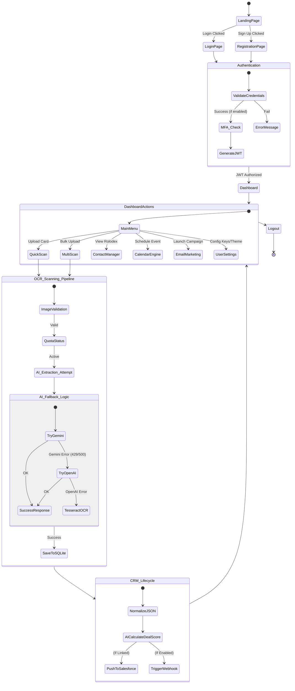

# IntelliScan — Global System Activity Diagram

This diagram represents the **High-Level Operational Flow** of the entire IntelliScan platform, from initial landing and authentication through the core OCR scanning loop to CRM synchronization and logout.

> **Note**: For the 20 individual feature-specific activity diagrams, please refer to the `IntelliScan_ActivityDiagrams.md` file already in your project folder.
