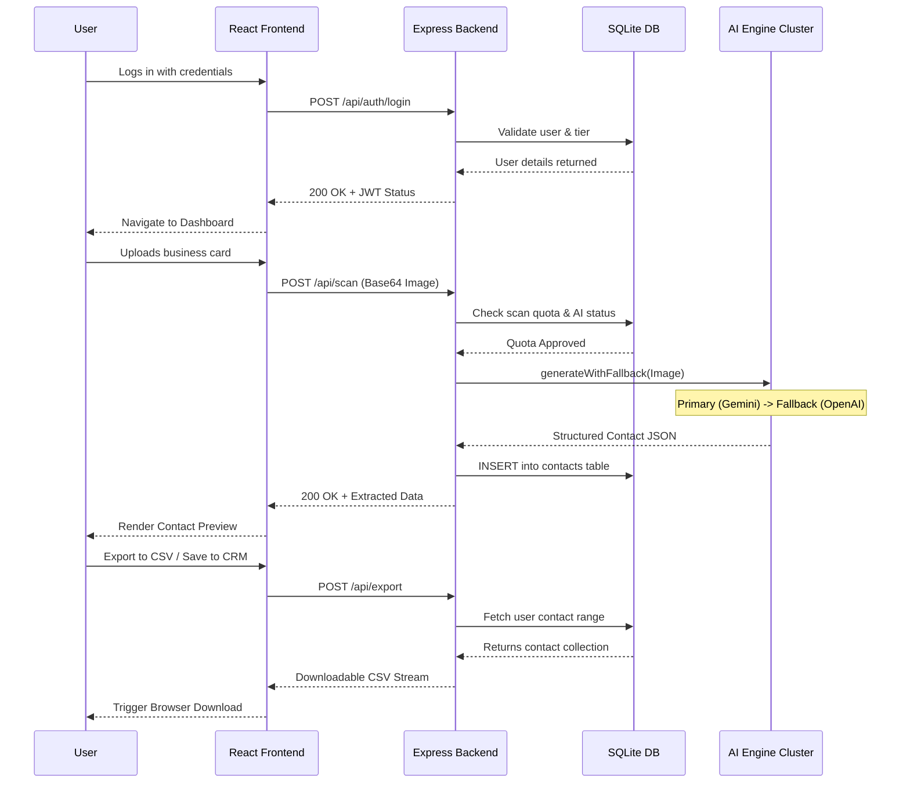

# IntelliScan — Global Interaction (Sequence) Diagram

This diagram provides a high-level overview of how the **User, Frontend, Backend API, AI Services (Gemini/OpenAI Cluster), and SQLite Database** interact across a standard session.

> **Note**: For the 20 detailed, feature-specific interaction (sequence) diagrams, please refer to the `IntelliScan_InteractionDiagrams.md` file in your project folder.
