# IntelliScan — Complete Interaction (Sequence) Diagrams (All Features)

> Every diagram below uses valid **Mermaid.js** `sequenceDiagram` syntax to map out the real-time, step-by-step interactions between Actors, Frontend UI, Backend APIs, Databases, and External APIs (like Gemini/OpenAI).
> Paste any block into [mermaid.live](https://mermaid.live) to render the sequence flows.

---

## FEATURE 1: Authentication & User Onboarding
**Description**: Sequence of events for a new user registering and hitting the onboarding checks.

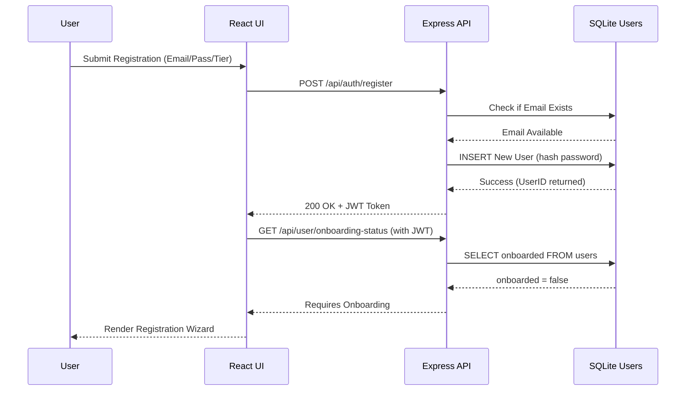
```mermaid
sequenceDiagram
    participant User
    participant Frontend as React UI
    participant Backend as Express API
    participant DB as SQLite Users
    
    User->>Frontend: Submit Registration (Email/Pass/Tier)
    Frontend->>Backend: POST /api/auth/register
    Backend->>DB: Check if Email Exists
    DB-->>Backend: Email Available
    Backend->>DB: INSERT New User (hash password)
    DB-->>Backend: Success (UserID returned)
    Backend-->>Frontend: 200 OK + JWT Token
    Frontend->>Backend: GET /api/user/onboarding-status (with JWT)
    Backend->>DB: SELECT onboarded FROM users
    DB-->>Backend: onboarded = false
    Backend-->>Frontend: Requires Onboarding
    Frontend-->>User: Render Registration Wizard
```

---

## FEATURE 2: Single Card OCR Scanner
**Description**: The precise API payload tracking from image upload to contact extraction.

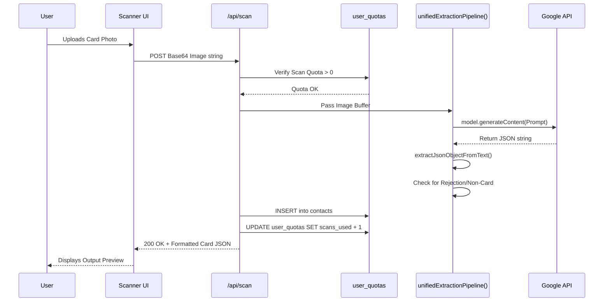
```mermaid
sequenceDiagram
    participant User
    participant UI as Scanner UI
    participant API as /api/scan
    participant DB as user_quotas
    participant Pipeline as unifiedExtractionPipeline()
    participant Gemini as Google API
    
    User->>UI: Uploads Card Photo
    UI->>API: POST Base64 Image string
    API->>DB: Verify Scan Quota > 0
    DB-->>API: Quota OK
    API->>Pipeline: Pass Image Buffer
    Pipeline->>Gemini: model.generateContent(Prompt)
    Gemini-->>Pipeline: Return JSON string
    Pipeline->>Pipeline: extractJsonObjectFromText()
    Pipeline->>Pipeline: Check for Rejection/Non-Card
    API->>DB: INSERT into contacts
    API->>DB: UPDATE user_quotas SET scans_used + 1
    API-->>UI: 200 OK + Formatted Card JSON
    UI-->>User: Displays Output Preview
```

---

## FEATURE 3: Multi-Card Group Scanner
**Description**: How the backend slices a bulk request into an array of contacts.

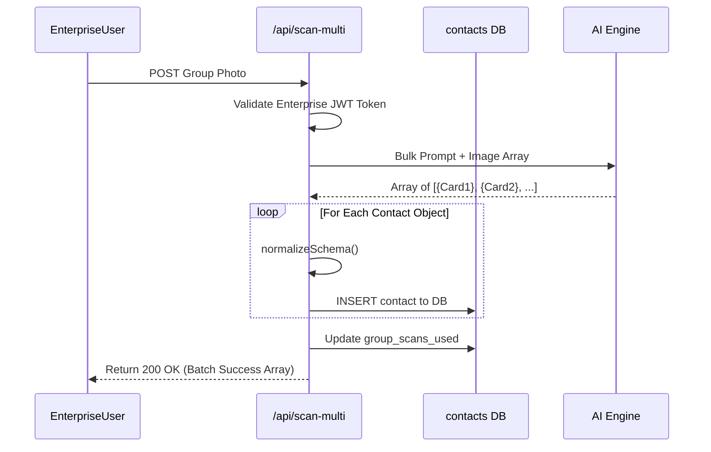
```mermaid
sequenceDiagram
    participant EnterpriseUser
    participant API as /api/scan-multi
    participant DB as contacts DB
    participant LLM as AI Engine
    
    EnterpriseUser->>API: POST Group Photo
    API->>API: Validate Enterprise JWT Token
    API->>LLM: Bulk Prompt + Image Array
    LLM-->>API: Array of [{Card1}, {Card2}, ...]
    loop For Each Contact Object
        API->>API: normalizeSchema()
        API->>DB: INSERT contact to DB
    end
    API->>DB: Update group_scans_used
    API-->>EnterpriseUser: Return 200 OK (Batch Success Array)
```

---

## FEATURE 4: Contact Management (CRUD)
**Description**: Interaction mapping for updating a specific contact record natively.

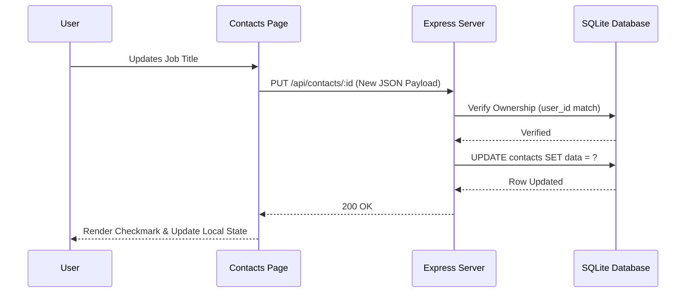
```mermaid
sequenceDiagram
    participant User
    participant UI as Contacts Page
    participant API as Express Server
    participant DB as SQLite Database
    
    User->>UI: Updates Job Title
    UI->>API: PUT /api/contacts/:id (New JSON Payload)
    API->>DB: Verify Ownership (user_id match)
    DB-->>API: Verified
    API->>DB: UPDATE contacts SET data = ?
    DB-->>API: Row Updated
    API-->>UI: 200 OK
    UI-->>User: Render Checkmark & Update Local State
```

---

## FEATURE 5: AI Dual-Engine Fallback
**Description**: Real-time failover network logic trapping API outages.

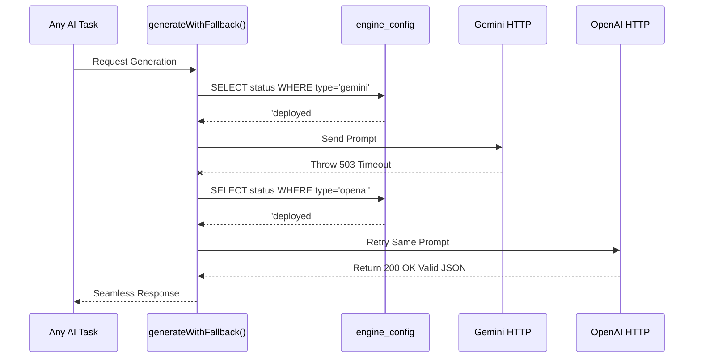
```mermaid
sequenceDiagram
    participant Function as Any AI Task
    participant Wrapper as generateWithFallback()
    participant EngineDB as engine_config
    participant API_G as Gemini HTTP
    participant API_O as OpenAI HTTP
    
    Function->>Wrapper: Request Generation
    Wrapper->>EngineDB: SELECT status WHERE type='gemini'
    EngineDB-->>Wrapper: 'deployed'
    Wrapper->>API_G: Send Prompt
    API_G--xWrapper: Throw 503 Timeout
    Wrapper->>EngineDB: SELECT status WHERE type='openai'
    EngineDB-->>Wrapper: 'deployed'
    Wrapper->>API_O: Retry Same Prompt
    API_O-->>Wrapper: Return 200 OK Valid JSON
    Wrapper-->>Function: Seamless Response
```

---

## FEATURE 6: Calendar & Event Scheduling
**Description**: The multi-service sequence resolving database records and SMTP email deliveries concurrently.

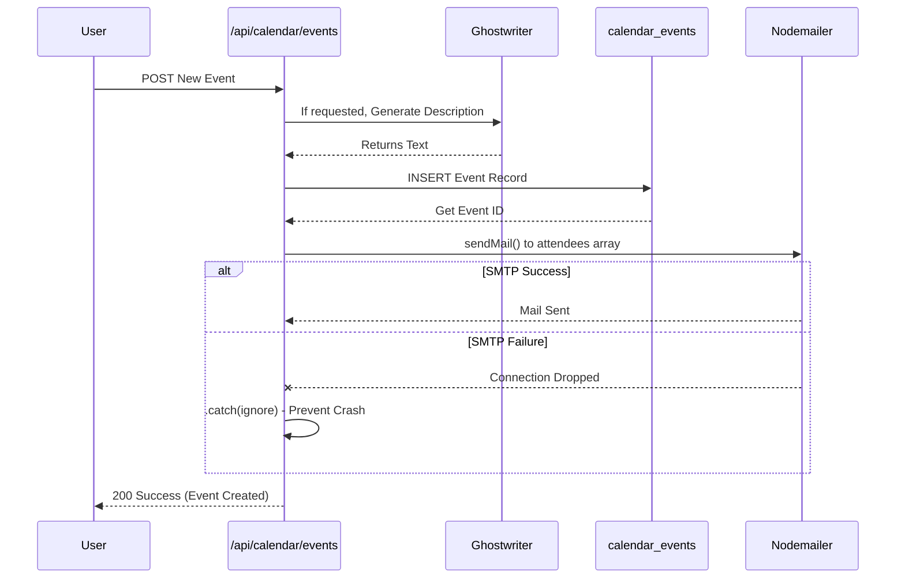
```mermaid
sequenceDiagram
    participant User
    participant API as /api/calendar/events
    participant Ghostwriter
    participant DB as calendar_events
    participant SMTP as Nodemailer
    
    User->>API: POST New Event
    API->>Ghostwriter: If requested, Generate Description
    Ghostwriter-->>API: Returns Text
    API->>DB: INSERT Event Record
    DB-->>API: Get Event ID
    API->>SMTP: sendMail() to attendees array
    alt SMTP Success
        SMTP-->>API: Mail Sent
    else SMTP Failure
        SMTP--xAPI: Connection Dropped
        API->>API: .catch(ignore) - Prevent Crash
    end
    API-->>User: 200 Success (Event Created)
```

---

## FEATURE 7: AI Networking Coach & Insights
**Description**: How the frontend fetches actionable networking advice through data synthesis.

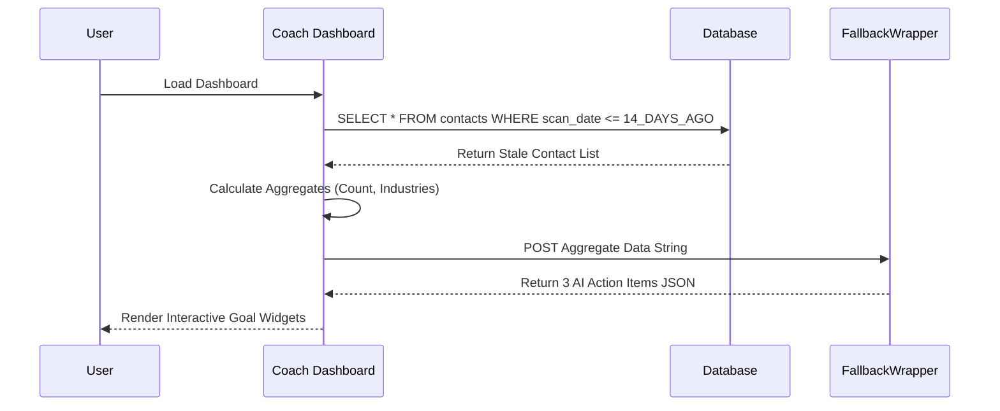
```mermaid
sequenceDiagram
    participant User
    participant App as Coach Dashboard
    participant DB as Database
    participant LLM as FallbackWrapper
    
    User->>App: Load Dashboard
    App->>DB: SELECT * FROM contacts WHERE scan_date <= 14_DAYS_AGO
    DB-->>App: Return Stale Contact List
    App->>App: Calculate Aggregates (Count, Industries)
    App->>LLM: POST Aggregate Data String
    LLM-->>App: Return 3 AI Action Items JSON
    App-->>User: Render Interactive Goal Widgets
```

---

## FEATURE 8: Email Marketing Campaigns
**Description**: The logic chain for dispatching a dynamic HTML email to a target list.

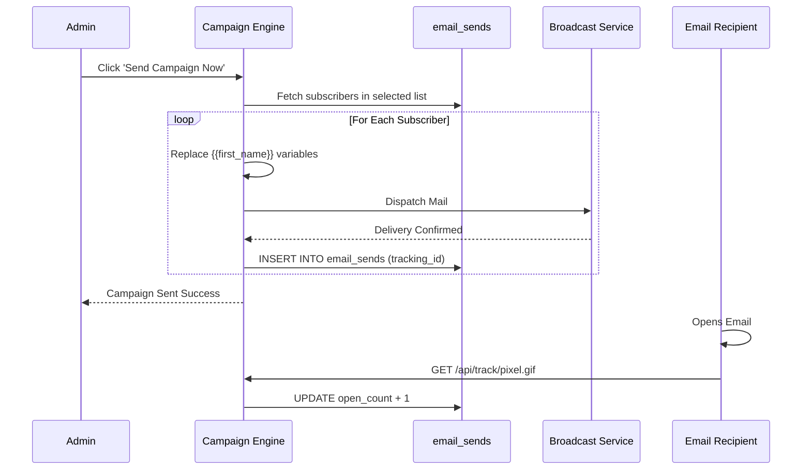
```mermaid
sequenceDiagram
    participant Admin
    participant Server as Campaign Engine
    participant DB as email_sends
    participant SMTP as Broadcast Service
    participant Client as Email Recipient
    
    Admin->>Server: Click 'Send Campaign Now'
    Server->>DB: Fetch subscribers in selected list
    loop For Each Subscriber
        Server->>Server: Replace {{first_name}} variables
        Server->>SMTP: Dispatch Mail
        SMTP-->>Server: Delivery Confirmed
        Server->>DB: INSERT INTO email_sends (tracking_id)
    end
    Server-->>Admin: Campaign Sent Success
    Client->>Client: Opens Email
    Client->>Server: GET /api/track/pixel.gif
    Server->>DB: UPDATE open_count + 1
```

---

## FEATURE 9: CRM Integration (Salesforce / HubSpot)
**Description**: Pushing a newly scanned contact directly to a third-party CRM.

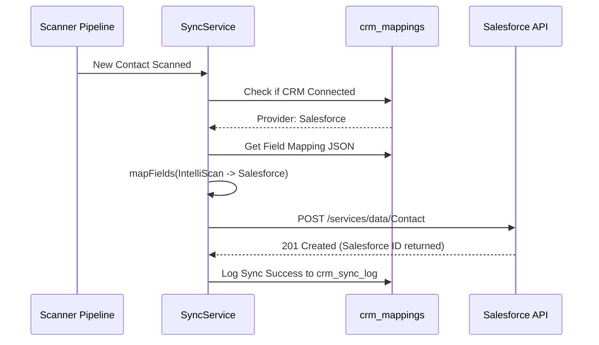
```mermaid
sequenceDiagram
    participant Scanner Pipeline
    participant SyncService
    participant DB as crm_mappings
    participant ThirdParty as Salesforce API
    
    Scanner Pipeline->>SyncService: New Contact Scanned
    SyncService->>DB: Check if CRM Connected
    DB-->>SyncService: Provider: Salesforce
    SyncService->>DB: Get Field Mapping JSON
    SyncService->>SyncService: mapFields(IntelliScan -> Salesforce)
    SyncService->>ThirdParty: POST /services/data/Contact
    ThirdParty-->>SyncService: 201 Created (Salesforce ID returned)
    SyncService->>DB: Log Sync Success to crm_sync_log
```

---

## FEATURE 10: Gamified Leaderboard
**Description**: Sequence for calculating the top performing workspace members.

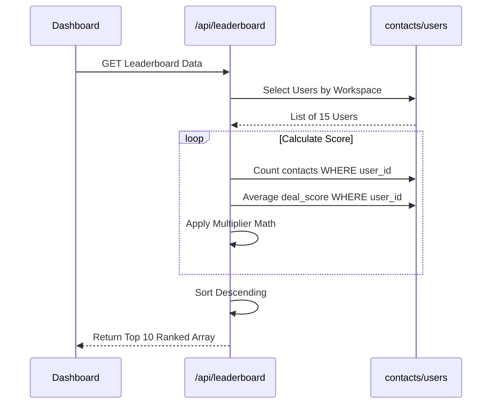
```mermaid
sequenceDiagram
    participant Dashboard
    participant API as /api/leaderboard
    participant DB as contacts/users
    
    Dashboard->>API: GET Leaderboard Data
    API->>DB: Select Users by Workspace
    DB-->>API: List of 15 Users
    loop Calculate Score
        API->>DB: Count contacts WHERE user_id
        API->>DB: Average deal_score WHERE user_id
        API->>API: Apply Multiplier Math
    end
    API->>API: Sort Descending
    API-->>Dashboard: Return Top 10 Ranked Array
```

---

## FEATURE 11: Digital Card Creator
**Description**: How a visitor requests a user's sharing link and sees their digital profile.

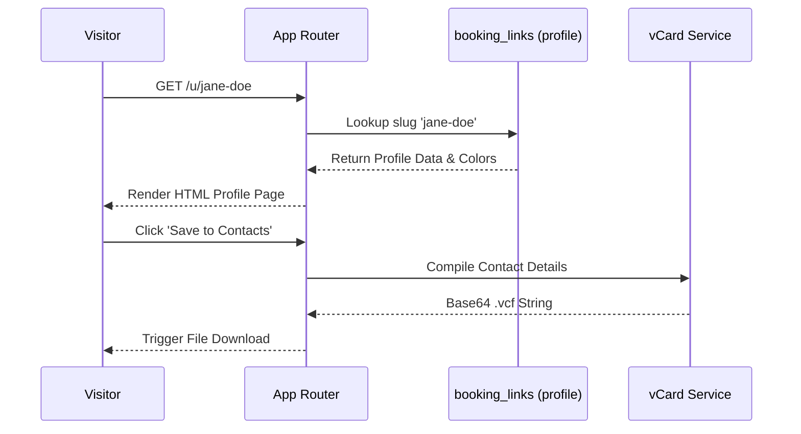
```mermaid
sequenceDiagram
    participant Visitor
    participant Server as App Router
    participant DB as booking_links (profile)
    participant VcardGen as vCard Service
    
    Visitor->>Server: GET /u/jane-doe
    Server->>DB: Lookup slug 'jane-doe'
    DB-->>Server: Return Profile Data & Colors
    Server-->>Visitor: Render HTML Profile Page
    Visitor->>Server: Click 'Save to Contacts'
    Server->>VcardGen: Compile Contact Details
    VcardGen-->>Server: Base64 .vcf String
    Server-->>Visitor: Trigger File Download
```

---

## FEATURE 12: SuperAdmin Engine Management
**Description**: Modifying core server behaviors securely from the web UI.

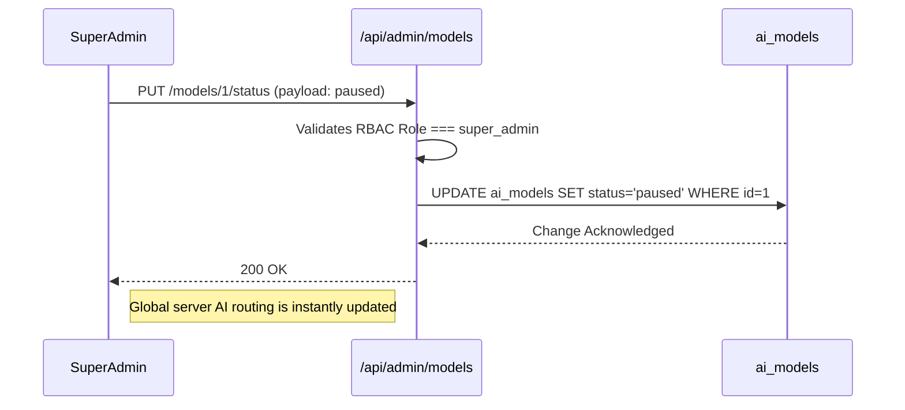
```mermaid
sequenceDiagram
    participant SuperAdmin
    participant API as /api/admin/models
    participant DB as ai_models
    
    SuperAdmin->>API: PUT /models/1/status (payload: paused)
    API->>API: Validates RBAC Role === super_admin
    API->>DB: UPDATE ai_models SET status='paused' WHERE id=1
    DB-->>API: Change Acknowledged
    API-->>SuperAdmin: 200 OK
    Note right of SuperAdmin: Global server AI routing is instantly updated
```

---

## FEATURE 13: Workspace Collaboration
**Description**: Sharing a private contact into the public workspace Rolodex.

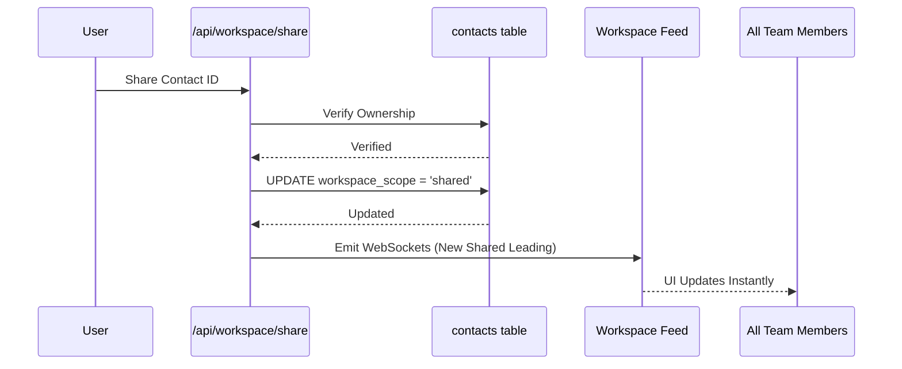
```mermaid
sequenceDiagram
    participant User
    participant Router as /api/workspace/share
    participant DB_Contact as contacts table
    participant GlobalStream as Workspace Feed
    
    User->>Router: Share Contact ID #402
    Router->>DB_Contact: Verify Ownership
    DB_Contact-->>Router: Verified
    Router->>DB_Contact: UPDATE workspace_scope = 'shared'
    DB_Contact-->>Router: Updated
    Router->>GlobalStream: Emit WebSockets (New Shared Leading)
    GlobalStream-->>All Team Members: UI Updates Instantly
```

---

## FEATURE 14: Analytics & Reporting
**Description**: Requesting visual telemetry arrays for ChartJs.

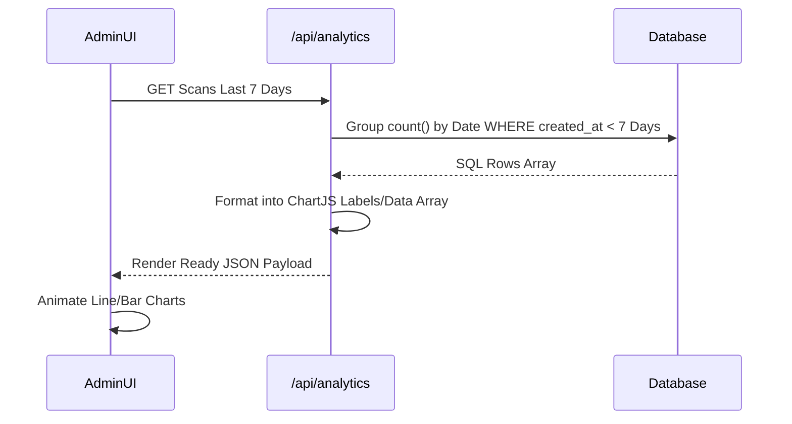
```mermaid
sequenceDiagram
    participant AdminUI
    participant API as /api/analytics
    participant DB as Database
    
    AdminUI->>API: GET Scans Last 7 Days
    API->>DB: Group count() by Date WHERE created_at < 7 Days
    DB-->>API: SQL Rows Array
    API->>API: Format into ChartJS Labels/Data Array
    API-->>AdminUI: Render Ready JSON Payload
    AdminUI->>AdminUI: Animate Line/Bar Charts
```

---

## FEATURE 15: Billing & Subscriptions
**Description**: Initiating the upgrade process and resolving tier adjustments.

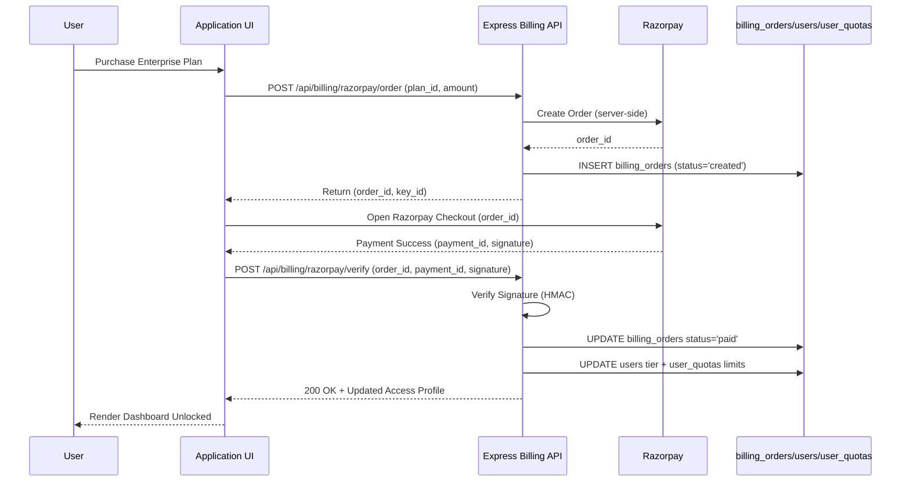
```mermaid
sequenceDiagram
    participant User
    participant Client as Application UI
    participant API as Express Billing API
    participant PaymentAPI as Razorpay
    participant DB as billing_orders/users/user_quotas
    
    User->>Client: Purchase Enterprise Plan
    Client->>API: POST /api/billing/razorpay/order (plan_id, amount)
    API->>PaymentAPI: Create Order (server-side)
    PaymentAPI-->>API: order_id
    API->>DB: INSERT billing_orders (status='created')
    API-->>Client: Return (order_id, key_id)
    Client->>PaymentAPI: Open Razorpay Checkout (order_id)
    PaymentAPI-->>Client: Payment Success (payment_id, signature)
    Client->>API: POST /api/billing/razorpay/verify (order_id, payment_id, signature)
    API->>API: Verify Signature (HMAC)
    API->>DB: UPDATE billing_orders status='paid'
    API->>DB: UPDATE users tier + user_quotas limits
    API-->>Client: 200 OK + Updated Access Profile
    Client-->>User: Render Dashboard Unlocked
```

---

## FEATURE 16: AI Drafts & Ghostwriter
**Description**: Selecting a lead and dynamically generating a cold email draft.

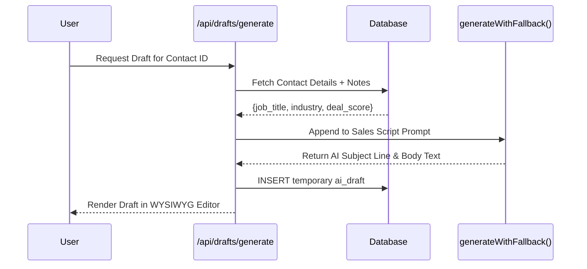
```mermaid
sequenceDiagram
    participant User
    participant API as /api/drafts/generate
    participant CRMContext as Database
    participant LLM as generateWithFallback()
    
    User->>API: Request Draft for Contact ID #88
    API->>CRMContext: Fetch Contact Details + Notes
    CRMContext-->>API: {job_title, industry, deal_score}
    API->>LLM: Append to Sales Script Prompt
    LLM-->>API: Return AI Subject Line & Body Text
    API->>CRMContext: INSERT temporary ai_draft
    API-->>User: Render Draft in WYSIWYG Editor
```

---

## FEATURE 17: Kiosk Mode (Conference Scanner)
**Description**: The localized loop preventing page refresh while streaming the camera feed.

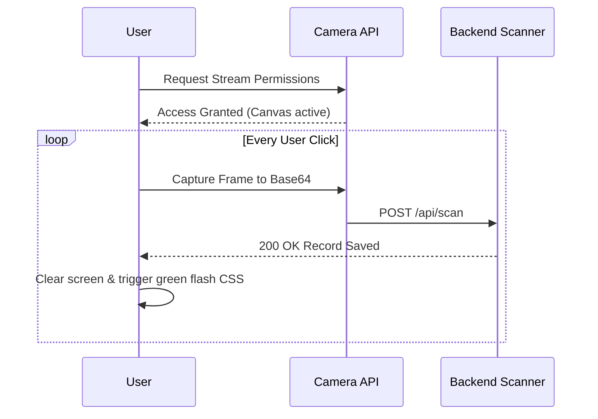
```mermaid
sequenceDiagram
    participant User
    participant Camera API
    participant Backend Scanner
    
    User->>Camera API: Request Stream Permissions
    Camera API-->>User: Access Granted (Canvas active)
    loop Every User Click
        User->>Camera API: Capture Frame to Base64
        Camera API->>Backend Scanner: POST /api/scan
        Backend Scanner-->>User: 200 OK Record Saved
        User->>User: Clear screen & trigger green flash CSS
    end
```

---

## FEATURE 18: Meeting Presence & Signals
**Description**: Automatic recognition of attendee engagement from calendar linkages.

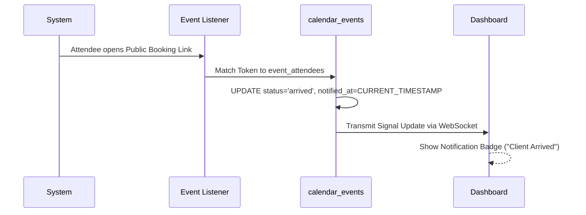
```mermaid
sequenceDiagram
    participant System
    participant Webhook as Event Listener
    participant DB as calendar_events
    participant Dashboard
    
    System->>Webhook: Attendee opens Public Booking Link
    Webhook->>DB: Match Token to event_attendees
    DB->>DB: UPDATE status='arrived', notified_at=CURRENT_TIMESTAMP
    DB->>Dashboard: Transmit Signal Update via WebSocket
    Dashboard-->>Dashboard: Show Notification Badge ("Client Arrived")
```

---

## FEATURE 19: Settings & Profile Config
**Description**: The secure sequence for storing and applying API Keys per user.

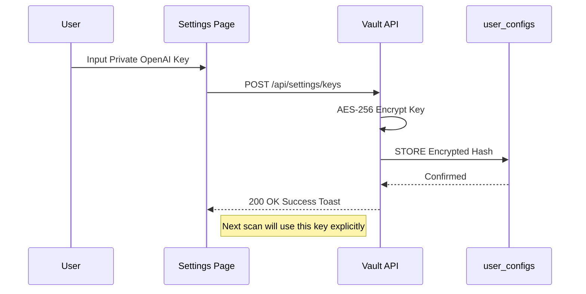
```mermaid
sequenceDiagram
    participant User
    participant UI as Settings Page
    participant KeyService as Vault API
    participant DB as user_configs
    
    User->>UI: Input Private OpenAI Key
    UI->>KeyService: POST /api/settings/keys
    KeyService->>KeyService: AES-256 Encrypt Key
    KeyService->>DB: STORE Encrypted Hash
    DB-->>KeyService: Confirmed
    KeyService-->>UI: 200 OK Success Toast
    Note right of UI: Next scan will use this key explicitly
```

---

## FEATURE 20: Support Chatbot
**Description**: Conversing seamlessly with the AI customer support widget.

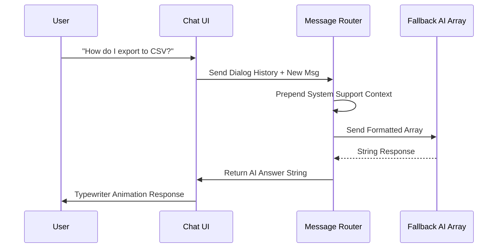
```mermaid
sequenceDiagram
    participant User
    participant Chat UI
    participant ChatBackend as Message Router
    participant Wrapper as Fallback AI Array
    
    User->>Chat UI: "How do I export to CSV?"
    Chat UI->>ChatBackend: Send Dialog History + New Msg
    ChatBackend->>ChatBackend: Prepend System Support Context
    ChatBackend->>Wrapper: Send Formatted Array
    Wrapper-->>ChatBackend: String Response
    ChatBackend->>Chat UI: Return AI Answer String
    Chat UI->>User: Typewriter Animation Response
```
