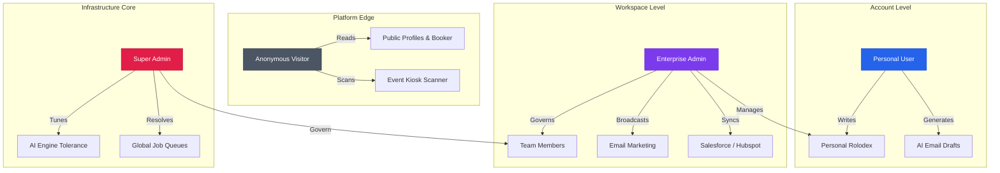

# IntelliScan — Role-Based Access Control (RBAC) Matrix

> **Version**: 1.0.0 | **Generated**: April 2026

The IntelliScan platform employs a strict, 4-tier authentication matrix. Access is controlled simultaneously at the **Frontend Route-Level** using `<RoleGuard>` wrappers and at the **Backend API Level** using JWT middleware (`authenticateToken`, `requireEnterpriseOrAdmin`, `requireSuperAdmin`).

Below is the definitive guide detailing **Who** can access **What**, and **When**.

---

## 🌎 1. Anonymous Worker (Public / Unauthenticated)
**Status:** No JWT Token / Logged Out

Anonymous users are individuals interacting with the platform's public edges. These are usually leads, prospects, or visitors evaluating the software.

### Accessible Features & When They Occur:
| Feature | URL Path | When Accessed |
|---------|----------|---------------|
| **Marketing Pages** | `/`, `/pricing` | Used during initial product discovery and evaluation. |
| **Authentication** | `/sign-in`, `/sign-up`, `/forgot-password` | When creating an account, onboarding, or recovering access. |
| **Public Analytics** | `/public-stats` | Evaluators looking at the global speed and accuracy of the AI engine. |
| **API Documentation** | `/api-docs` | Developers figuring out how to integrate with the IntelliScan platform. |
| **Public Profiles** | `/u/:slug` | When a logged-in user shares their "Digital Business Card" via QR code, the anonymous user receives this page. |
| **Calendar Booking** | `/book/:slug` | When a prospect uses an Enterprise User's calendar link to schedule a meeting. |
| **Kiosk Scanner** | `/scan/:token` | When at a trade show, anonymous attendees use an iPad to scan their own cards into the Enterprise user's CRM. |

---

## 👤 2. Personal User
**Status:** Authenticated (Role: `user`)

The Personal User is the base-level authenticated individual. They use IntelliScan purely for individual productivity, personal networking, and solo CRM management.

### Accessible Features & When They Occur:
| Feature | Sub-system | When Accessed |
|---------|------------|---------------|
| **AI Card Scanning** | `dashboard/scan` | When returning from a networking event and needing to digitize a stack of business cards (Gemini/OpenAI fallback active). |
| **Personal CRM** | `dashboard/contacts` | When searching for a specific contact, exporting an Excel sheet, or tagging connections. |
| **AI Draft Composer** | `dashboard/drafts` | When writing a personalized follow-up email after a meeting using AI generated context. |
| **AI Networking Coach** | `dashboard/coach` | When looking for AI insights on who they haven't spoken to recently and should reconnect with. |
| **Digital Card Editor** | `dashboard/my-card` | Before a conference, designing their shareable QR profile (`/u/:slug`). |
| **Meeting Prep** | `dashboard/presence` | Generating pre-meeting briefings on specific LinkedIn profiles or companies. |

*❌ **Restricted From:** Shared workspaces, Email Broadcasts, Advanced Calendars, Core Platform settings.*

---

## 🏢 3. Enterprise User (Business Admin)
**Status:** Authenticated (Role: `business_admin` + Paid Tier: `enterprise`)

The Business Admin controls a `workspace_id`. They govern a team of users and have access to mass communication, data hygiene, and third-party integrations.

### Accessible Features & When They Occur:
*(Includes ALL Personal User Features, plus:)*

| Feature | Sub-system | When Accessed |
|---------|------------|---------------|
| **Workspace CRM** | `workspace/dashboard` | Managing the shared "Team Rolodex", ensuring sales reps aren't stepping on each other's toes. |
| **Team Management** | `workspace/members` | Onboarding new employees, purchasing seats, and assigning internal user roles. |
| **Email Marketing** | `dashboard/email-marketing/*` | When launching a massive 10,000-person HTML email campaign to all scanned attendees from a trade show. Includes list building and template design. |
| **Calendar System** | `dashboard/calendar/*` | Setting up intelligent availability slots, recurring events, and generating Calendly-style booking links (`/book/:slug`). |
| **CRM Integration** | `workspace/crm-mapping` | Setting up automatic background syncs that push IntelliScan data directly into Salesforce or HubSpot. |
| **Data Quality Center** | `workspace/data-quality` | Resolving AI-flagged duplicate contacts (e.g., merging "John Doe" and "J. Doe"). |
| **Routing Rules** | `workspace/routing-rules` | Automatically assigning "VP of Tech" scans to the Senior Account Executive. |

*❌ **Restricted From:** Core AI Model tweaks, Server Error Logs, Super Admin overrides.*

---

## 👑 4. Super Admin
**Status:** Authenticated (Role: `super_admin`)

The absolute highest level of access. Super Admins are the engineers, founders, and platform operators. They oversee the physical infrastructure, AI models, and debug global failures.

### Accessible Features & When They Occur:
*(Includes ALL Personal AND Enterprise User Features, plus:)*

| Feature | Sub-system | When Accessed |
|---------|------------|---------------|
| **Admin Dashboard** | `/admin/dashboard` | Daily global monitoring of MRR (Monthly Recurring Revenue), total active workspaces, and server load. |
| **Engine Performance** | `/admin/engine-performance` | When the OCR/AI processing is slowing down, the admin can slide tolerance thresholds to speed up Gemini/OpenAI queries globally. |
| **Model Versioning** | `/admin/custom-models` | Rolling back the AI LLM prompt if a new version degrades extraction accuracy. |
| **System Incidents** | `/admin/incidents` | Paging DevOps when the OpenAI API goes down, updating platform-wide "Maintenance" banners. |
| **Global Job Queues** | `/admin/job-queues` | Investigating why a specific Enterprise's Salesforce sync webhook failed and manually brute-forcing a retry. |
| **API Sandbox** | `/admin/sandbox` | Testing new features and mock JSON payloads directly against the live database without affecting real users. |
| **Feedback Hub** | `/admin/feedback` | Reading and resolving bug reports submitted by Personal and Enterprise users. |

---

### Security Overview Diagram

