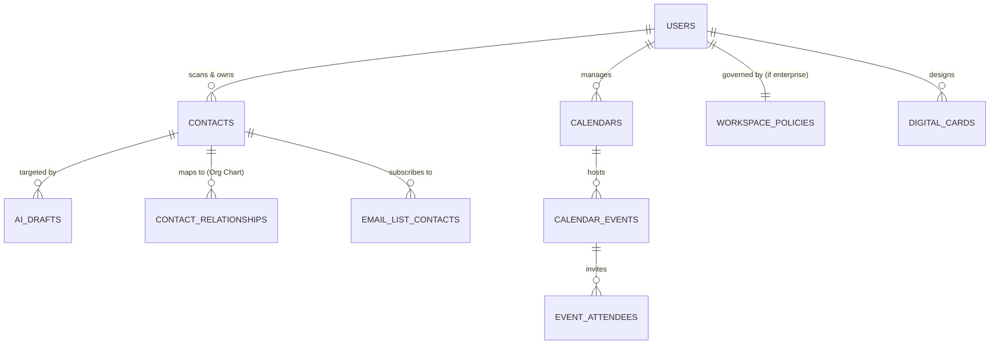
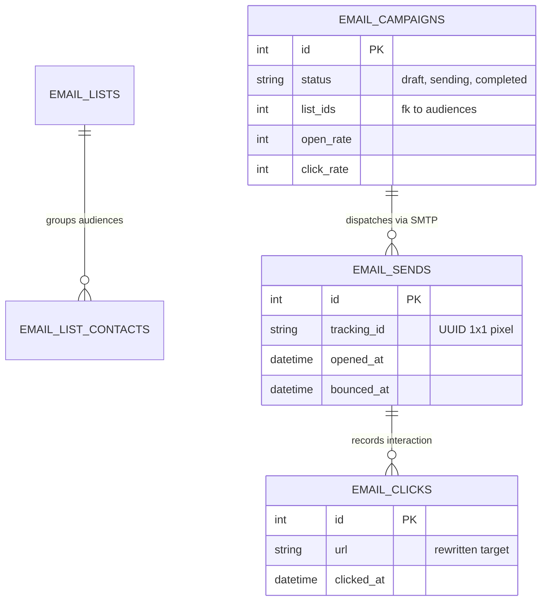
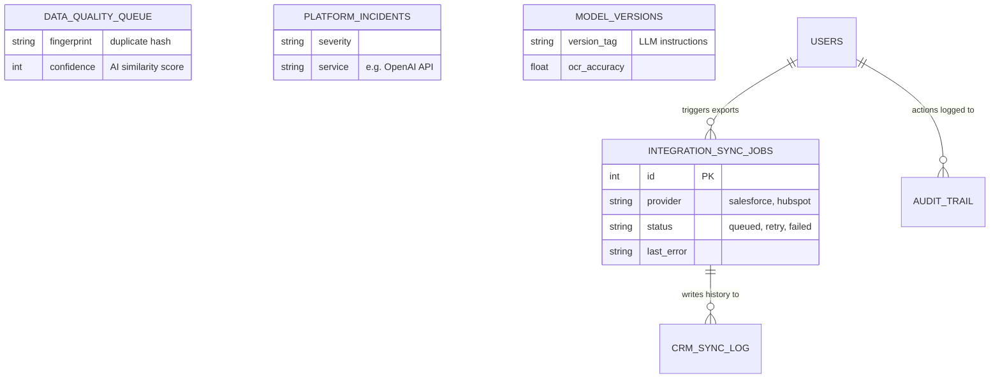

# IntelliScan: Ultimate Database Architecture & Theoretical Schema

> **Version**: 1.0.0 | **Generated**: April 2026

IntelliScan is an enterprise-grade SaaS CRM platform designed for scale, multi-tenancy, and AI-driven data capture. This document outlines the theoretical underpinning, structural diagramming, and exact table-by-table physical schema of the SQLite database powering the system.

---

## 🏗️ 1. Theoretical Data Model

### Multi-Tenant Isolation Strategy
IntelliScan utilizes a **logical isolation** approach to multi-tenancy within a single unified database. The primary boundary is the `workspace_id`. 
* **Personal Tier**: Users operate in a siloed state where `workspace_scope` maps back to their generic `user_id`. 
* **Enterprise Tier**: A `workspace_id` acts as the umbrella for an entire organization. Entities like `crm_sync_log`, `email_lists`, `workspace_policies`, and `billing_invoices` are hard-bound to this ID. Queries enforce this boundary, meaning an Enterprise Admin (`business_admin`) can see all contacts, lists, and users tagged with their `workspace_id`, ensuring strict corporate data sovereignty.

### RBAC Boundaries
The relational model strictly defines access control via the `role` field on the `users` table:
* **`super_admin`**: Operates above the `workspace_id` boundary. This role interacts with `platform_incidents`, `model_versions`, `engine_config`, and the root `audit_trail`. They tune the physical AI engine.
* **`business_admin`**: Operates at the `workspace_id` boundary. This role creates `routing_rules`, manages `crm_mappings`, oversees `email_campaigns`, and sets `workspace_policies`.
* **`user`**: Operates at the `user_id` boundary. This role creates `events`, generates `ai_drafts`, designs `digital_cards`, and manages their personal `contacts`.

### Telemetry & Tracking Hooks
The architecture connects edge-level actions seamlessly to core entities. When an `email_campaign` is dispatched, it generates thousands of `email_sends` (each with a unique UUID `tracking_id`). The system intercepts 1x1 tracking pixel loads (Opens) and URL redirects (Clicks). These actions write to `email_clicks` and increment `open_count` on the send record, rolling data dynamically back up to the `email_campaigns` entity for real-time dashboard plotting.

---

## 📊 2. Architectural Diagrams

### A. The Master Flow Diagram (Core Entities)
This diagram illustrates the heart of IntelliScan: Users capturing Contacts, which fuel both the Email and Calendar subsystems.

### B. Email Marketing Engine (Broadcast Flow)
This specialized diagram details the massive email infrastructure, depicting how Lists transform into Campaigns, Sends, and Tracked Clicks.

### C. Admin, Integrations, & Infrastructure Layer
This diagram explores the backend operations, detailing how data flows out of IntelliScan into external CRMs, and how system health is monitored.

---

## 🗄️ 3. In-Depth Table Breakdowns

### Domain 1: Identity, RBAC, and Provisioning

#### `users`
* **Purpose**: Primary identity truth. Handles auth and bounds users to workspaces.
* **Columns**: 
  * `email` (TEXT UNIQUE): Primary key for login.
  * `password` (TEXT): bcrypt salted hash.
  * `role` (TEXT): `user`, `business_admin`, or `super_admin`.
  * `workspace_id` (INTEGER): Plugs user into Enterprise tenant structure.
  * `tier` (TEXT): Determines billing quotas (`personal`, `pro`, `enterprise`).

#### `sessions`
* **Purpose**: Tracks active JWT lifecycles, allowing users to forcefully sign out other devices.
* **Columns**: `token` (JWT string), `device_info` (User-Agent string), `ip_address`, `is_active` (BOOLEAN).

#### `user_quotas`
* **Purpose**: Limits API abuse mapping to the User's tier.
* **Columns**: 
  * `used_count` (INTEGER): Current billing cycle standard scans.
  * `group_scans_used` (INTEGER): Heavy-duty batch OCR scans.
  * `limit_amount` (INTEGER): Hard ceiling before "Upgrade Required".

#### `workspace_policies`
* **Purpose**: Configures legal and compliance guardrails per enterprise.
* **Columns**: 
  * `retention_days` (INTEGER): Time until raw images are purged.
  * `pii_redaction_enabled` (INTEGER): Masks emails in audit logs if enabled.

#### `onboarding_prefs`
* **Purpose**: JSON blob storing user industry and goal preferences set during signup.

---

### Domain 2: Core CRM, AI Contacts & Quality

#### `contacts`
* **Purpose**: The absolute core of IntelliScan. Represents a parsed business card.
* **Columns**: 
  * `confidence` (INTEGER): Score (0-100) determining how sure the AI was during OCR extraction. Lower scores flag the contact for manual review.
  * `engine_used` (TEXT): Was this pulled by Gemini, OpenAI, or Tesseract? 
  * `inferred_industry` / `inferred_seniority`: Metadata guessed by LLMs to help auto-routing.
  * `workspace_scope` (INTEGER): Tied to `workspace_id` (shared) or `user_id` (siloed).
  * `crm_synced` (INTEGER): Boolean flag preventing double-exports to external CRMs.

#### `contact_relationships`
* **Purpose**: Powers the Org Chart visualizer.
* **Columns**: `from_contact_id`, `to_contact_id`, `type` (Enum: 'reports_to', 'colleague', 'introduced_by').

#### `data_quality_dedupe_queue`
* **Purpose**: AI flags potential duplicate contacts so human admins can merge them safely.
* **Columns**: 
  * `fingerprint` (TEXT): A normalization hash (e.g. `johndoe@test.com`).
  * `contact_ids_json` (TEXT): Array of IDs in conflict.
  * `status` (TEXT): Moves from `pending` -> `merged` or `dismissed`.

#### `routing_rules`
* **Purpose**: Zapier-style triggers assigning newly scanned contacts based on rules.
* **Columns**: `condition_field` (e.g. 'job_title'), `condition_val` (e.g. 'CEO'), `target` (user ID to assign to).

---

### Domain 3: AI Tooling & Generative Systems

#### `ai_drafts`
* **Purpose**: Saves pre-written emails generated by the LLM from a contact's card.
* **Columns**: `contact_name`, `subject`, `body`, `tone` (professional/casual), `status` (draft/sent).

#### `digital_cards`
* **Purpose**: Serves public, QR-code scannable digital profiles for users.
* **Columns**: `url_slug` (Unique path `/u/john-doe`), `views`, `saves`, `design_json` (CSS positioning and layout properties).

---

### Domain 4: Email Marketing Architecture

#### `email_campaigns`
* **Purpose**: Represents a broadcast dispatch.
* **Columns**: 
  * `html_body` / `text_body`: The physical content.
  * `list_ids` (TEXT): Comma-separated array linking to target audiences.
  * `open_rate` / `click_rate` (INTEGER): Pre-calculated metric caches for fast dashboard loading.

#### `email_lists` / `email_list_contacts`
* **Purpose**: Segmentation buckets. 
* **Columns**: `segment_rules` (Dynamic logic SQL), `subscribed` (BOOLEAN opt-in status), `unsubscribed_at` (Compliance timestamp).

#### `email_sends`
* **Purpose**: The atomic unit of delivery for ONE contact in ONE campaign.
* **Columns**: `tracking_id` (UUID injected into a 1x1 image pixel), `opened_at`, `click_count`, `bounce_reason`.

#### `email_clicks`
* **Purpose**: Link-by-link action tracker.
* **Columns**: `url` (The target destination the user navigated to), `clicked_at`.

---

### Domain 5: Calendar System

#### `calendars` & `calendar_events`
* **Purpose**: Full scheduling interface.
* **Columns**: 
  * `recurrence_rule` (TEXT): Standard RRULE syntax (e.g. `FREQ=WEEKLY;BYDAY=MO`).
  * `timezone` (TEXT): Enforces temporal accuracy against UTC DB storage.

#### `booking_links` & `availability_slots`
* **Purpose**: Public-facing Calendly-clone pages.
* **Columns**: `slug` (Unique path `/book/sync-with-john`), `duration_minutes`, `day_of_week` (0=Sunday, 6=Saturday), `start_time` / `end_time`.

---

### Domain 6: External Integrations

#### `crm_mappings`
* **Purpose**: Tells the system how an IntelliScan field translates to Salesforce.
* **Columns**: `provider` (salesforce, hubspot), `mapping_json` (e.g. `{"job_title": "Title", "company": "Account Name"}`).

#### `integration_sync_jobs`
* **Purpose**: Heavy-duty background queue ensuring external API failures don't permanently drop data.
* **Columns**: 
  * `payload_json` (The data being shipped out).
  * `status` (queued, processing, failed).
  * `retry_count` / `next_retry_at` (Implements exponential backoff strategy).

---

### Domain 7: Infrastructure, Audit, & System Health (Super Admin)

#### `audit_trail`
* **Purpose**: Immutable ledger logging every destructive or secure action (Logins, Deletions, Exports).
* **Columns**: `actor_user_id`, `actor_role`, `action`, `resource` (Endpoint URL), `ip_address`, `details_json`.

#### `platform_incidents`
* **Purpose**: Tracks major outages (e.g., "Gemini API down").
* **Columns**: `severity` (low, critical), `service`, `status` (open, resolved).

#### `model_versions` & `engine_config`
* **Purpose**: Allows developers to Hot-Swap AI instruction sets in production and tweak OCR tolerances.
* **Columns**: 
  * `version_tag`: "v2.5-aggressive-denoise".
  * `ocr_accuracy` / `avg_latency_ms`: Real-time performance monitors.
  * `value` (in engine_config): Allows live adjustment of threshold parameters.

#### `analytics_logs`
* **Purpose**: Global frontend performance parsing.
* **Columns**: `path` (URL visited), `duration_ms` (Page load time), `user_role`.

---

*This architecture enforces scalability by decoupling background jobs (`integration_sync_jobs`), massive telemetry scaling (`email_sends/clicks`), and isolating multi-tenant cross-pollination at the storage boundary level.*
