# IntelliScan — Complete Use Case Diagrams (All Features)

> Every diagram below uses valid **Mermaid.js** `flowchart` syntax to represent Use Case relationships.  
> **Actors** are shown as 👤 labeled boxes, **Use Cases** as rounded ovals `([...])`, **include** as dashed arrows `-.->`, and **extend** as dotted arrows `-.->`.  
> Paste any block into [mermaid.live](https://mermaid.live) to see the rendered graphic.

---

## GLOBAL: Full Project Use Case (All Roles)

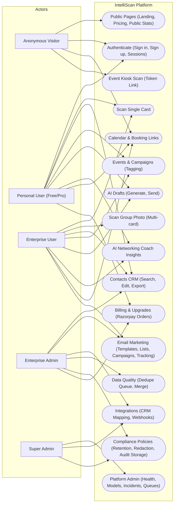

---

## FEATURE 1: Authentication & User Onboarding

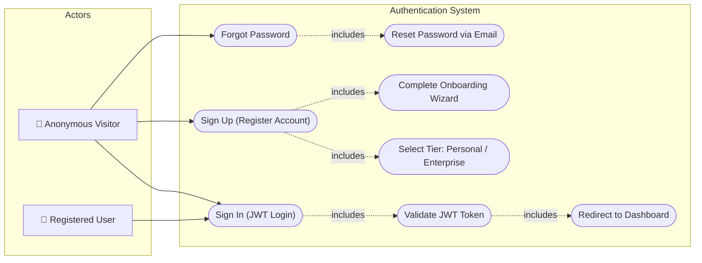

---

## FEATURE 2: Intelligent OCR Scanner (Single Card)

```mermaid
flowchart LR
    subgraph Actors
        U1["👤 Personal User"]
        U2["👤 Enterprise User"]
    end

    subgraph "Single Card OCR System"
        UC1(["Upload / Capture Card Image"])
        UC2(["Validate File Type & Size"])
        UC3(["Check User Scan Quota"])
        UC4(["Check AI Engine Status"])
        UC5(["Send Image to Gemini LLM"])
        UC6(["Fallback to OpenAI GPT-4o-mini"])
        UC7(["Fallback to Tesseract.js"])
        UC8(["Extract Structured JSON"])
        UC9(["Normalize Contact Schema"])
        UC10(["Calculate AI Deal Score"])
        UC11(["Detect Language & Industry"])
        UC12(["Save Contact to Database"])
        UC13(["Display Extraction Preview"])
        UC14(["Reject Non-Card Image"])
    end

    U1 --> UC1
    U2 --> UC1

    UC1 -.->|includes| UC2
    UC2 -.->|includes| UC3
    UC3 -.->|includes| UC4
    UC4 -.->|includes| UC5
    UC5 -.->|extends| UC6
    UC6 -.->|extends| UC7
    UC5 -.->|includes| UC8
    UC6 -.->|includes| UC8
    UC8 -.->|includes| UC9
    UC9 -.->|includes| UC10
    UC9 -.->|includes| UC11
    UC10 -.->|includes| UC12
    UC12 -.->|includes| UC13
    UC2 -.->|extends| UC14
```

---

## FEATURE 3: Multi-Card / Group Photo Scanner

```mermaid
flowchart LR
    subgraph Actors
        E1["👤 Enterprise User"]
    end

    subgraph "Multi-Card Scanning System"
        UC1(["Upload Group Photo"])
        UC2(["Validate Enterprise Tier"])
        UC3(["Check Group Scan Quota"])
        UC4(["Send to AI with Bulk Prompt"])
        UC5(["AI Identifies Individual Cards"])
        UC6(["Extract Array of Contacts"])
        UC7(["Normalize Each Contact"])
        UC8(["Bulk Insert to Database"])
        UC9(["Increment Quota Counter"])
        UC10(["Display All Extracted Cards"])
        UC11(["Show Upgrade Prompt"])
    end

    E1 --> UC1

    UC1 -.->|includes| UC2
    UC2 -.->|includes| UC3
    UC3 -.->|includes| UC4
    UC3 -.->|extends| UC11
    UC4 -.->|includes| UC5
    UC5 -.->|includes| UC6
    UC6 -.->|includes| UC7
    UC7 -.->|includes| UC8
    UC8 -.->|includes| UC9
    UC9 -.->|includes| UC10
```

---

## FEATURE 4: Contact Management (CRUD)

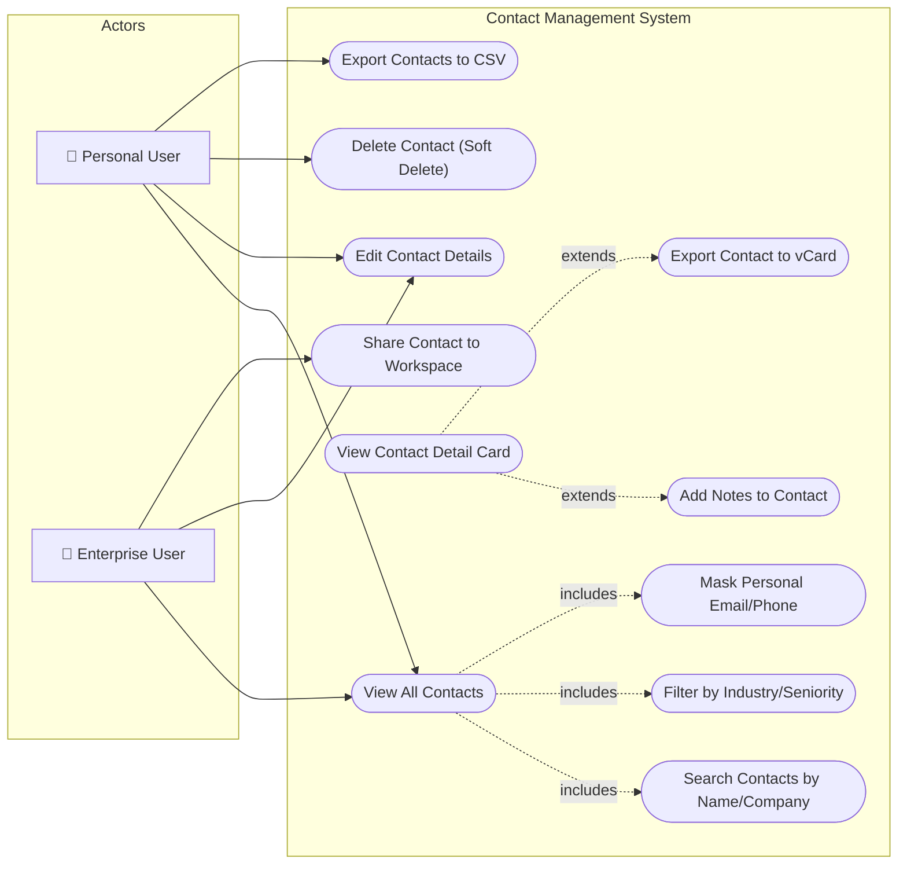

---

## FEATURE 5: AI Dual-Engine Fallback System

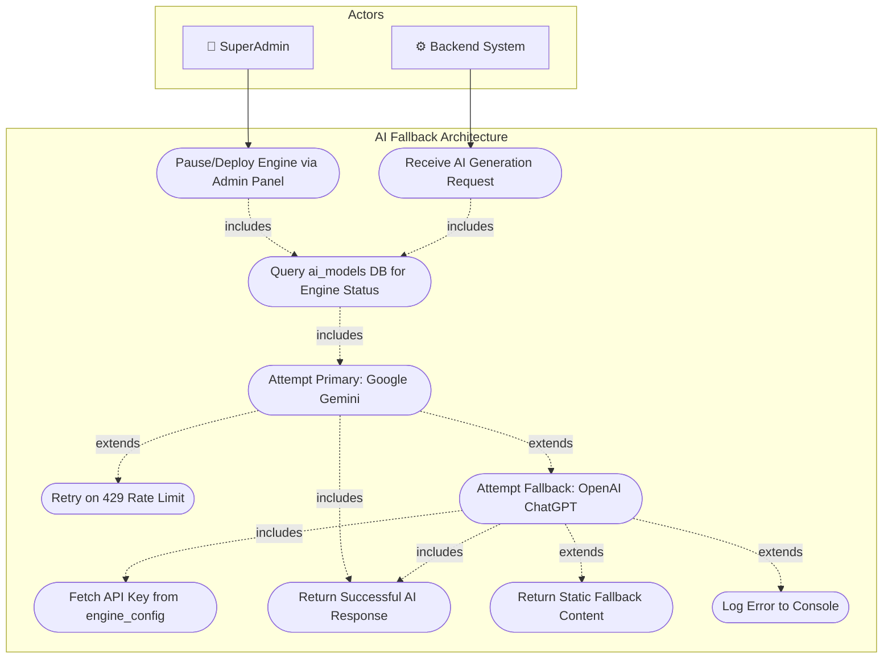

---

## FEATURE 6: Smart Calendar & Event Scheduling

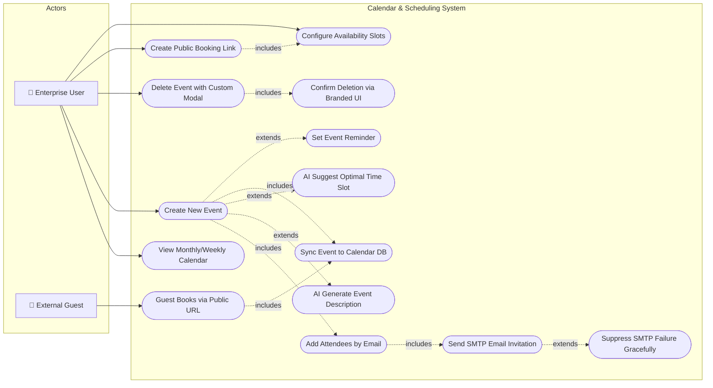

---

## FEATURE 7: AI Networking Coach & Insights

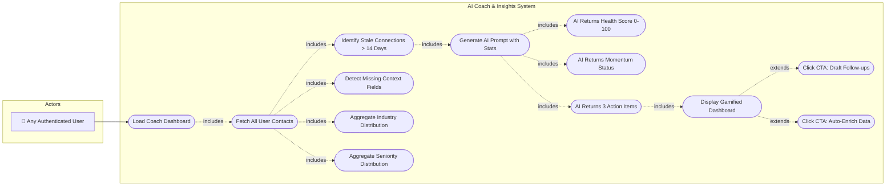

---

## FEATURE 8: Email Marketing & Campaign System

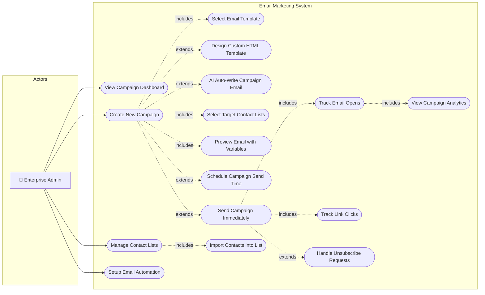

---

## FEATURE 9: CRM Integration (Salesforce / HubSpot)

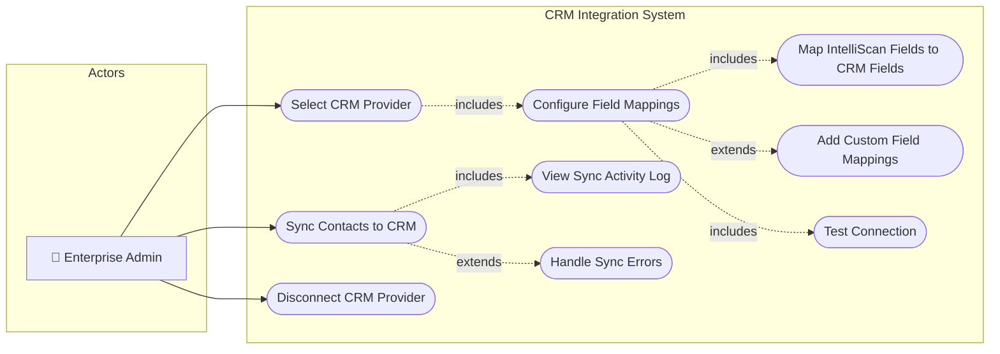

---

## FEATURE 10: Gamified Leaderboard

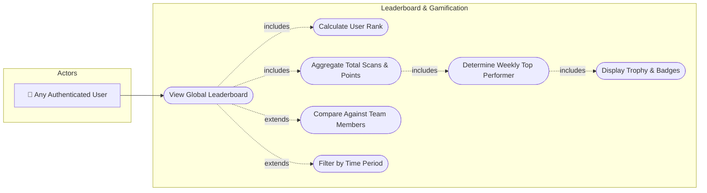

---

## FEATURE 11: Digital Card Creator & My Card

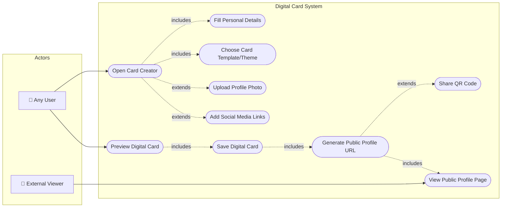

---

## FEATURE 12: SuperAdmin Platform Management

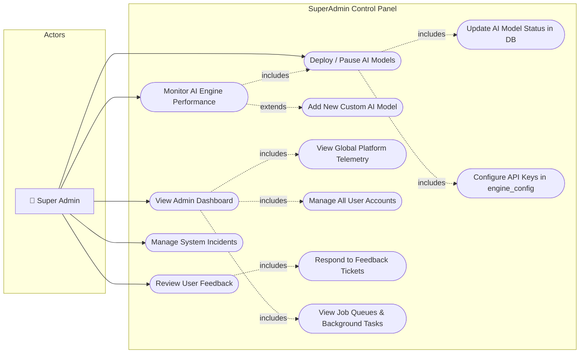

---

## FEATURE 13: Workspace & Team Collaboration

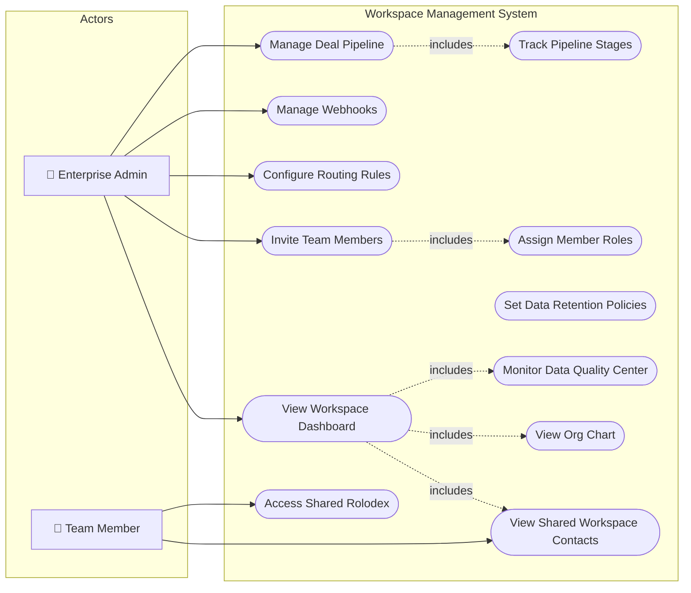

---

## FEATURE 14: Analytics & Reporting Dashboard

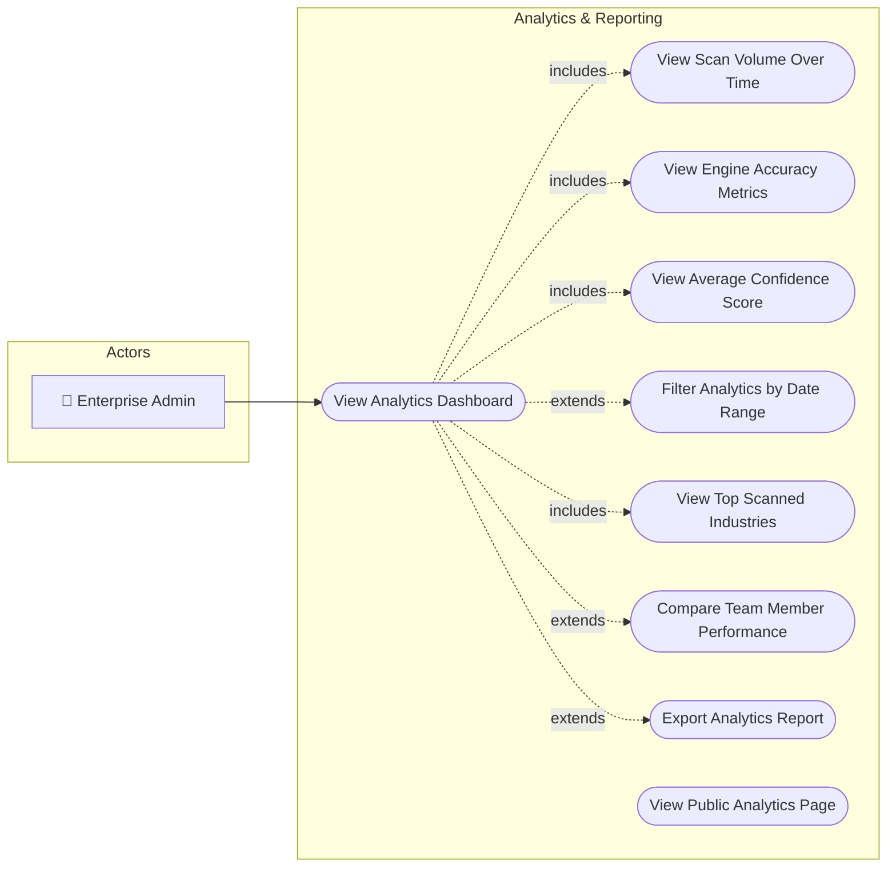

---

## FEATURE 15: Billing & Subscription Management

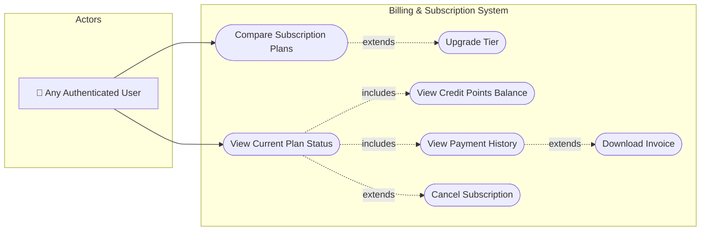

---

## FEATURE 16: AI Drafts & Email Ghostwriter

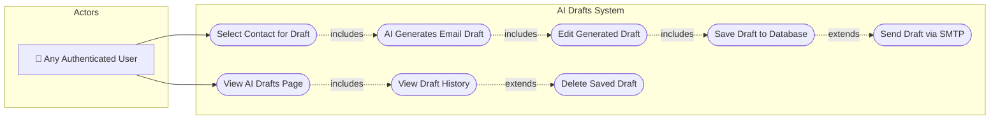

---

## FEATURE 17: Kiosk Mode (Conference Scanner)

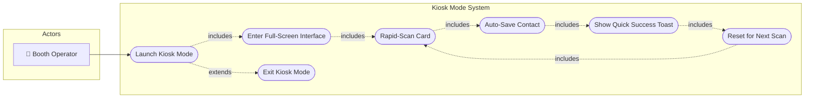

---

## FEATURE 18: Meeting Presence & Signals

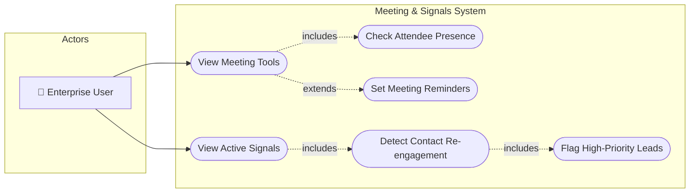

---

## FEATURE 19: Settings & Profile Configuration

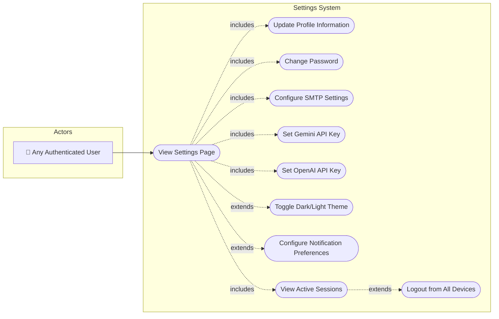

---

## FEATURE 20: Support Chatbot

```mermaid
flowchart LR
    subgraph Actors
        U["👤 Any Authenticated User"]
    end

    subgraph "Support Chatbot System"
        UC1(["Open Floating Chat Widget"])
        UC2(["Type Support Question"])
        UC3(["Send Message to AI Backend"])
        UC4(["AI Processes via generateWithFallback"])
        UC5(["Display AI Response in Chat"])
        UC6(["View Chat History"])
        UC7(["Minimize Chat Widget"])
        UC8(["Escalate to Human Support"])
    end

    U --> UC1

    UC1 -.->|includes| UC2
    UC2 -.->|includes| UC3
    UC3 -.->|includes| UC4
    UC4 -.->|includes| UC5
    UC1 -.->|includes| UC6
    UC1 -.->|extends| UC7
    UC5 -.->|extends| UC8
```
