    # IntelliScan — Complete Use Case Diagrams (All Features)

> Every diagram below uses valid **Mermaid.js** `flowchart` syntax to represent Use Case relationships.  
> **Actors** are shown as 👤 labeled boxes, **Use Cases** as rounded ovals `([...])`, **include** as dashed arrows `-.->`, and **extend** as dotted arrows `-.->`.  
> Paste any block into [mermaid.live](https://mermaid.live) to see the rendered graphic.

---

## FEATURE 1: Authentication & User Onboarding

**Description**: The gateway module securing access to all platform capabilities. Supports JWT-based login, multi-tier registration (Personal / Enterprise / SuperAdmin), password recovery via email, and a guided first-time onboarding wizard.

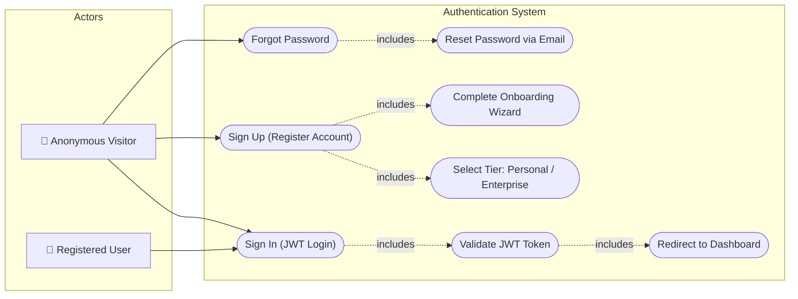

**Detailed Use Cases**:

| Use Case ID | Name | Actor | Precondition | Flow | Postcondition |
|---|---|---|---|---|---|
| UC-A1 | Sign Up | Anonymous Visitor | User is not registered | User fills name, email, password, selects tier → Server hashes password, stores in `users` table → JWT returned | Account created, token stored in localStorage |
| UC-A2 | Sign In | Any User | Account Exists | Email + Password validated → JWT Generated → UI loads Dashboard | Session active for 24 hours |
| UC-A3 | Forgot Password | Anonymous Visitor | Email exists in DB | User enters email → Server sends reset link via SMTP → User clicks link and sets new password | Password updated |
| UC-A4 | Onboarding Wizard | New User | First login detected | Step-by-step guided tour: upload photo, set company, configure notification preferences | Profile complete |

---

## FEATURE 2: Intelligent OCR Scanner (Single Card)

**Description**: The core value proposition. Users upload or photograph a single business card. The image is transmitted as Base64 to the backend, where it enters the `unifiedExtractionPipeline`. The AI model (Gemini or OpenAI fallback) parses the image and returns a structured JSON contact profile.

```mermaid
flowchart LR
    subgraph Actors
        U1["👤 Personal User"]
        U2["👤 Enterprise User"]
    end

    subgraph "Single Card OCR System"
        UC1(["Upload / Capture Card Image"])
        UC2(["Validate File Type & Size"])
        UC3(["Check User Scan Quota"])
        UC4(["Check AI Engine Status"])
        UC5(["Send Image to Gemini LLM"])
        UC6(["Fallback to OpenAI GPT-4o-mini"])
        UC7(["Fallback to Tesseract.js"])
        UC8(["Extract Structured JSON"])
        UC9(["Normalize Contact Schema"])
        UC10(["Calculate AI Deal Score"])
        UC11(["Detect Language & Industry"])
        UC12(["Save Contact to Database"])
        UC13(["Display Extraction Preview"])
        UC14(["Reject Non-Card Image"])
    end

    U1 --> UC1
    U2 --> UC1

    UC1 -.->|includes| UC2
    UC2 -.->|includes| UC3
    UC3 -.->|includes| UC4
    UC4 -.->|includes| UC5
    UC5 -.->|extends| UC6
    UC6 -.->|extends| UC7
    UC5 -.->|includes| UC8
    UC6 -.->|includes| UC8
    UC8 -.->|includes| UC9
    UC9 -.->|includes| UC10
    UC9 -.->|includes| UC11
    UC10 -.->|includes| UC12
    UC12 -.->|includes| UC13
    UC2 -.->|extends| UC14
```

**Detailed Use Cases**:

| Use Case ID | Name | Actor | Precondition | Flow | Postcondition |
|---|---|---|---|---|---|
| UC-S1 | Upload Card Image | Any Authenticated User | User is on /dashboard/scan | User drags image or clicks upload → File validated (JPG/PNG/WebP, <5MB) | Image ready for processing |
| UC-S2 | Check Scan Quota | System | User uploaded image | System queries `user_quotas` table → Compares against tier limits (Personal: 50, Enterprise: 99999) | Quota approved or 403 error |
| UC-S3 | AI Extraction | System | Quota approved | Image sent to `unifiedExtractionPipeline` → Gemini processes → If fail, OpenAI processes → If fail, Tesseract OCR | Structured JSON returned |
| UC-S4 | Normalize Schema | System | Raw JSON received | Fields mapped to standard schema (name, email, phone, company, job_title, deal_score, linkedin_url) | Clean contact record |
| UC-S5 | Calculate Deal Score | System | Contact normalized | AI assigns 0-100 score based on title seniority, company domain, email domain type | Deal score stored |
| UC-S6 | Reject Non-Card | System | AI detects non-card image | Returns `{rejected: true}` with human-readable reason | 422 error shown to user |

---

## FEATURE 3: Multi-Card / Group Photo Scanner

**Description**: Enterprise-exclusive feature allowing scanning of multiple business cards laid out in a single group photograph. The AI identifies and separates each card, returning an array of structured contacts.

```mermaid
flowchart LR
    subgraph Actors
        E1["👤 Enterprise User"]
    end

    subgraph "Multi-Card Scanning System"
        UC1(["Upload Group Photo"])
        UC2(["Validate Enterprise Tier"])
        UC3(["Check Group Scan Quota"])
        UC4(["Send to AI with Bulk Prompt"])
        UC5(["AI Identifies Individual Cards"])
        UC6(["Extract Array of Contacts"])
        UC7(["Normalize Each Contact"])
        UC8(["Bulk Insert to Database"])
        UC9(["Increment Quota Counter"])
        UC10(["Display All Extracted Cards"])
        UC11(["Show Upgrade Prompt"])
    end

    E1 --> UC1

    UC1 -.->|includes| UC2
    UC2 -.->|includes| UC3
    UC3 -.->|includes| UC4
    UC3 -.->|extends| UC11
    UC4 -.->|includes| UC5
    UC5 -.->|includes| UC6
    UC6 -.->|includes| UC7
    UC7 -.->|includes| UC8
    UC8 -.->|includes| UC9
    UC9 -.->|includes| UC10
```

**Detailed Use Cases**:

| Use Case ID | Name | Precondition | Flow | Postcondition |
|---|---|---|---|---|
| UC-M1 | Upload Group Photo | User is Enterprise tier | User uploads photo with 2-10 cards visible | Image queued |
| UC-M2 | Check Group Quota | Image uploaded | System queries `group_scans_used` from `user_quotas` | Approved or upgrade prompt |
| UC-M3 | AI Bulk Parse | Quota approved | LLM receives special prompt instructing array output → Returns `{cards: [...]}` | Array of contacts |
| UC-M4 | Bulk Insert | Array received | Loop through each card → normalize → INSERT → increment quota | All contacts saved |

---

## FEATURE 4: Contact Management (CRUD)

**Description**: Full lifecycle management of scanned contacts — viewing, searching, editing, soft-deleting, exporting to CSV/vCard, and sharing within workspaces.

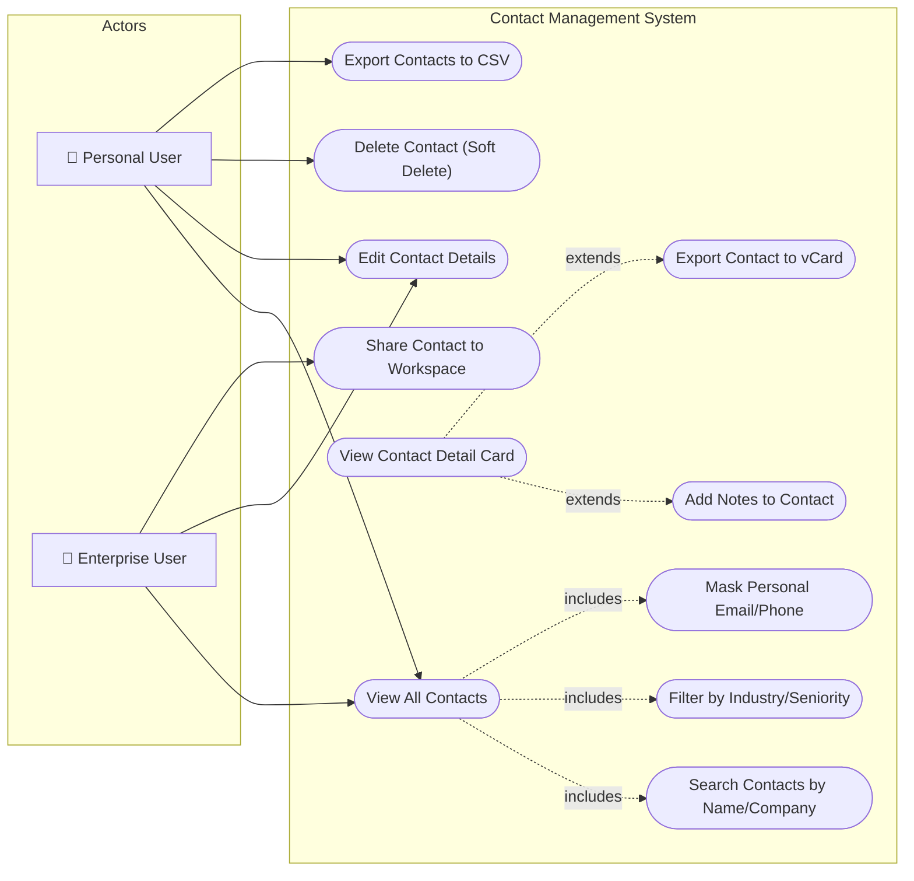

**Detailed Use Cases**:

| Use Case ID | Name | Actor | Flow | Postcondition |
|---|---|---|---|---|
| UC-C1 | View All Contacts | Any User | Fetch paginated contacts from `contacts` table scoped to user_id | Contact list rendered |
| UC-C2 | Search Contacts | Any User | User types in search box → API filters by name, company, email LIKE query | Filtered results shown |
| UC-C3 | Edit Contact | Any User | User clicks edit → Modal opens → Changes saved via PUT /api/contacts/:id | Record updated |
| UC-C4 | Soft Delete | Any User | User clicks delete → Confirmation → `is_deleted=1` flag set | Contact hidden from list |
| UC-C5 | Export CSV | Any User | User clicks export → Server generates CSV buffer → Browser downloads file | .csv file downloaded |
| UC-C6 | Mask PII | System | Personal email domains (gmail, yahoo) auto-masked as `pr***@gmail.com` | Privacy enforced |

---

## FEATURE 5: AI Dual-Engine Fallback System

**Description**: The architectural backbone ensuring 99.9% AI uptime. Every AI-powered feature routes through `generateWithFallback()`, which attempts Gemini first and silently fails over to OpenAI ChatGPT if the primary engine crashes.

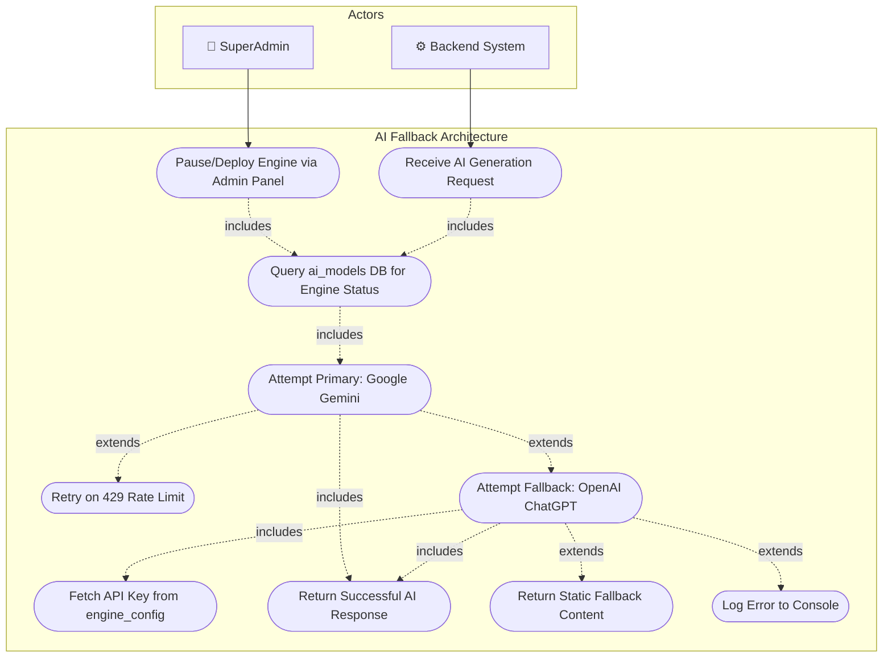

**Detailed Use Cases**:

| Use Case ID | Name | Flow | Postcondition |
|---|---|---|---|
| UC-F1 | Route AI Request | Any endpoint (Ghostwriter, Coach, Campaign) calls `generateWithFallback(prompt)` | Prompt queued |
| UC-F2 | Check Engine Status | Query `ai_models` table → If Gemini status='paused', skip directly to OpenAI | Engine selected |
| UC-F3 | Try Gemini | Call `GoogleGenerativeAI.generateContent()` → Parse response text | JSON or Error |
| UC-F4 | Retry on 429 | If error is rate-limit, wait `retryAfterMs` then retry up to 2 times | Success or escalate |
| UC-F5 | Try OpenAI | Call `openai.chat.completions.create()` with same prompt | JSON or final error |
| UC-F6 | Static Fallback | If both engines fail, return pre-built hardcoded response | UI never crashes |

---

## FEATURE 6: Smart Calendar & Event Scheduling

**Description**: A fully integrated scheduling engine supporting event creation with AI-generated descriptions, automated SMTP email invitations to attendees, custom deletion confirmation modals, and public booking link generation.

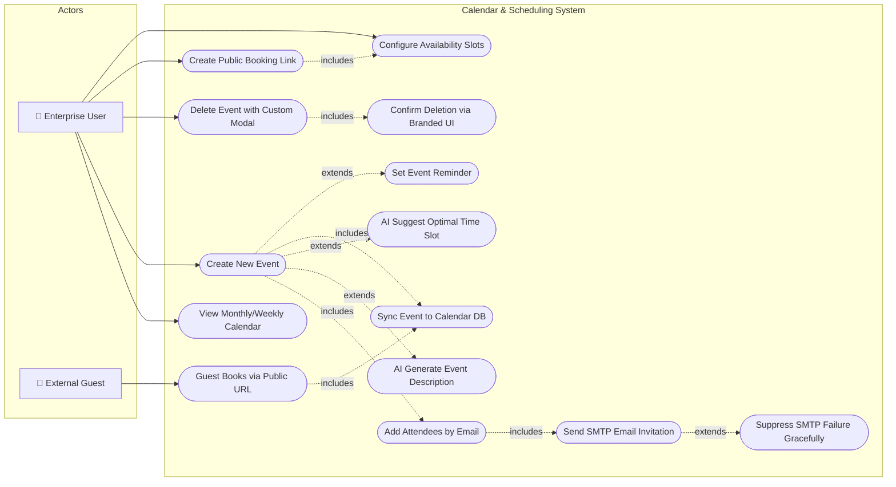

**Detailed Use Cases**:

| Use Case ID | Name | Actor | Flow | Postcondition |
|---|---|---|---|---|
| UC-CAL1 | Create Event | Enterprise User | Fill title, date/time, guests → Click Save → INSERT into `calendar_events` | Event appears on calendar |
| UC-CAL2 | AI Ghostwriter | Enterprise User | Click "AI Ghostwriter" → `generateWithFallback()` generates description | Text auto-filled |
| UC-CAL3 | Send Invites | System | For each attendee email → SMTP dispatch → If fails, `.catch(console.error)` suppresses crash | Emails sent or silently skipped |
| UC-CAL4 | Delete Event | Enterprise User | Click delete → Custom `DeleteConfirmationModal` renders → Confirm → DELETE from DB | Event removed, UI updated |
| UC-CAL5 | Public Booking | External Guest | Guest visits `/book/:slug` → Selects available slot → Event auto-created | Meeting booked |

---

## FEATURE 7: AI Networking Coach & Insights

**Description**: An intelligent analytics engine that aggregates the user's entire contact database, identifies stale connections (no interaction >14 days), detects missing context fields, and uses AI to generate actionable networking recommendations.

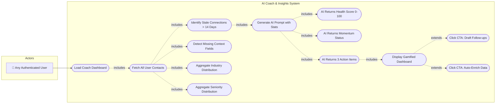

**Detailed Use Cases**:

| Use Case ID | Name | Flow | Postcondition |
|---|---|---|---|
| UC-CO1 | Fetch Contacts | SELECT all contacts for user → Count total, stale, missing fields | Statistics computed |
| UC-CO2 | Identify Stale | Compare `scan_date` to `now - 14 days` → Flag as stale | Stale count ready |
| UC-CO3 | AI Analysis | Feed stats into `generateWithFallback(prompt)` → AI returns JSON with health_score, momentum_status, and actions array | Insights generated |
| UC-CO4 | Render Dashboard | Parse AI JSON → Display health score gauge, momentum badge, 3 actionable cards with CTAs | Interactive dashboard |

---

## FEATURE 8: Email Marketing & Campaign System

**Description**: An enterprise-grade email marketing suite supporting campaign creation, HTML template design, contact list segmentation, AI-powered cold email auto-writing, open/click tracking, and automation workflows.

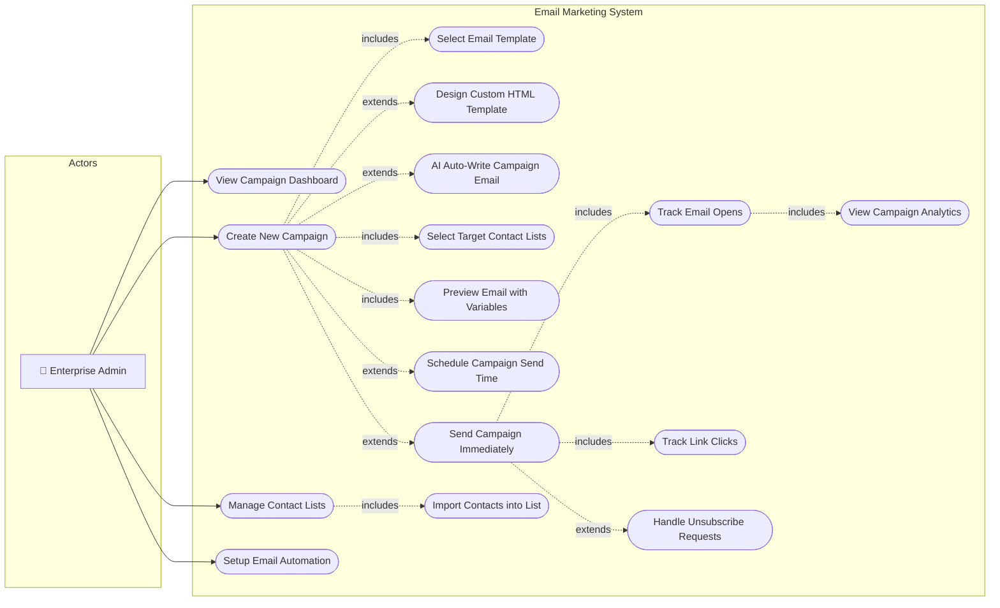

**Detailed Use Cases**:

| Use Case ID | Name | Flow | Postcondition |
|---|---|---|---|
| UC-EM1 | Create Campaign | Admin fills name, subject, body → Selects template → Assigns target lists | Campaign saved as draft |
| UC-EM2 | AI Auto-Write | Click auto-write → System sends industry + seniority to `generateWithFallback()` → AI writes subject + body | Email content generated |
| UC-EM3 | Send Campaign | System loops through list contacts → Sends via SMTP → Inserts tracking pixel → Logs to `email_sends` | Emails dispatched |
| UC-EM4 | Track Opens | Recipient opens email → Tracking pixel fires GET request → `open_count` incremented | Analytics updated |
| UC-EM5 | Track Clicks | Recipient clicks link → Redirect through tracking endpoint → `click_count` incremented | Click data logged |

---

## FEATURE 9: CRM Integration (Salesforce / HubSpot)

**Description**: Allows enterprise admins to map IntelliScan contact fields to external CRM platforms, establish OAuth connections, and synchronize scanned contacts directly into their sales pipeline.

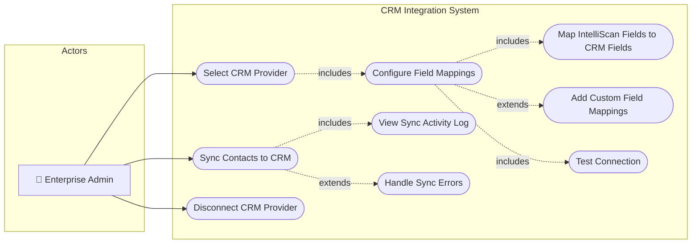

---

## FEATURE 10: Gamified Leaderboard

**Description**: A competitive ranking system comparing scan activity, contact quality, and engagement metrics across all users in the platform to drive adoption and networking productivity.

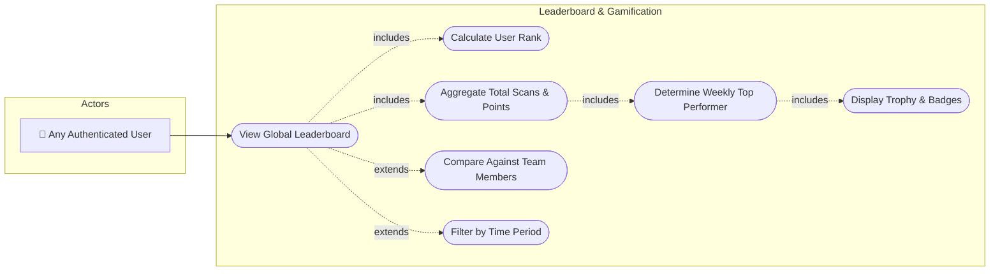

---

## FEATURE 11: Digital Card Creator & My Card

**Description**: Users can design and customize their own digital business card with personal branding, then share it via a unique public URL or QR code.

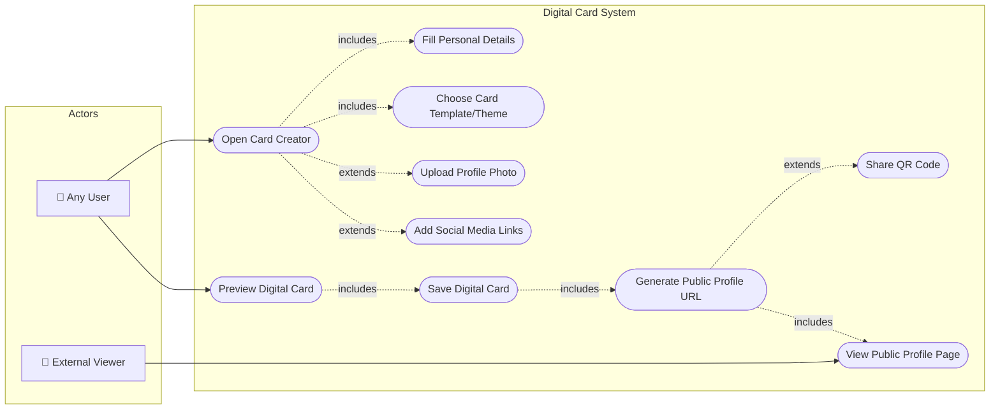

---

## FEATURE 12: SuperAdmin Platform Management

**Description**: The top-level administrative console providing full control over AI engine deployment, system health monitoring, user management, feedback triage, and incident response.

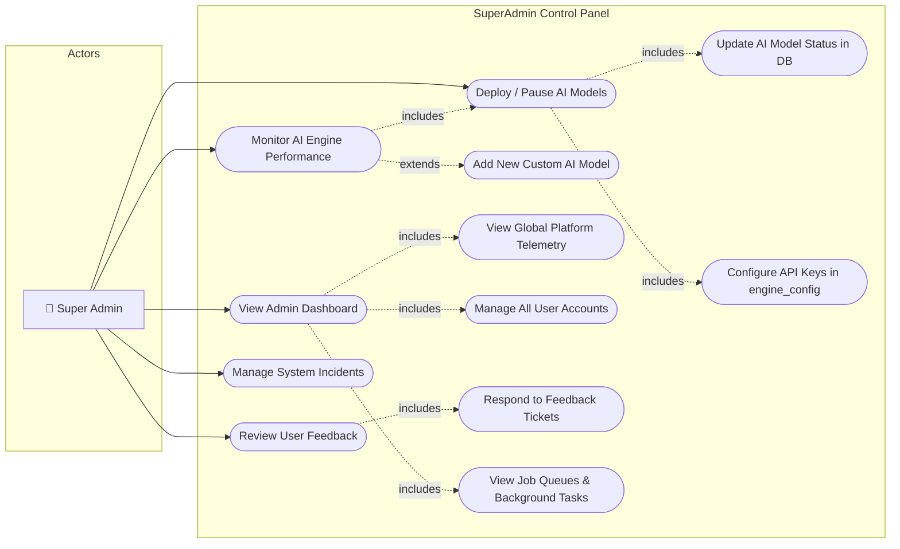

---

## FEATURE 13: Workspace & Team Collaboration

**Description**: Enterprise workspace management enabling team-based contact sharing, member invitation, role assignment, shared rolodex, and collaborative deal pipeline tracking.

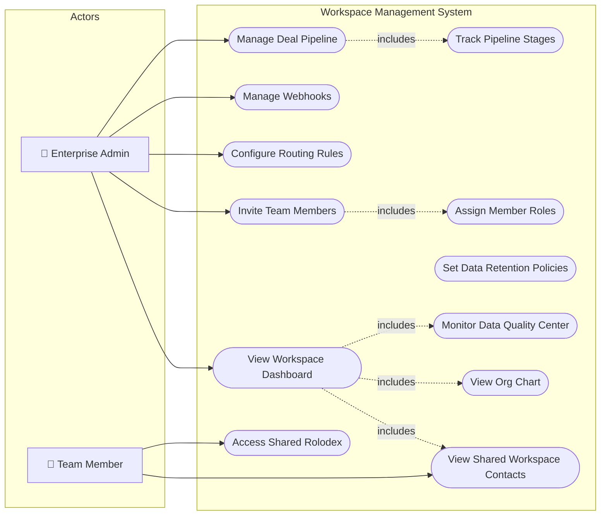

---

## FEATURE 14: Analytics & Reporting Dashboard

**Description**: Visual analytics providing scan volume trends, engine accuracy metrics, contact quality scores, and team performance metrics.

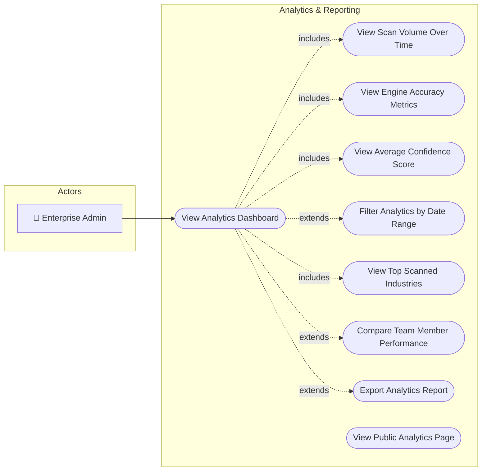

---

## FEATURE 15: Billing & Subscription Management

**Description**: Tier-based subscription management enabling plan comparison, upgrade flows, credit point tracking, and payment history.

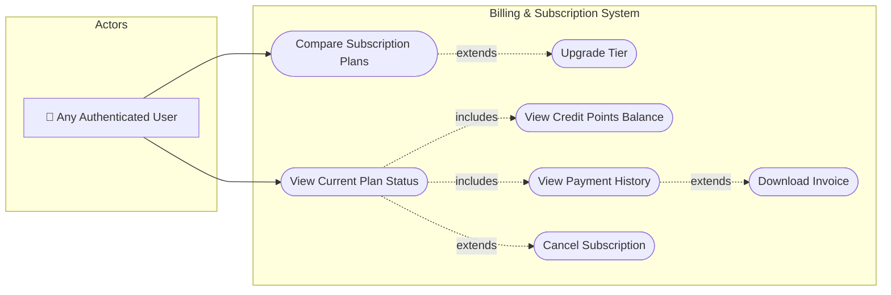

---

## FEATURE 16: AI Drafts & Email Ghostwriter

**Description**: AI-powered follow-up email drafting that analyzes a contact's profile and generates personalized, professional outreach emails ready to send.

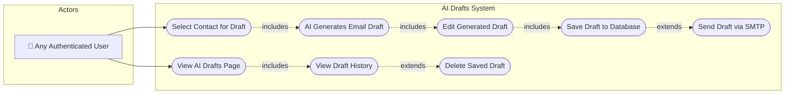

---

## FEATURE 17: Kiosk Mode (Conference Scanner)

**Description**: A dedicated full-screen scanning mode designed for trade show booths and conference reception desks, allowing rapid continuous card scanning without navigating the full dashboard.

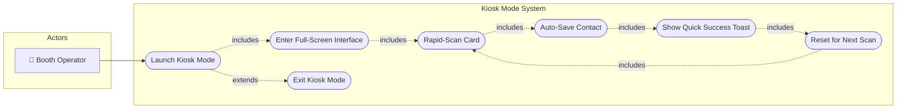

---

## FEATURE 18: Meeting Presence & Signals

**Description**: Provides real-time awareness of meeting readiness, attendee presence tracking, and intent signals from contacts who interact with shared content.

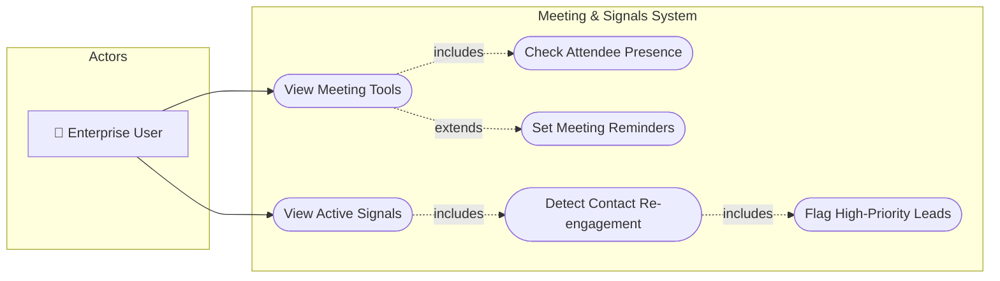

---

## FEATURE 19: Settings & Profile Configuration

**Description**: Centralized user settings for profile management, API key configuration, notification preferences, theme toggling, and session management.

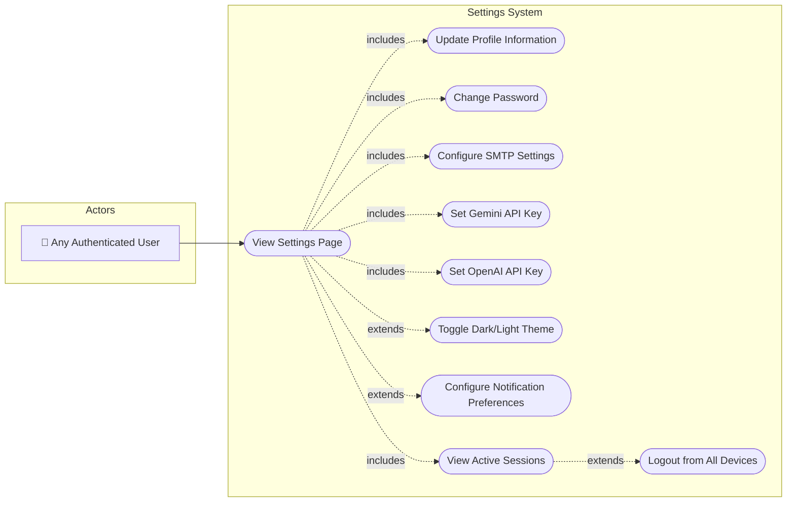

---

## FEATURE 20: Support Chatbot

**Description**: An AI-powered floating chatbot widget accessible from every page, providing instant platform assistance using Gemini/OpenAI with automatic fallback.

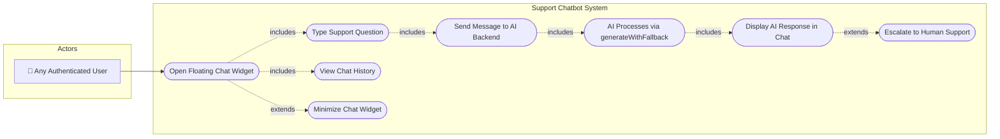

---

## Summary Table: All Features × Use Case Count

| # | Feature | Use Cases | Actors Involved |
|---|---|---|---|
| 1 | Authentication & Onboarding | 8 | Anonymous, Registered User |
| 2 | Single Card OCR Scanner | 14 | Personal, Enterprise |
| 3 | Multi-Card Group Scanner | 10 | Enterprise Only |
| 4 | Contact Management | 11 | Personal, Enterprise |
| 5 | AI Dual-Engine Fallback | 10 | System, SuperAdmin |
| 6 | Calendar & Scheduling | 14 | Enterprise, External Guest |
| 7 | AI Coach & Insights | 13 | Any User |
| 8 | Email Marketing | 16 | Enterprise Admin |
| 9 | CRM Integration | 9 | Enterprise Admin |
| 10 | Gamified Leaderboard | 7 | Any User |
| 11 | Digital Card Creator | 10 | Any User, External Viewer |
| 12 | SuperAdmin Management | 12 | SuperAdmin Only |
| 13 | Workspace Collaboration | 12 | Enterprise Admin, Members |
| 14 | Analytics & Reporting | 9 | Enterprise Admin |
| 15 | Billing & Subscriptions | 7 | Any User |
| 16 | AI Drafts & Ghostwriter | 8 | Any User |
| 17 | Kiosk Mode | 7 | Booth Operator |
| 18 | Meeting & Signals | 6 | Enterprise User |
| 19 | Settings & Configuration | 10 | Any User |
| 20 | Support Chatbot | 8 | Any User |
| **Total** | **20 Features** | **201 Use Cases** | **7 Actor Types** |
