# IntelliScan Project Diagrams (Draw.io Style PNG)

This folder contains **simple black-and-white diagrams** exported as **PNG** so they can be copied into Word.

These diagrams are based on the actual IntelliScan project modules and pages described across:

- `ALL_DOCUMENT_OF_PROJECT/*` (project overview, architecture, RBAC, features)
- `INTELLISCAN_SYSTEM_ARCHITECTURE_AND_DESIGN.md` (system architecture + routes + API surface)
- `DATA_DICTIONARY_INTELLISCAN_DB.md` and `INTELLISCAN_DATA_DICTIONARY_DETAILED.md` (real DB schema + detailed dictionary)

## How To Use In Word

1. Open any PNG inside `PROJECT_DIAGRAMS/png/`.
2. Copy and paste into Word (or Insert -> Pictures).

## Regenerate PNGs

The renderer script writes both `svg/` and `png/`:

```powershell
node .\captures\render_project_diagrams.js
```

## A) Use Case Diagram (1)

### 1) IntelliScan Platform Use Case Diagram

File: `png/use_case_intelliscan.png`

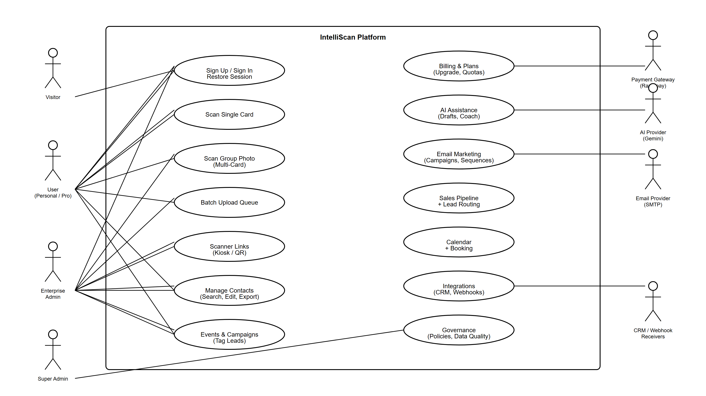

What it shows:

- Main user roles (Visitor, User, Enterprise Admin, Super Admin)
- Core platform capabilities (scan, batch upload, scanner links/kiosk, contacts, events, AI assistance, email marketing, pipeline/routing, calendar/booking, integrations, governance)
- External systems (Gemini AI, Razorpay, SMTP, CRM/webhook receivers)

## B) Activity Diagrams (5)

These activity diagrams are the **end-to-end workflows** behind the most important use cases.

### 1) Authenticate & Restore Session

File: `png/activity_1_auth_session.png`

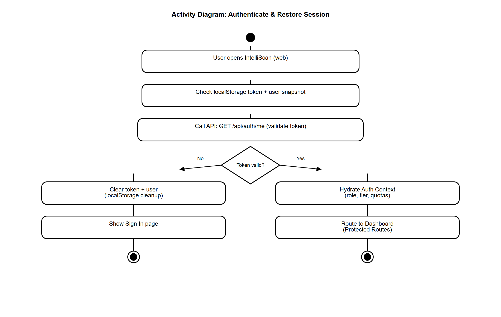

Maps to:

- Frontend: app boot -> protected routes
- Backend: auth validation endpoint(s)
- Storage: localStorage token + server-side session/validation

### 2) Single Card Scan -> Save Contact

File: `png/activity_2_single_scan.png`

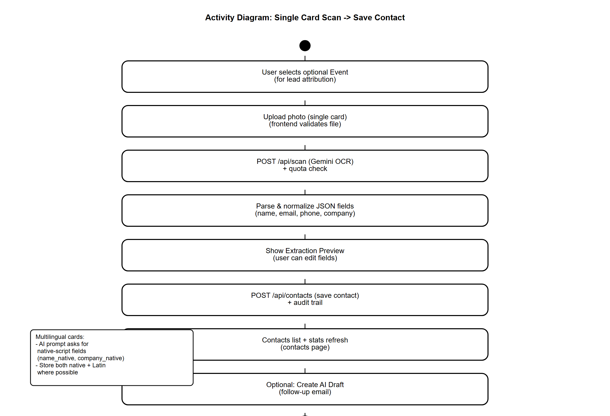

Maps to:

- Page: Scan (single card)
- Backend: `/api/scan` -> `/api/contacts`
- DB: `contacts`, `user_quotas`, `audit_trail` (where enabled)

### 3) Group Photo Scan -> Save All

File: `png/activity_3_group_scan.png`

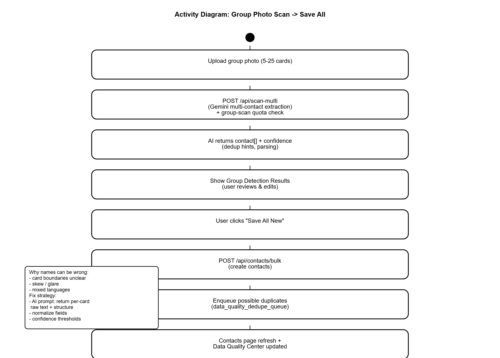

Maps to:

- Page: Scan (group photo)
- Backend: `/api/scan-multi` -> bulk create -> dedupe queue
- DB: `contacts`, `data_quality_dedupe_queue`, `user_quotas`

### 4) Email Campaign (Audience -> AI Copy -> Send -> Track)

File: `png/activity_4_email_campaign.png`

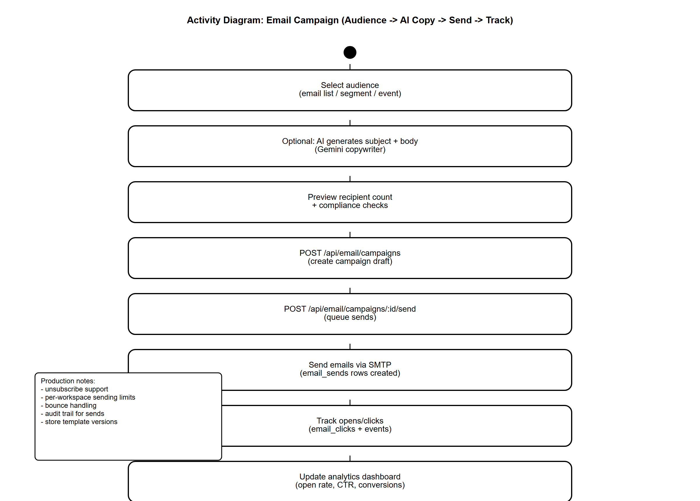

Maps to:

- Page: Email Marketing / Email Campaigns
- Backend: campaigns create/send, event tracking
- DB: `email_campaigns`, `campaign_recipients`, `email_sends`, `email_clicks`

### 5) Billing Upgrade (Razorpay) -> Tier/Quota Refresh

File: `png/activity_5_billing_razorpay.png`

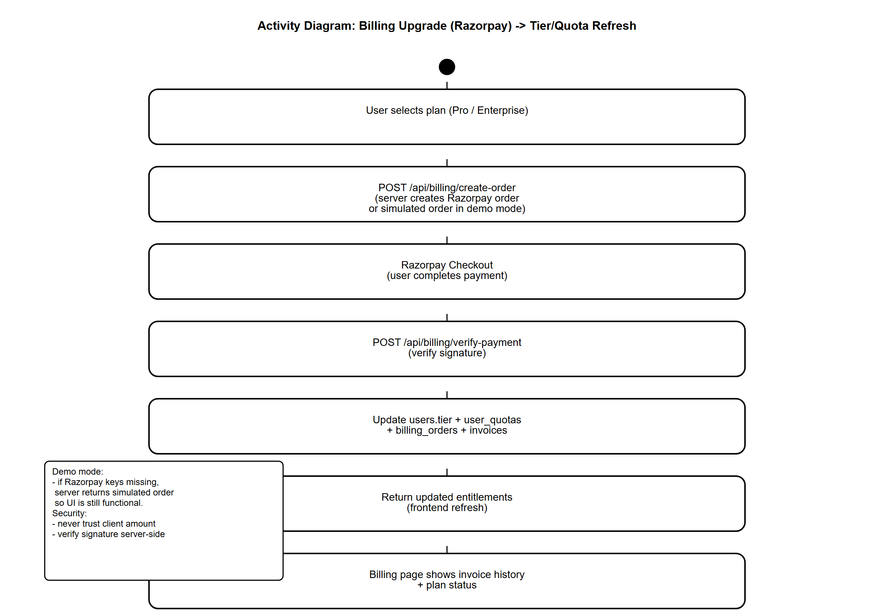

Maps to:

- Page: Billing
- Backend: create order -> verify payment -> upgrade tier
- DB: `billing_orders`, `billing_invoices`, `users`, `user_quotas`

## C) Interaction Diagrams (5)

These diagrams show **request/response flow** between UI and backend (sequence-style).

### 1) Session Restore on App Load

File: `png/sequence_1_auth_session.png`

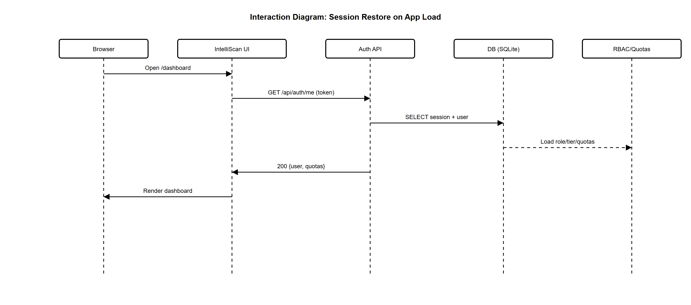

### 2) Single Scan -> Save Contact

File: `png/sequence_2_single_scan.png`

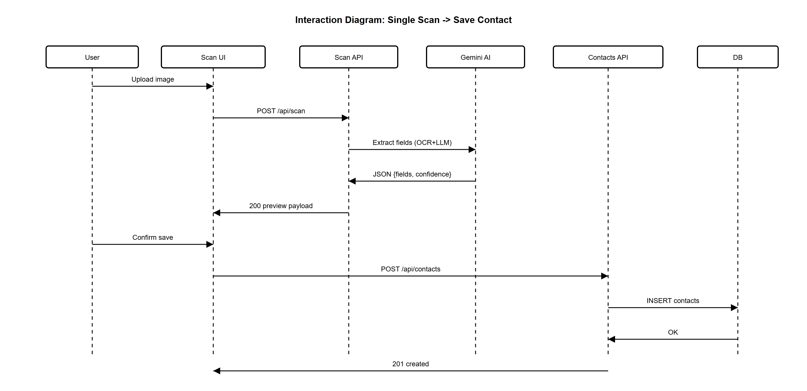

### 3) Group Scan -> Save All

File: `png/sequence_3_group_scan.png`

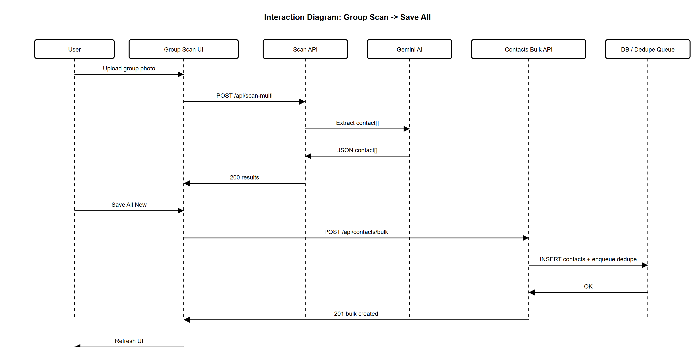

### 4) Email Campaign Send + Tracking

File: `png/sequence_4_email_campaign.png`

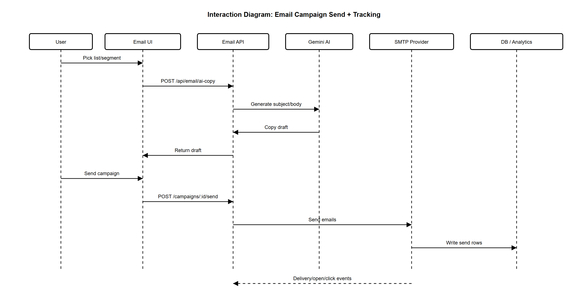

### 5) Billing Upgrade (Razorpay)

File: `png/sequence_5_billing_razorpay.png`

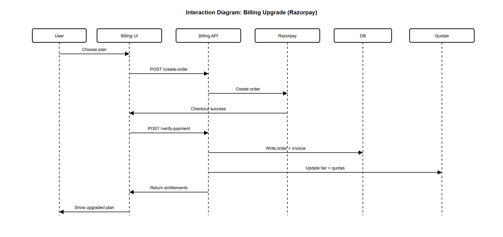

## D) Class Diagrams (5)

These are simplified domain models that match IntelliScan’s real modules.

### 1) Authentication & Access Profile

File: `png/class_1_auth_access.png`

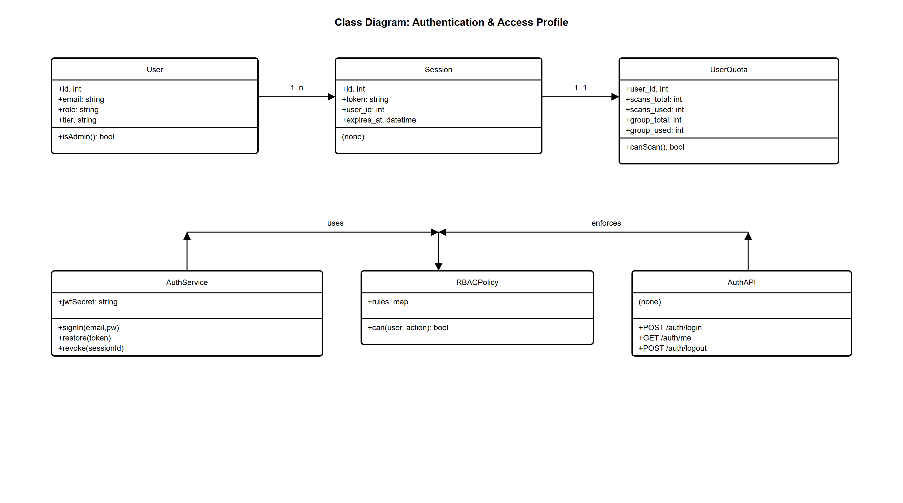

### 2) Single Scan Pipeline

File: `png/class_2_single_scan.png`

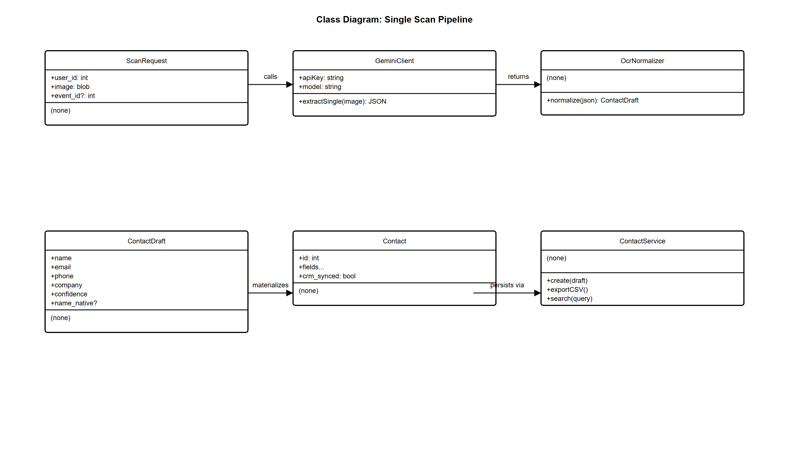

### 3) Group Scan + Data Quality

File: `png/class_3_group_scan_data_quality.png`

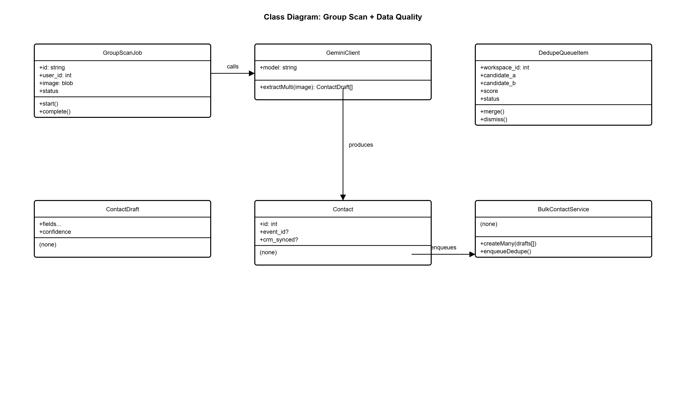

### 4) Email Marketing System

File: `png/class_4_email_campaign_system.png`

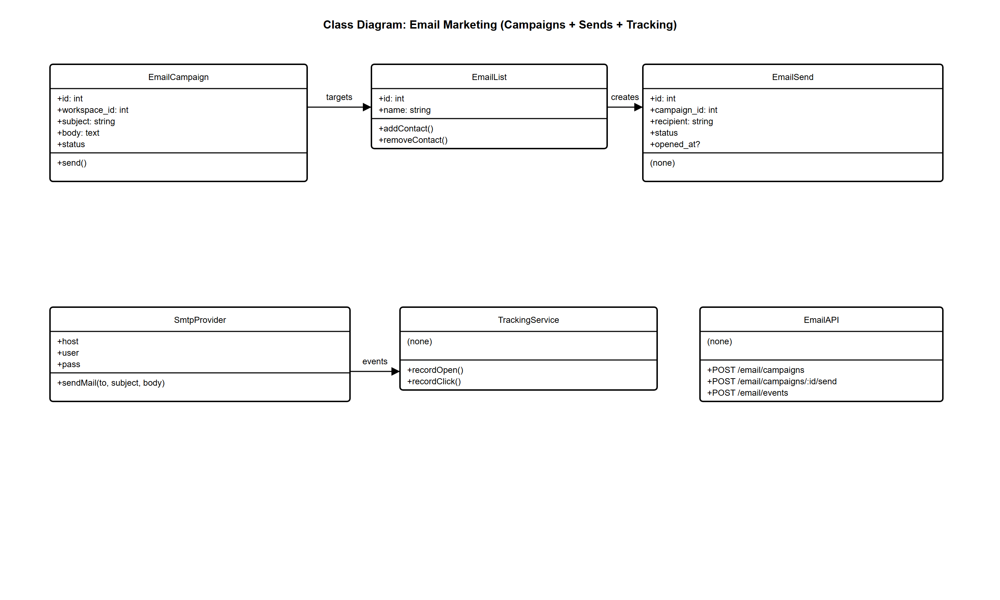

### 5) Billing (Razorpay) + Invoices

File: `png/class_5_billing_razorpay.png`

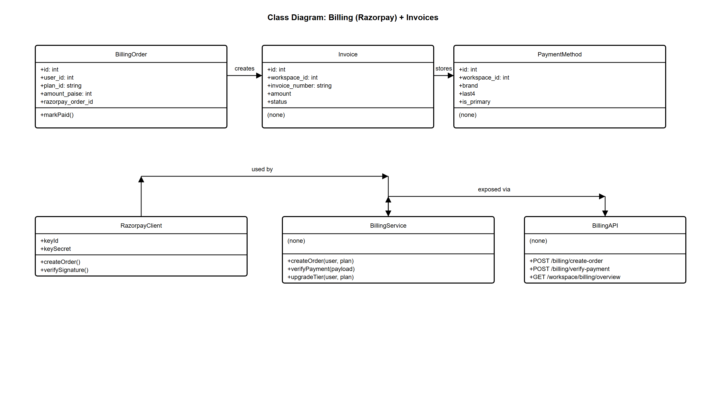

## E) Data Dictionary (Project-Wide)

The data dictionary is generated from the **real SQLite schema**.

- Authoritative schema dump: `../DATA_DICTIONARY_INTELLISCAN_DB.md`
- Detailed data dictionary: `../INTELLISCAN_DATA_DICTIONARY_DETAILED.md`
