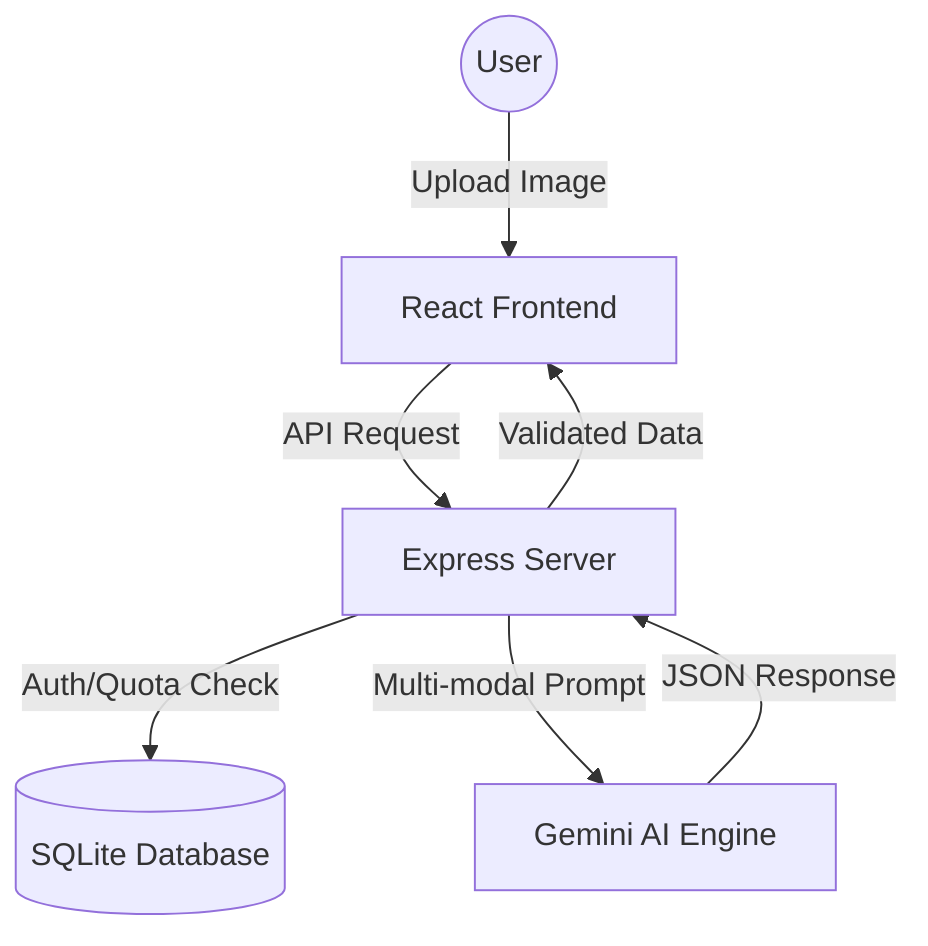

# 🛡️ IntelliScan Enterprise | AI-Powered Networking Ecosystem

[](https://ai.google.dev/)
[](https://react.dev/)
[](https://nodejs.org/)
[](https://sqlite.org/)

**IntelliScan** is a high-performance, enterprise-grade business card extraction and networking management platform. Built for marketing teams and sales executives, it leverages Google's **Gemini 1.5/2.0 Flash** models to transform physical networking into structured, actionable business data.

---

## 🚀 Key Enterprise Features
- **Intelligent Single-Card OCR:** Context-aware extraction with automatic id-card detection.
- **Group Photo Extraction:** Batch process up to 25 cards from one single photograph.
- **Campaign & Event Management:** segment scans by trade shows, conferences, or marketing campaigns.
- **AI Networking Coach:** Get real-time, LLM-powered insights on how to follow up with your new leads.
- **Multi-Tier Quota System:** Flexible 'Free', 'Professional', and 'Enterprise' tiers with simulated billing integration.
- **High-Volume Batch Queue:** Process hundreds of cards in the background with real-time shimmer progress states.

---

## 🛠️ Technology Stack
- **Frontend:** React 18, Tailwind CSS, Lucide Icons, Vite.
- **Backend:** Node.js (Express), SQLite3 (Production-ready relational schema).
- **AI Engine:** Google Generative AI (Gemini 1.5/2.0 Flash).
- **Real-time:** Socket.io for live engine analytics.

---

## 📂 Project Architecture


---

## 🚦 Getting Started (Development)

### 1. Prerequisites
- Node.js (v18+)
- Google AI Studio API Key

### 2. Installation
```bash
# Clone the repository
git clone https://github.com/your-repo/intelliscan.git

# Install dependencies
cd intelliscan-app && npm install
cd ../intelliscan-server && npm install
```

### 3. Environment Setup
Create a `.env` file in the `intelliscan-server` directory:
```env
PORT=5000
JWT_SECRET=your_jwt_secret
GEMINI_API_KEY=your_google_api_key
```

### 4. Run the Platform
```bash
# Start Backend
cd intelliscan-server && npm run dev

# Start Frontend
cd intelliscan-app && npm run dev
```

---

## 🛡️ Company-Grade Roadmap
- [ ] **Database Migration:** Transition from SQLite to Google Cloud SQL (PostgreSQL).
- [ ] **Production Observability:** Integrate Winston/Morgan logging and Prometheus metrics.
- [ ] **Testing Suite:** 80%+ coverage with Vitest and Playwright.
- [ ] **Deployment:** Automated CI/CD pipelines to Google Cloud Run and Firebase Hosting.

---

© 2026 IntelliScan Systems. All rights reserved.
