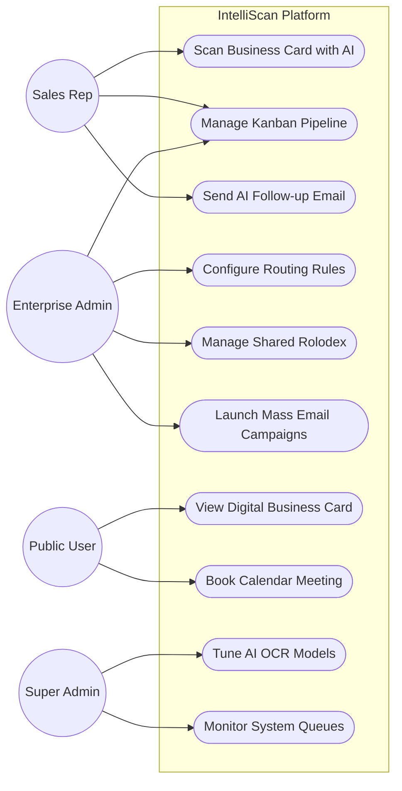
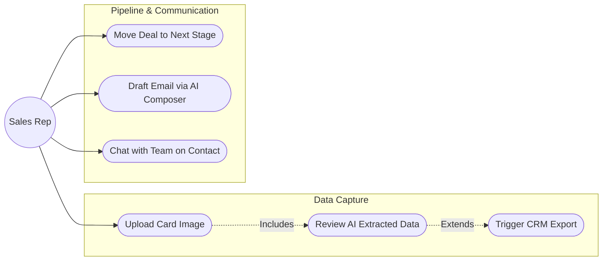
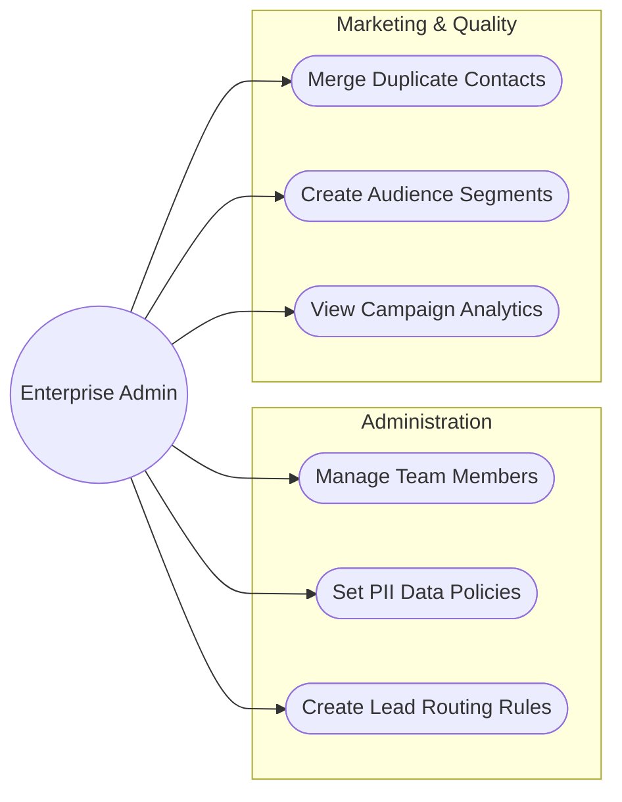
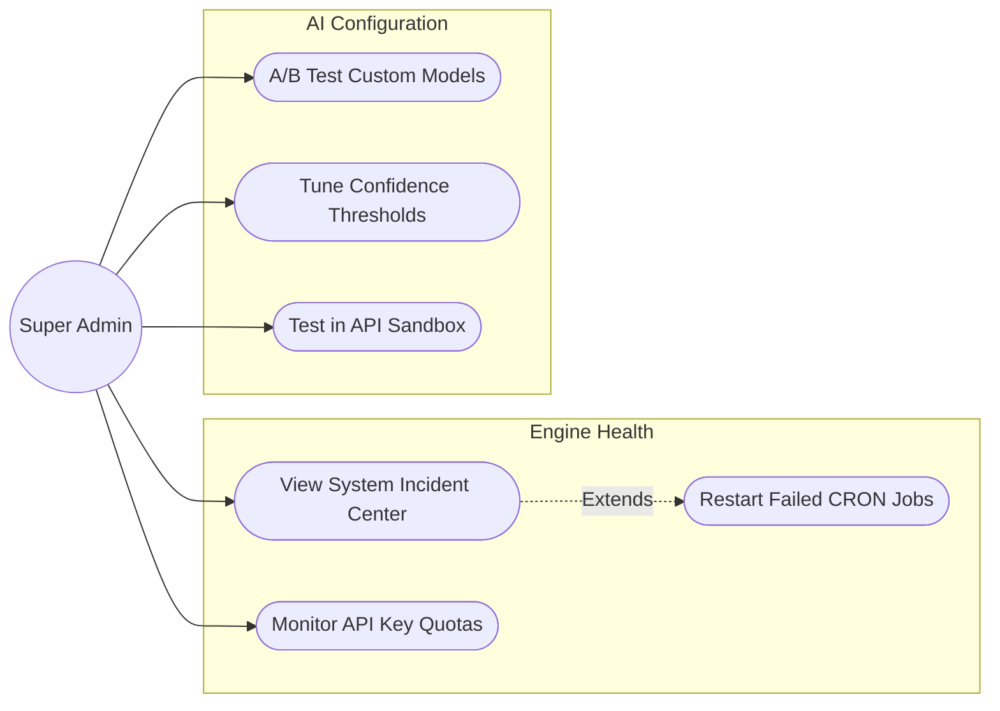
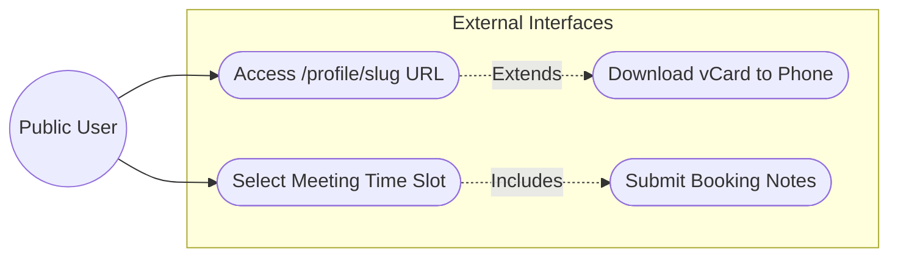

# IntelliScan: Use Case Diagrams & Role Analysis

> **Note:** This document continues the academic Phase-2 report. It details the system actors and presents technical Use Case Diagrams (written in standard UML flow structure) that map exactly to the IntelliScan functionality.

---

## 4.1 System Actors (Roles)

The IntelliScan platform operates on a strict Multi-Tenant Role-Based Access Control (RBAC) architecture. The system identifies four distinct actors:

1. **Public User (Anonymous):** External individuals who do not have an IntelliScan account. They interact with outward-facing features like Public Profiles and Calendar Booking links.
2. **Workspace Member (Sales Rep):** The primary daily user of the system. They attend events, scan cards, manage their personal deal pipeline, and draft follow-up emails.
3. **Enterprise Admin (Workspace Owner):** The manager of a company's workspace. They configure global Routing Rules, oversee the Shared Rolodex, manage enterprise-wide Email Campaigns, and handle Data Quality (deduplication).
4. **Platform Super Admin:** The system developer/administrator. They oversee the entire platform's health, manage the API Sandbox, tune the Google Gemini AI models, and monitor background Job Queues.

---

## 4.2 Comprehensive High-Level Use Case Diagram

This diagram provides a high-level overview of how the primary actors interact with the core modules of the IntelliScan system.

---

## 4.3 Detailed Use Cases by Role

### A) Sales Representative (Workspace Member) Use Cases
The Sales Representative focuses on individual data capture and immediate relationship management.

* **Use Case Description:** The Rep uploads an image. They review the AI's extraction (Confidence Score). They can optionally push this data directly to Salesforce. They then move the contact into a pipeline stage and use the AI Composer to automatically draft a follow-up email based on the contact's inferred industry.

---

### B) Enterprise Admin Use Cases
The Enterprise Admin focuses on workspace hygiene, team configuration, and macro-level marketing.

* **Use Case Description:** The Admin configures Routing Rules (e.g., "If AI detects an Executive, route to Senior Rep"). They monitor the Data Quality Center to merge duplicate contacts scanned by different reps. They also build Audience Segments (Lists) to send mass AI-generated email campaigns.

---

### C) Platform Super Admin Use Cases
The Super Admin operates entirely behind the scenes, ensuring the AI and background engines process correctly.

* **Use Case Description:** The Super Admin does not deal with customer pipelines. They use the API Sandbox to test new integrations. If emails fail to send, they clear the Job Queues. They monitor the AI Training Tuning page to adjust how aggressively the Gemini model guesses missing data.

---

### D) Public User Use Cases
The Public User interacts with the unauthenticated zones of the platform.

* **Use Case Description:** A person receives a link to a Rep's Profile. They view the digital card and click "Download vCard" to instantly save the contact to their phone. They click the Booking link, select an available calendar slot, and submit their notes to schedule a meeting.
